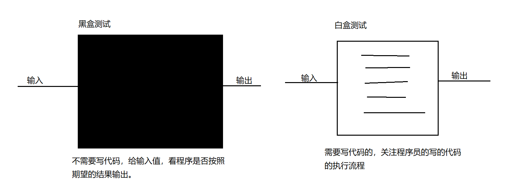

# Junit 单元测试

【1】软件测试的目的：
软件测试的目的是在规定的条件下对程序进行操作,以发现程序错误,衡量软件质量,并对其是否能满足设计要求进行评估的过程。
【2】测试分类：
（1）黑盒测试：
软件的黑盒测试意味着测试要在软件的接口处进行。这种方法是把测试对象看做一个黑盒子,测试人员完全不考虑程序内部的逻辑结构和内部特性,只依据程序的需求规格说明书,检查程序的功能是否符合它的功能说明。因此黑盒测试又叫功能测试。
（2）白盒测试：---》Junit 属于白盒测试。
软件的白盒测试是对软件的过程性细节做细致的检查。这种方法是把测试对象看做一个打开的盒子,它允许测试人员利用程序内部的逻辑结构及有关信息,设计或选择测试用例,对程序的所有逻辑路径进行测试,通过在不同点检查程序状态,确定实际状态是否与预期的状态一致。因此白盒测试又称为结构测试。


## 没有 Junit 情况下如何测试

在没有使用 Junit 的时候，缺点：
（1）测试一定走 main 方法，是程序的入口，main 方法的格式必须不能写错。
（2）要是在同一个 main 方法中测试的话，那么不需要测试的东西必须注释掉。
（3）测试逻辑如果分开的话，需要定义多个测试类，麻烦。
（4）业务逻辑和测试代码，都混淆了。
代码：

```java
package com.msb.calculator;
/**
 * @Auther: msb-zhaoss
 */
public class Calculator {
    //加法：
    public int add(int a,int b){
        return a+b;
    }
    //减法：
    public int sub(int a,int b){
        return a-b;
    }
}
```

```java
public class Test {
    //这是一个main方法，是程序的入口：
    public static void main(String[] args) {
        //测试加法：
        Calculator cal = new Calculator();
        int result = cal.add(10, 20);
        System.out.println(result);
        //测试减法：
       /* int result = cal.sub(30, 10);
        System.out.println(result);*/
    }
}
```

```java
public class Test02 {
    //这是一个main方法，是程序的入口：
    public static void main(String[] args) {
        Calculator cal = new Calculator();
        //测试减法：
        int result = cal.sub(30, 10);
        System.out.println(result);
    }
}
```

## Junit 测试

【1】一般测试和业务做一个分离，分离为不同的包：
建议起名：公司域名倒着写+test
以后测试类就单独放在这个包下
【2】测试类的名字：\*\*\*\*Test --->见名知意
【3】测试方法的定义--》这个方法可以独立运行，不依托于 main 方法
建议：
名字：testAdd() testSub() 见名知意
参数：无参
返回值：void

【4】测试方法定义完以后，不能直接就独立运行了，必须要在方法前加入一个注解： @Test
【5】导入 Junit 的依赖的环境：

【6】代码：

```java
package com.msb.test;
import com.msb.calculator.Calculator;
import org.junit.Test;
/**
 * @Auther: msb-zhaoss
 */
public class CalculatorTest {
    //测试add方法
    @Test
    public void testAdd(){
        System.out.println("测试add方法");
        Calculator cal = new Calculator();
        int result = cal.add(10, 30);
        System.out.println(result);
    }
    //测试sub方法
    @Test
    public void testSub(){
        System.out.println("测试sub方法");
        Calculator cal = new Calculator();
        int result = cal.sub(10, 30);
        System.out.println(result);
    }
}
```

【7】判定结果：
绿色：正常结果
红色：出现异常

【8】即使出现绿色效果，也不意味着你的测试就通过了，因为代码中逻辑也可能出现问题，这种情况怎么解决呢？
加入断言

```java
package com.msb.test;
import com.msb.calculator.Calculator;
import org.junit.Assert;
import org.junit.Test;
/**
 * @Auther: msb-zhaoss
 */
public class CalculatorTest {
    //测试add方法
    @Test
    public void testAdd(){
        System.out.println("测试add方法");
        Calculator cal = new Calculator();
        int result = cal.add(10, 30);
        //System.out.println(result);--》程序的运行结果可以不关注
        //加入断言：预测一下结果，判断一下我预测的结果和 实际的结果是否一致：
        Assert.assertEquals(40,result);//第一个参数：预测结果  第二个参数：实际结果
    }
    //测试sub方法
    @Test
    public void testSub(){
        System.out.println("测试sub方法");
        Calculator cal = new Calculator();
        int result = cal.sub(10, 30);
        System.out.println(result);
    }
}
```

## @before\_@after

@Before:
某一个方法中，加入了@Before 注解以后，那么这个方法中的功能会在测试方法执行前先执行
一般会在@Beforer 修饰的那个方法中加入：加入一些申请资源的代码：申请数据库资源，申请 IO 资源，申请网络资源。。。

@After:
某一个方法中，加入了@After 注解以后，那么这个方法中的功能会在测试方法执行后先执行
一般会在@After 修饰的那个方法中加入：加入释放资源的代码：释放数据库资源，释放 IO 资源，释放网络资源。。。

代码：

```java
package com.msb.test;
import com.msb.calculator.Calculator;
import org.junit.After;
import org.junit.Assert;
import org.junit.Before;
import org.junit.Test;
/**
 * @Auther: msb-zhaoss
 */
public class CalculatorTest {
    @Before
    public void init(){
        System.out.println("方法执行开始了。。。");
    }
    @After
    public void close(){
        System.out.println("方法执行结束了。。。");
    }
    //测试add方法
    @Test
    public void testAdd(){
        System.out.println("测试add方法");
        Calculator cal = new Calculator();
        int result = cal.add(10, 30);
        //System.out.println(result);--》程序的运行结果可以不关注
        //加入断言：预测一下结果，判断一下我预测的结果和 实际的结果是否一致：
        Assert.assertEquals(40,result);//第一个参数：预测结果  第二个参数：实际结果
    }
    //测试sub方法
    @Test
    public void testSub(){
        System.out.println("测试sub方法");
        Calculator cal = new Calculator();
        int result = cal.sub(10, 30);
        System.out.println(result);
    }
}
```
