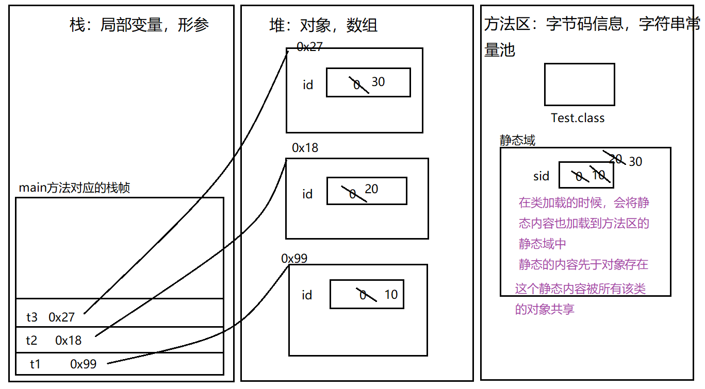

# JAVA基础
1. 科学记数法形式，如
314e2      314E2 (E的大小写没有区分)    314E-2
```java
double  f = 314e2;  //314*10^2-->31400.0
double  f2 = 314e-2; //314*10^(-2)-->3.14
```
2. 浮点数注意点
```java
//注意：浮点型默认是double类型的，要想将一个double类型的数赋给float类型，必须后面加上F或者f
float f1 = 3.14234567898623F;
System.out.println(f1);
//注意：double类型后面可以加D或者d，但是一般我们都省略不写
double d1 = 3.14234567898623D;
System.out.println(d1);
//注意：我们最好不要进行浮点类型的比较：
float f2 = 0.3F;
double d2 = 0.3;
System.out.println(f2==d2);
```
3. `boolean`类型有两个常量值，`true`和`false`，在内存中占一位（不是一个字节），不可以使用 `0` 或非 `0` 的整数替代 `true` 和 `false` ，这点和C语言不同。 `boolean` 类型用来判断逻辑条件，一般用于程序流程控制 。
4. 编码问题详解 
【1】什么是编码？

【2】通过生活案例：


【3】由权威机构形成的编码表才可以称之为：字符集
* ASCII
英文字符集
用一个字节的7位表示

* IOS8859-1
西欧字符集
用一个字节的8位表示

* GB2312
简体中文字符集
最多使用两个字节编码
>中文：2个字节
GB2312兼容了ASCII中的字符

* GBK
GB2312的升级，加入了繁体字
最多使用两个字节编码

疑问：

首位如果是0：一个字节代码代表一个字符
首位如果是1：那么一个字节不够，要加上后面的字节才能完整的表示一个字符。

* Unicode
国际通用字符集，融合了目前人类使用的所有字符。为每个字符分配唯一的字符码。
推出了UTF标准：

三种编码方案：  UTF-8，UTF-16,UTF-32 

* 以UTF-8为案例讲解：

中文： 珊     ---》Unicode  ： 29642


底层存储：


UTF-8标准最多可以用6个字节表示：


以后我们用的最多的就是UTF-8.
>JAVA中char类型使用的是UTF-16编码（char占据两字节，只能存储大小为两字节的字符，底层根据Unicode码表存储）
5. 用记事本选择编码方法的时候一般要选择为ANSI---》获取当前操作系统的编码格式：GBK
6. 类型转换
```java
public class TestVar10{
    public static void main(String[] args){
        //类型转换的两种形式：
        double d = 6;//int-->double  自动类型转换
        System.out.println(d);
        int i = (int)6.5;//double--->int  强制类型转换 （强转）
        System.out.println(i);
        
        //在同一个表达式中，有多个数据类型的时候，应该如何处理：
        //多种数据类型参与运算的时候，整数类型，浮点类型，字符类型都可以参与运算，唯独布尔类型不可以参与运算。
        //double d2 = 12+1294L+8.5F+3.81+'a'+true;
        double d2 = 12+1294L+8.5F+3.81+'a';
        System.out.println(d2);
        /*
        类型级别：(从低到高的)
        byte,short,char-->int--->long--->float--->double
        级别用来做什么？当一个表达式中有多种数据类型的时候，要找出当前表达式中级别最高的那个类型，然后
        其余的类型都转换为当前表达式中级别最高的类型进行计算。
        double d2 = 12+1294L+8.5F+3.81+'a';
                  = 12.0+1294.0+8.5+3.81+97.0
        */
        int i2 = (int)(12+1294L+8.5F+3.81+'a');
        System.out.println(i2);
        /*
        在进行运算的时候：
        左=右  : 直接赋值
        左<右  ：强转
        左>右  ：直接自动转换
        */
        
        //以下情况属于特殊情形：对于byte，short，char类型来说，只要在他们的表数范围中，赋值的时候就不需要进行
        //强转了直接赋值即可。
        byte b = 12;
        System.out.println(b);
        byte b2 = (byte)270;
        System.out.println(b2);
    }
}
```
7. final常量：一个变量被final修饰，这个变量就变成了一个常量，这个常量的值就不可变了。这个常量就是我们所说的字符常量。
1、字面常量：包括整形常量，字符型常量，字符串常量。注意：不存在数组常量，结构体常量等结构型的字面常量。但是存在结构型的符号常量
2、符号常量：（可以定义结构型常量）用#define和const定义的常量！
这两种常量之间的区别：#define定义的常量，除了字符串字面常量外都不占内存，所以无法取常量的地址，仅仅是宏替换而已，eg：
①#define NAME “pang dong”；
本质是字符串字面常量，会占用“静态存储区”；
②#define MAX 256；
本质是整形的字面常量，不会分配内存。
>约定俗成的规定：字符常量的名字全部大写.
8. Scanner的使用(`import java.util.Scanner;`)
```java
//拿来一个扫描器：
Scanner sc = new Scanner(System.in);
//给一个友好性的提示：
System.out.print("请录入一个半径：");
//让扫描器扫描键盘录入的int类型的数据：
int r = sc.nextInt();
```
9. `+`运算符
```java
public class TestOpe03{
    public static void main(String[] args){
        //表示正数：
        System.out.println(+5);//5
        //相加操作：
        System.out.println(5+6);//11
        System.out.println(5+'6');//59
        //字符串的拼接：
        //规则：+左右两侧的任意一侧有字符串，那么这个加号就是字符串拼接的作用，结果一定是字符串
        int num = 56;
        System.out.println("num="+num);//"num=56" ---> num=56
        System.out.println(5+6+"7");//11+"7"--->"117"  --->117
        System.out.println(5+'6'+"7");//59 +"7"--->"597" --->597
        System.out.println("5"+6+"7");//"56"+"7"  --->"567"--->567
        System.out.println("5"+'6'+"7");//"56"+"7"--->"567"--->567
        System.out.println("5"+'6'+'7');//"56"+'7'--->"567"---567
    }
}
```
>`+`的作用：
（1）表示正数
（2）表示相加操作
（3）进行字符串的拼接
10. `++`优先级>`+`

11. `a+=b`  和  `a=a+b`  区别：
(1)`a+=b`    可读性稍差 编译效率高   底层自动进行类型转换
(2)`a=a+b`     可读性好  编译效率低   手动进行类型转换
(3)a+=b相当于a=a+b,那么也相当于  a=b+a吗？
>基本类型相同，String类型不同

>下面的代码哪一句出错：  4
byte a = 10;  --->1
int b = 20;  --->2
a+=b;  ---->3
a = a+b ;---->4
更正：  a = (byte)(a+b);
12. 逻辑运算符与位运算符
* 逻辑运算符：
逻辑与 ：`&` 规律：只要有一个操作数是`false`，那么结果一定是`false`
短路与：`&&` 规律：效率高一些，只要第一个表达式是`false`，那么第二个表达式就不用计算了，结果一定是`false`
逻辑或：`|` 规律：只要有一个操作数是`true`，那么结果一定是`true`
短路或：`||` 规律：效率高一些，只要第一个表达式是`true`，那么第二个表达式就不用计算了，结果一定是`true`
逻辑非：   `!`  规律：相反结果
逻辑异或： `^`  规律：两个操作数相同，结果为false，不相同，结果为`true`
* 位运算符：
`<<`   左移
`>>` 有符号右移
`>>>` 无符号右移
`&` 与
`|` 或
`^`异或
`~`反
> 1. 4乘以8最快的方式：  4<<3 
> 2. -6>>2 = -2
> 
13. `switch`

【1】语法结构：
```java
switch(){
        case * :
        case * :
        .......
}
```
【2】`switch`后面是一个()，()中表达式返回的结果是一个等值，这个等值的类型可以为：
`int`,`byte`,`short`,`char`,`String`,枚举类型
【3】这个()中的等值会依次跟`case`后面的值进行比较，如果匹配成功，就执行:后面的代码
【4】为了防止代码的“穿透”效果：在每个分支后面加上一个关键词`break`，遇到`break`这个分支就结束了
【5】类似`else`的“兜底”“备胎”的分支：`default`分支
【6】`default`分支可以写在任意的位置上，但是如果没有在最后一行，后面必须加上`break`关键字，
如果在最后一行的话，`break`可以省略
【7】相邻分支逻辑是一样的，那么就可以只保留最后一个分支，上面的都可以省去不写了
【8】`switch`分支和`if`分支区别：
表达式是等值判断的话--》`if` ，`switch`都可以
如果表达式是区间判断的情况---》`if`最好
【9】`switch`应用场合：就是等值判断，等值的情况比较少的情况下

14.  构成方法重载的条件：
* 不同的含义：形参类型、形参个数、形参顺序不同
* 只有返回值不同不构成方法的重载
如：`int a(String str){}`与 `void a(String str){}`不构成方法重载
* 只有形参的名称不同，不构成方法的重载
如：`int a(String str){}`与`int a(String s){}`不构成方法重载

15.  数组的初始化方式总共有三种：静态初始化、动态初始化、默认初始化。
* 静态初始化
  除了用new关键字来产生数组以外，还可以直接在定义数组的同时就为数组元素分配空间并赋值。

eg:
```java
int[] arr = {12,23,45};
int[] arr = new int[]{12,23,45};
```
>注意：
1::`new int[3]{12,23,45};`-->错误(更正:)
2.`int[] arr ;arr = {12,23,45};`  --->错误

* 动态初始化
数组定义与为数组元素分配空间并赋值的操作分开进行。

eg:
```java
int[] arr ;
arr = new int[3]
arr[0] = 12;
arr[1] = 23;
arr[2] = 45;
```

* 默认初始化
数组是引用类型，它的元素相当于类的实例变量，因此数组一经分配空间，其中的每个元素也被按照实例变量同样的方式被隐式初始化。

eg:
`int[] arr = new int[3];`   ---> 数组有默认的初始化值

16. main方法

【1】main方法：程序的入口，在同一个类中，如果有多个方法，那么虚拟机就会识别main方法，从这个方法作为程序的入口
【2】main方法格式严格要求：
`public static void main(String[] args){}`

`public static` --->修饰符 ，暂时用这个 -->面向对象一章
`void` --->代表方法没有返回值 对应的类型void
`main `--->见名知意名字
`String[] args`  --->形参  --->不确定因素

【3】问题：程序中是否可以有其他的方法也叫main方法？
可以，构成了方法的重载。
```java
public class TestArray10{
    public static void main(String[] args){
                
        }
        public static void main(String str){
                
        }
}
```
【4】形参为String[] 那么实参到底是什么？
```java
public class TestArray10{
public static void main(String[] args){
        //从侧面验证：
        //int[] arr1; //如果对数组只声明，没有后续操作，那么相当于 白定义了。
        //int[] arr2 = null; 
        //System.out.println(arr2.length);//Exception in thread "main" java.lang.NullPointerException
        //int[] arr3 = new int[0];
        //System.out.println(arr3.length);
        //int[] arr4 = new int[4];
        //System.out.println(arr4.length);
        
        //System.out.println(args.length);//0
        //从这个结果证明，参数是String[],实参是  new String[0] 
        //默认情况下，虚拟机在调用main方法的时候就是传入了一个长度为0的数组
        
        System.out.println(args.length);
        for(String str:args){
                System.out.println(str);
        }
    }
}
```
手动传入实参：
有特殊符号的时候可以加上`""`


没有特殊符号用空格隔开即可：


17. 可变参数(了解，不使用)
```java
public class TestArray12{
    /*
    1.可变参数：作用提供了一个方法，参数的个数是可变的 ,解决了部分方法的重载问题
    int...num
    double...num
    boolean...num
    
    
    2.可变参数在JDK1.5之后加入的新特性
    3.方法的内部对可变参数的处理跟数组是一样
    4.可变参数和其他数据一起作为形参的时候，可变参数一定要放在最后
    5.我们自己在写代码的时候，建议不要使用可变参数。
    */
    public static void main(String[] args){
            //method01(10);
            //method01();
            //method01(20,30,40);
            method01(30,40,50,60,70);
            //method01(new int[]{11,22,33,44});
    }
    public static void method01(int num2,int...num){
        System.out.println("-----1");
        for(int i:num){
                System.out.print(i+"\t");
        }
        System.out.println();
        
        System.out.println(num2);
    }
}
```

18. Array工具类
```java
import java.util.Arrays;
public class TestArray13{
    public static void main(String[] args){
        //给定一个数组：
        int[] arr = {1,3,7,2,4,8};
        //toString:对数组进行遍历查看的，返回的是一个字符串，这个字符串比较好看
        System.out.println(Arrays.toString(arr));
        
        //binarySearch:二分法查找：找出指定数组中的指定元素对应的索引：
        //这个方法的使用前提：一定要查看的是一个有序的数组：
        //sort：排序 -->升序
        Arrays.sort(arr);
        System.out.println(Arrays.toString(arr));
        System.out.println(Arrays.binarySearch(arr,4));
        
        int[] arr2 = {1,3,7,2,4,8};
        //copyOf:完成数组的复制：
        int[] newArr = Arrays.copyOf(arr2,4);
        System.out.println(Arrays.toString(newArr));
        
        //copyOfRange:区间复制：
        int[] newArr2 = Arrays.copyOfRange(arr2,1,4);//[1,4)-->1,2,3位置
        System.out.println(Arrays.toString(newArr2));
        
        //equals:比较两个数组的值是否一样：
        int[] arr3 = {1,3,7,2,4,8};
        int[] arr4 = {1,3,7,2,4,8};
        System.out.println(Arrays.equals(arr3,arr4));//true
        System.out.println(arr3==arr4);//false ==比较左右两侧的值是否相等，比较的是左右的地址值，返回结果一定是false
        
        //fill：数组的填充：
        int[] arr5 = {1,3,7,2,4,8};
        Arrays.fill(arr5,10);
        System.out.println(Arrays.toString(arr5));
    }
}
```
19. 数组的复制操作


20. 二维数组
数组的初始化方式总共有三种：静态初始化、动态初始化、默认初始化。

* 静态初始化
除了用new关键字来产生数组以外，还可以直接在定义数组的同时就为数组元素分配空间并赋值。

eg:

`int[][] arr = {{1,2},{4,5,6},{4,5,6,7,8,9,9}};`
`int[][] arr =new int[][] {{1,2},{4,5,6},{4,5,6,7,8,9,9}};`
* 动态初始化
数组定义与为数组元素分配空间并赋值的操作分开进行。
eg:
```java
int[][] arr = new int[3][]; //本质上定义了一维数组长度为3，每个“格子”中放入的是一个数组
arr[0] = new int[]{1,2};
arr[1] = new int[]{3,4,5,6};
arr[2] = new int[]{34,45,56};
```
eg:
```java
int[][] arr = new int[3][2]; 
public class TestArray16{
        public static void main(String[] args){
                int[][] arr = new int[3][2];
                //本质上：定义一维数组，长度为3，每个数组“格子”中，有一个默认的长度为2的数组：

                arr[1] = new int[]{1,2,3,4};

                //数组遍历：
                for(int[] a:arr){
                        for(int num:a){
                                        System.out.print(num+"\t");
                        }
                        System.out.println();
                }

        }
}
```
* 默认初始化
数组是引用类型，它的元素相当于类的实例变量，因此数组一经分配空间，其中的每个元素也被按照实例变量同样的方式被隐式初始化。

21. 面向对象三个阶段：
【1】面向对象分析OOA  --  Object Oriented Analysis
对象：张三，王五，朱六，你，我
抽取出一个类----》人类

类里面有什么：
动词--》动态特性--》方法
名词--》静态特性--》属性
【2】面向对象设计OOD  --  Object Oriented Design
先有类，再有对象：
类：人类： Person
对象：zhangsan ，lisi，zhuliu
【3】面向对象编程OOP  --  Object Oriented Programming

22. 创建对象的过程：
1.第一次遇到Person的时候，进行类的加载（只加载一次）
2.创建对象，为这个对象在堆中开辟空间
3.为对象进行属性的初始化动作

new关键字实际上是在调用一个方法，这个方法叫构造方法（构造器）
调用构造器的时候，如果你的类中没有写构造器，那么系统会默认给你分配一个构造器，只是我们看不到罢了。
可以自己显式的将构造器编写出来：
构造器的格式：
`[修饰符] 构造器的名字(){}`

构造器和方法的区别：
1.没有方法的返回值类型
2.方法体内部不能有return语句
3.构造器的名字很特殊，必须跟类名一样
构造器的作用：不是为了创建对象，因为在调用构造器之前，这个对象就已经创建好了，并且属性有默认的初始化的值。
调用构造器的目的是给属性进行赋值操作的。
注意：我们一般不会在空构造器中进行初始化操作，因为那样的话每个对象的属性就一样了。
实际上，我们只要保证空构造器的存在就可以了，里面的东西不用写

23. 局部变量和成员变量的区别

* 区别1：代码中位置不同
         成员变量：类中方法外定义的变量
         局部变量：方法中定义的变量  代码块中定义的变量
* 区别2：代码的作用范围
         成员变量：当前类的很多方法
         局部变量：当前一个方法（当前代码块）   
* 区别3：是否有默认值
         成员变量：有
         局部变量：没有
* 区别4：是否要初始化
         成员变量：不需要，不建议初始化，后续使用的时候再赋值即可
         局部变量：一定需要，不然直接使用的时候报错
* 区别5：内存中位置不同
         成员变量：堆内存
         局部变量：栈内存   
* 区别6：作用时间不同
         成员变量：当前对象从创建到销毁
         局部变量：当前方法从开始执行到执行完毕

24. 构造器
* 一般保证空构造器的存在，空构造器中一般不会进行属性的赋值操作
* 一般我们会重载构造器，在重载的构造器中进行属性赋值操作
* 在重载构造器以后，假如空构造器忘写了，系统也不会给你分配默认的空构造器了，那么你要调用的话就会出错了。
* 当形参名字和属性名字重名的时候，会出现就近原则：在要表示对象的属性前加上this.来修饰 ，因为this代表的就是你创建的那个对象。

eg：
```java
public class Person {
    //属性：
    String name;
    int age;
    double height;
    //空构造器
    public Person(){
    }
    public Person(String name,int age,double height){
        //当形参名字和属性名字重名的时候，会出现就近原则：
        //在要表示对象的属性前加上this.来修饰 ，因为this代表的就是你创建的那个对象
        this.name = name;
        this.age = age;
        this.height = height;
    }
    public Person(String a,int b){
        name = a;
        age = b;
    }
    //方法：
    public void eat(){
        System.out.println("我喜欢吃饭");
    }
}
```
>属性，方法，构造器之间的顺序不重要。

this存的是当前对象的地址

25. this使用场景：
* this可以修饰属性：属性名字和形参发生重名的时候，或者  属性名字 和局部变量重名的时候，都会发生就近原则，所以如果我要是直接使用变量名字的话就指的是离的近的那个形参或者局部变量，这时候如果我想要表示属性的话，在前面要加上：`this.修饰`

>如果不发生重名问题的话，实际上你要是访问属性也可以省略this.
```java
public class Person {
    //属性
    int age;
    String name;
    double height;
    //空构造器
    public Person(){
    }
    //有参构造器
    public Person(int age,String name,double height){
        this.age = age;
        this.name = name;
        this.height = height;
    }
    //方法：
    public void eat(){
        int age = 10;
        System.out.println(age);//就近原则，age指的是离它近的age--》局部变量的age
        System.out.println(this.age);//这里指代的就是属性的age
        System.out.println("我喜欢吃饭");
    }
}
```
* this修饰方法:在同一个类中，方法可以互相调用，this.可以省略不写。
```java
public class Person {
    //属性
    int age;
    String name;
    double height;
    //空构造器
    public Person(){
    }
    //有参构造器
    public Person(int age,String name,double height){
        this.age = age;
        this.name = name;
        this.height = height;
    }
    //方法：
    /*public void eat(){
        int age = 10;
        System.out.println(age);//就近原则，age指的是离它近的age--》局部变量的age
        System.out.println(this.age);//这里指代的就是属性的age
        System.out.println("我喜欢吃饭");
    }*/
    public void play(){
        /*this.*/eat();
        System.out.println("上网");
        System.out.println("洗澡");
    }
    public void eat(){
        System.out.println(/*this.*/age);
        System.out.println("吃饭");
    }
}
```
* this可以修饰构造器：同一个类中的构造器可以相互用this调用
>this修饰构造器必须放在第一行
```java
public class Person {
    //属性
    int age;
    String name;
    double height;
    //空构造器
    public Person(){
    }
    //有参构造器
    public Person(int age,String name,double height){
        this(age,name);
        this.height = height;
    }
    public Person(int age,String name){
        this(age);
        this.name = name;
    }
    public Person(int age){
        this.age = age;
    }
    //方法：
    /*public void eat(){
        int age = 10;
        System.out.println(age);//就近原则，age指的是离它近的age--》局部变量的age
        System.out.println(this.age);//这里指代的就是属性的age
        System.out.println("我喜欢吃饭");
    }*/
    public void play(){
        /*this.*/eat();
        System.out.println("上网");
        System.out.println("洗澡");
    }
    public void eat(){
        System.out.println(/*this.*/age);
        System.out.println("吃饭");
    }
}
```

26.   创建对象时的内存分析
* 代码1：
```java
public class Person {
        int  id;
        int  age;

        public static void main(String args[]){
                Person p1= new Person();
        }
}
```

* 代码2:
```java
public class Person {
    int id;
    int age;
    String school;
    public Person (int a,int b,String c){
            id=a;
            age=b;
            school=c;
    }
    public static void main(String args[]){
            Person p= new Person(1,20, "海淀");
    }
}
```

* 代码3：
```java
class Person{
    int id;
    int age;
    String school;
    Person (int a,int b,String c){
            id=a;
            age=b;
            school=c;
    }
    public void setAge(int a){
            age=a;
    }
}

public class Test {
    public static void main(String[] args) {
        Test t=new Test();
        int age=40;
        Person tom=new Person(1,20,"海淀");
        Person jack=new Person(2,30,"朝阳");
        t.change1(age);
        t.change2(tom);
        t.change3(jack);
        System.out.println(age); //40
        System.out.println("id:"+jack.id+",age:"+jack.age+",school:"+jack.school); //id:2,age:66,school:"朝阳"
    }
    public void change1(int i){
                i=3366;
    }

    public void change2(Person p){
              p=new Person(3,22,"西城");
    }

    public void change3(Person p){
        p.setAge(66);
    }
}
```


27. static可以修饰：属性，方法，代码块，内部类。
* static修饰属性
```java
public class Test {
    //属性：
    int id;
    static int sid;
    //这是一个main方法，是程序的入口：
    public static void main(String[] args) {
        //创建一个Test类的具体的对象
        Test t1 = new Test();
        t1.id = 10;
        t1.sid = 10;
        Test t2 = new Test();
        t2.id = 20;
        t2.sid = 20;
        Test t3 = new Test();
        t3.id = 30;
        t3.sid = 30;
        //读取属性的值：
        System.out.println(t1.id);
        System.out.println(t2.id);
        System.out.println(t3.id);
        System.out.println(t1.sid);
        System.out.println(t2.sid);
        System.out.println(t3.sid);
    }
}
```

>一般官方的推荐访问方式：可以通过类名.属性名的方式去访问
* static修饰属性总结：
（1）在类加载的时候一起加载入方法区中的静态域中
（2）先于对象存在
（3）访问方式： 对象名.属性名    类名.属性名（推荐）

static修饰属性的应用场景：某些特定的数据想要在内存中共享，只有一块 --》这个情况下，就可以用static修饰的属性
```java
public class MsbStudent {
    //属性：
    String name;
    int age;
    static String school;
    //这是一个main方法，是程序的入口：
    public static void main(String[] args) {
        MsbStudent.school = "马士兵教育";
        //创建学生对象：
        MsbStudent s1 = new MsbStudent();
        s1.name = "张三";
        s1.age = 19;
        //s1.school = "马士兵教育";
        MsbStudent s2 = new MsbStudent();
        s2.name = "李四";
        s2.age = 21;
        //s2.school = "马士兵教育";
        System.out.println(s2.school);
    }
}
```
属性：
静态属性 （类变量）
非静态属性（实例变量）

* static修饰方法
```java
public class Demo {
    int id;
    static int sid;
    public void a(){
        System.out.println(id);
        System.out.println(sid);
        System.out.println("------a");
    }
    //1.static和public都是修饰符，并列的没有先后顺序，先写谁后写谁都行
    static public void b(){
        //System.out.println(this.id);//4.在静态方法中不能使用this关键字
        //a();//3.在静态方法中不能访问非静态的方法
        //System.out.println(id);//2.在静态方法中不能访问非静态的属性
        System.out.println(sid);
        System.out.println("------b");
    }
    //这是一个main方法，是程序的入口：
    public static void main(String[] args) {
        //5.非静态的方法可以用对象名.方法名去调用
        Demo d = new Demo();
        d.a();
        //6.静态的方法可以用   对象名.方法名去调用  也可以 用  类名.方法名 （推荐）
        Demo.b();
        d.b();
        
        //在同一个类中可以直接调用
        b();
    }
}
```

28. 代码块
类的组成：属性，方法，构造器，代码块，内部类
代码块分类：普通块，构造块，静态块，同步块（多线程）
```java
public class Test {
    //属性
    int a;
    static int sa;
    //方法
    public void a(){
        System.out.println("-----a");
        {
            //普通块限制了局部变量的作用范围
            System.out.println("这是普通块");
            System.out.println("----000000");
            int num = 10;
            System.out.println(num);
        }
        //System.out.println(num);
        //if(){}
        //while(){}
    }
    public static void b(){
        System.out.println("------b");
    }
    //构造块
    {
        System.out.println("------这是构造块");
    }
    //静态块
    static{
        System.out.println("-----这是静态块");
        //在静态块中只能访问：静态属性，静态方法
        System.out.println(sa);
        b();
    }
    //构造器
    public Test(){
        System.out.println("这是空构造器");
    }
    public Test(int a){
        this.a = a;
    }
    //这是一个main方法，是程序的入口：
    public static void main(String[] args) {
        Test t = new Test();
        t.a();
        Test t2 = new Test();
        t2.a();
    }
}
```
输出：

代码块执行顺序：
最先执行静态块，只在类加载的时候执行一次，所以一般以后实战写项目：创建工厂，数据库的初始化信息都放入静态块。
一般用于执行一些全局性的初始化操作。
再执行构造块，（不常用）再执行构造器，再执行方法中的普通块。

29. 导包
* 包的作用：为了解决重名问题（实际上包对应的就是盘符上的目录），解决权限问题
* 包名定义：
（1）名字全部小写
（2）中间用.隔开
（3）一般都是公司域名倒着写 ：  com.jd   com.msb
（4）加上模块名字：
com.jd.login    com.jd.register
（5）不能使用系统中的关键字：nul,con,com1---com9.....
（6）包声明的位置一般都在非注释性代码的第一行
* 小问题：
```java
//声明包：
package com.msb7;
import com.msb2.Person; //导包：就是为了进行定位
import java.util.Date;
/**
 * @Auther: msb-zhaoss
 */
public class Test {
    //这是一个main方法，是程序的入口：
    public static void main(String[] args) {
        new Person();
        new Date();
        new java.sql.Date(1000L);//在导包以后，还想用其他包下同名的类，就必须要手动自己写所在的包。
        new Demo();
    }
}
```
* 总结：
（1）使用不同包下的类要需要导包： import **.*.*;  例如：import java.util.Date;
（2）在导包以后，还想用其他包下同名的类，就必须要手动自己写所在的包。
（3）同一个包下的类想使用不需要导包，可以直接使用。
（4）在java.lang包下的类，可以直接使用无需导包：
（5）可以直接导入*

* 在Java中的导包没有包含和被包含的关系：即导入对应的包（即文件夹）之后不会自动导入该包下的子包（子文件夹）
* 静态导入：要使用静态成员（方法和变量）我们必须给出提供这个静态成员的类。 使用 静态导入 可以使被导入类的 静态变量 和 静态方法 在当前类 直接可见 ，使用这些静态成员无需再给出他们的类名。
```java
//静态导入：
import static java.lang.Math.*;
//导入：java.lang下的Math类中的所有静态的内容
public class Test {
    //这是一个main方法，是程序的入口：
    public static void main(String[] args) {
        System.out.println(random());
        System.out.println(PI);
        System.out.println(round(5.6));
    }
    //在静态导入后，同一个类中有相同的方法的时候，会优先走自己定义的方法。
    public static int round(double a){
        return 1000;
    }
}
```

30. 封装
* Java中封装的理解：将某些东西进行隐藏，然后提供相应的方式进行获取。（提高代码安全性）
* 我们程序设计追求“高内聚，低耦合”。
➢高内聚:类的内部数据操作细节自己完成，不允许外部干涉;
➢低耦合:仅对外暴露少量的方法用于使用。 
隐藏对象内部的复杂性，只对外公开简单的接口。便于外界调用，从而提高系统的可扩展性、可维护性。通俗的说，把该隐藏的隐藏起来，该暴露的暴露出来。这就是封装性的设计思想。 
* 代码实例：
```java
public class Girl {//女孩
    //属性：
    private int age;
    //读取年龄：
    public int duquAge(){
        return age;
    }
    //设置年龄：
    public void shezhiAge(int age){
        if(age >= 30 ){
            this.age = 18;
        }else{
            this.age = age;
        }
    }
}
public class Test {
    public static void main(String[] args) {
        //创建一个Girl类的对象：
        Girl g = new Girl();
        /*g.age = 33;
        System.out.println(g.age);*/
        //设置年龄：
        g.shezhiAge(31);
        //读取年龄：
        System.out.println(g.duquAge());
    }
}
```
上面的代码，对于属性age来说，我加了修饰符private，这样外界对它的访问就受到了限制，现在我还想加上其他的限制条件，但是在属性本身上没有办法再加了，所以我们通过定义方法来进行限制条件的添加。
以属性为案例：
进行封装：
（1）将属性私有化，被private修饰--》加入权限修饰符
一旦加入了权限修饰符，其他人就不可以随意的获取这个属性
（2）提供public修饰的方法让别人来访问/使用
（3）即使外界可以通过方法来访问属性了，但是也不能随意访问，因为咱们在方法中可以加入 限制条件。
31. 继承总结：
（1）继承关系 ：
父类/基类/超类
子类/派生类
子类继承父类一定在合理的范围进行继承的    子类 extends  父类
（2）继承的好处：
 1. 提高了代码的复用性，父类定义的内容，子类可以直接拿过来用就可以了，不用代码上反复重复定义了
 2. 便于代码的扩展
 3. 为了以后多态的使用。是多态的前提。

（3）父类private修饰的内容，子类也继承过来了。
（4）一个父类可以有多个子类。
（5）一个子类只能有一个直接父类。
但是可以间接的继承自其它类。
（6）继承具有传递性：Student --》继承自  Person  ---》继承自Object
>Object类是所有类的根基父类。所有的类都直接或者间接的继承自Object。

内存分析：


32. 权限修饰符

【1】private：权限：在当前类中可以访问
【2】default:缺省修饰符：权限：到同一个包下的其他类都可以访问(default不写出来，默认即缺省，写出来反而报错)
【3】protected：权限：最大到不同包下的子类
【4】public：在整个项目中都可以访问
总结：
属性，方法：修饰符：四种：private，缺省，protected，public
类：修饰符：两种：缺省，public

>以后写代码一般属性：用private修饰 ，方法：用public修饰

33. 方法的重写
* 重写：发生在子类和父类中，当子类对父类提供的方法不满意的时候，要对父类的方法进行重写。
* 重写有严格的格式要求：子类的方法名字和父类必须一致，参数列表（个数，类型，顺序）也要和父类一致。
* 内存分析：
* 重载和重写的区别：
重载：在同一个类中，当方法名相同，形参列表不同的时候  多个方法构成了重载
重写：在不同的类中，子类对父类提供的方法不满意的时候，要对父类的方法进行重写。


34. super
super:指的是：  父类的
super可以修饰属性，可以修饰方法；
在子类的方法中，可以通过  super.属性  super.方法 的方式，显示的去调用父类提供的属性，方法。在通常情况下，super.可以省略不写：
在特殊情况下，当子类和父类的属性重名时，你要想使用父类的属性，必须加上修饰符super.，只能通过super.属性来调用,在这种情况下，super.就不可以省略不写。

* super修饰构造器：
其实我们平时写的构造器的第一行都有：super()  -->作用：调用父类的空构造器，只是我们一般都省略不写
（所有构造器的第一行默认情况下都有super(),但是一旦你的构造器中显示的使用super调用了父类构造器，那么这个super()就不会给你默认分配了。如果构造器中没有显式的调用父类构造器的话，那么第一行都有super(),可以省略不写）


如果构造器中已经显示的调用super父类构造器，那么它的第一行就没有默认分配的super();了


在构造器中，super调用父类构造器和this调用子类构造器只能存在一个，两者不能共存：
因为super修饰构造器要放在第一行，this修饰构造器也要放在第一行：

>改正二选一即可

* 继承条件下构造方法的执行：


35. Object类：
所有类都直接或间接的继承自Object类，Object类是所有Java类的根基类。
也就意味着所有的Java对象都拥有Object类的属性和方法。
如果在类的声明中未使用extends关键字指明其父类，则默认继承Object类。

36.  Object类的toString()的作用：

方法原理:

toString的作用就是对对象进行“自我介绍”，一般子类对父类提供的toString都不满意，都要进行重写。
```java
    public String toString() {
        return "Student{" +
                "name='" + name + '\'' +
                ", age=" + age +
                ", height=" + height +
                '}';
    }
```
37. Object类的equals作用：这个方法提供了对对象的内容是否相等 的一个比较方式，对象的内容指的就是属性。
父类Object提供的equals就是在比较==地址，没有实际的意义，我们一般不会直接使用父类提供的方法，
而是在子类中对这个方法进行重写。

* 利用集成开发环境生成equals方法
  * eclipse
  * idea 

38. 类和类之间的关系
总结：
【1】面向对象的思维：找参与者，找女孩类，找男孩类
【2】体会了什么叫方法的形参，什么叫方法的实参（具体传入的内容）
【3】类和类可以产生关系：
（1）将一个类作为另一个类中的方法的形参
（2）将一个类作为另一个类的属性

```java
class Girl {
    //属性：
    String name;
    double weight;
    Mom m /*= new Mom()*/;
    //方法：
    public void add(int a){//参数是基本数据类型
        System.out.println(a);
        System.out.println(a+100);
    }
    //谈恋爱的方法：
    public void love(Boy b){//参数是引用数据类型Boy
        System.out.println("我男朋友的名字是："+b.name+"，我男朋友的年龄是："+b.age);
        b.buy();
    }
    //女孩跟妈妈聊天：
    public void wechat(){
        m.say();
    }
    //构造器：
    public Girl(String name, double weight) {
        this.name = name;
        this.weight = weight;
    }
}

class Boy {
    //属性：
    int age;
    String name;
    //方法：
    public void buy(){
        System.out.println("跟我谈恋爱，我给你买买买。。。");
    }
    //构造器：
    public Boy(int age, String name) {
        this.age = age;
        this.name = name;
    }
}

class Mom {
    //方法：
    public void say(){
        System.out.println("妈妈唠唠叨叨 都是爱，听妈妈的话。。");
    }
}


public class Test {
    public static void main(String[] args) {
        //创建一个Boy类的具体的对象：
        Boy boy = new Boy(30,"鹿晗");
        //创建一个Girl类的具体的对象：
        Girl girl = new Girl("关晓彤",100);
        //谈恋爱：
        //girl.love(boy);
        Boy boy2 = new Boy(35,"陈伟霆");
        girl.love(boy2);
        //还可以跟妈妈微信聊天：
        girl.m = new Mom();
        girl.wechat();
    }
}
```

总结：
一、继承关系      
继承指的是一个类（称为子类、子接口）继承另外的一个类（称为父类、父接口）的功能，并可以增加它自己的新功能的能力。在Java中继承关系通过关键字extends明确标识，在设计时一般没有争议性。在UML类图设计中，继承用一条带空心三角箭头的实线表示，从子类指向父类，或者子接口指向父接口。

二、实现关系      
实现指的是一个class类实现interface接口（可以是多个）的功能，实现是类与接口之间最常见的关系。在Java中此类关系通过关键字implements明确标识，在设计时一般没有争议性。在UML类图设计中，实现用一条带空心三角箭头的虚线表示，从类指向实现的接口。

三、依赖关系      
简单的理解，依赖就是一个类A使用到了另一个类B，而这种使用关系是具有偶然性的、临时性的、非常弱的，但是类B的变化会影响到类A。比如某人要过河，需要借用一条船，此时人与船之间的关系就是依赖。表现在代码层面，**让类B作为参数被类A在某个method方法中使用**。在UML类图设计中，依赖关系用由类A指向类B的带箭头虚线表示。
 
四、关联关系  
关联体现的是两个类之间语义级别的一种强依赖关系，比如我和我的朋友，这种关系比依赖更强、不存在依赖关系的偶然性、关系也不是临时性的，一般是长期性的，而且双方的关系一般是平等的。关联可以是单向、双向的。表现在代码层面，**为被关联类B以类的属性形式出现在关联类A中**，也可能是关联类A引用了一个类型为被关联类B的全局变量。在UML类图设计中，关联关系用由关联类A指向被关联类B的带箭头实线表示，在关联的两端可以标注关联双方的角色和多重性标记。

五、聚合关系      
聚合是关联关系的一种特例，它体现的是整体与部分的关系，即has-a的关系。此时整体与部分之间是可分离的，它们可以具有各自的生命周期，部分可以属于多个整体对象，也可以为多个整体对象共享。比如计算机与CPU、公司与员工的关系等，比如一个航母编队包括海空母舰、驱护舰艇、舰载飞机及核动力攻击潜艇等。**表现在代码层面，和关联关系是一致的，只能从语义级别来区分**。在UML类图设计中，聚合关系以空心菱形加实线箭头表示。

六、组合关系     
组合也是关联关系的一种特例，它体现的是一种contains-a的关系，这种关系比聚合更强，也称为强聚合。它同样体现整体与部分间的关系，但此时整体与部分是不可分的，整体的生命周期结束也就意味着部分的生命周期结束，比如人和人的大脑。**表现在代码层面，和关联关系是一致的，只能从语义级别来区分**。在UML类图设计中，组合关系以实心菱形加实线箭头表示。

七、总结     
对于继承、实现这两种关系没多少疑问，它们体现的是一种类和类、或者类与接口间的纵向关系。其他的四种关系体现的是类和类、或者类与接口间的引用、横向关系，是比较难区分的，有很多事物间的关系要想准确定位是很难的。前面也提到，这四种关系都是语义级别的，所以从代码层面并不能完全区分各种关系，但总的来说，后几种关系所表现的强弱程度依次为：组合>聚合>关联>依赖。

39. 多态(方法的多态)
案例代入：
```java
class Animal {//父类：动物：
    public void shout(){
        System.out.println("我是小动物，我可以叫。。。");
    }
}

class Cat extends Animal{
    //喊叫方法：
    public void shout(){
        System.out.println("我是小猫，可以喵喵叫");
    }
    public void scratch(){
        System.out.println("我是小猫，我可以挠人");
    }
}

class Dog extends Animal{
    //喊叫：
    public void shout(){
        System.out.println("我是小狗，我可以汪汪叫");
    }
    public void guard(){
        System.out.println("我是小狗，我可以看家护院，保护我的小主人。。。");
    }
}

class Pig extends Animal{
    public void shout(){
        System.out.println("我是小猪，我嗯嗯嗯的叫");
    }
    public void eat(){
        System.out.println("我是小猪，我爱吃东西。。");
    }
}

class Girl {
    //跟猫玩耍：
    /*public void play(Cat cat){
        cat.shout();
    }*/
    //跟狗玩耍：
    /*public void play(Dog dog){
        dog.shout();
    }*/
    //跟小动物玩耍：
    public void play(Animal an){
        an.shout();
    }
}

public class Test {
    public static void main(String[] args) {
        //具体的猫：--》猫的对象
        //Cat c = new Cat();
        //具体的小女孩：--》女孩的对象
        Girl g = new Girl();
        //小女孩跟猫玩：
        //g.play(c);
        //具体的狗---》狗的对象：
        //Dog d = new Dog();
        //小女孩跟狗玩：
        //g.play(d);
        //具体的动物：--》动物的对象：
        //Cat c = new Cat();
        //Dog d = new Dog();
        Pig p = new Pig();
        Animal an = p;
        g.play(an);
    }
}
```

总结：
（1）先有父类，再有子类：--》继承   先有子类，再抽取父类 ----》泛化 
（2）什么是多态：
多态就是多种状态：同一个行为，不同的子类表现出来不同的形态。
多态指的就是同一个方法调用，然后由于对象不同会产生不同的行为。
（3）多态的好处：
为了提高代码的扩展性，符合面向对象的设计原则：开闭原则。
开闭原则：指的就是扩展是 开放的，修改是关闭的。
>多态可以提高扩展性，但是扩展性没有达到最好，以后我们会学习 反射
（4）多态的要素：
一，继承：   Cat extends Animal  ,Pig extends Animal,   Dog extends Animal
二，重写：子类对父类的方法shout()重写
三， 父类引用指向子类对象：
```java
Pig p = new Pig();
Animal an = p;
```
将上面的代码合为一句话：
`Animal an = new Pig();`
=左侧：编译期的类型
=右侧：运行期的类型
Animal an = new Pig();
g.play(an); //

```java
public void play(Animal an){//Animal an = an = new Pig();
        an.shout();
    }
```
上面的代码，也是多态的一种非常常见的应用场合：父类当方法的形参，然后传入的是具体的子类的对象，
然后调用同一个方法，根据传入的子类的不同展现出来的效果也不同，构成了多态。

内存分析：


现在我就想访问到eat()方法和weight属性：
```java
public class Demo {
    //这是一个main方法，是程序的入口：
    public static void main(String[] args) {
        Pig p = new Pig();
        Animal an = p;//转型：向上转型
        an.shout();
        //加入转型的代码：
        //将Animal转为Pig类型：
        Pig pig = (Pig)an ;//转型：向下转型
        pig.eat();
        pig.age = 10;
        pig.weight = 60.8;
    }
}
```
对应内存：

先前的equals方法：


40. 简单工厂设计模式

不仅可以使用父类做方法的形参，还可以使用父类做方法的返回值类型，真实返回的对象可以是该类的任意一个子类对象。简单工厂模式的实现，它是解决大量对象创建问题的一个解决方案。将创建和使用分开，工厂负责创建，使用者直接调用即可。简单工厂模式的基本要求是

* 定义一个static方法，通过类名直接调用

* 返回值类型是父类类型，返回的可以是其任意子类类型

* 传入一个字符串类型的参数，工厂根据参数创建对应的子类产品
```java
public class Test {
    public static void main(String[] args) {
        Girl g = new Girl();
        //Cat c = new Cat();
        //Dog d = new Dog();
        //Pig p = new Pig();
        Animal an = PetStore.getAnimal("狗");
        g.play(an);
    }
}

class PetStore {//宠物店 ---》工厂类
    //方法：提供动物
    public static Animal getAnimal(String petName){//多态的应用场合（二）
        Animal an = null;
        if("猫".equals(petName)){//petName.equals("猫") --》这样写容易发生空指针异常
            an = new Cat();
        }
        if("狗".equals(petName)){
            an = new Dog();
        }
        if("猪".equals(petName)){
            an = new Pig();
        }
        return an;
    }
}
```

41. final
* 修饰变量：
```java
public class Test {
    //这是一个main方法，是程序的入口：
    public static void main(String[] args) {
        //第1种情况：
        //final修饰一个变量，变量的值不可以改变，这个变量也变成了一个字符常量，约定俗称的规定：名字大写
        final int A = 10;//final修饰基本数据类型
        //A = 20; 报错：不可以修改值
        //第2种情况：
        final Dog d = new Dog();//final修饰引用数据类型，那么地址值就不可以改变
        //d = new Dog(); -->地址值不可以更改
        //d对象的属性依然可以改变：
        d.age = 10;
        d.weight = 13.7;
        //第3种情况：
        final Dog d2 = new Dog();
        a(d2);
        //第4种情况：
        b(d2);
    }
    public static void a(Dog d){
        d = new Dog();
    }
    public static void b(final Dog d){//d被final修饰 ，指向不可以改变
        //d = new Dog();
    }
}
```
* 修饰方法：final修饰方法，那么这个方法不可以被该类的子类重写：
* 修饰类：final修饰类，代表没有子类，该类不可以被继承：一旦一个类被final修饰，那么里面的方法也没有必要用final修饰了（final可以省略不写）
* 案例：JDK提供的Math类：看源码发现：
（1）使用Math类的时候无需导包，直接使用即可：

（2）Math类没有子类，不能被其他类继承了

（3）里面的属性全部被final修饰，方法也是被final修饰的，只是省略不写了
原因：子类没有必要进行重写。
（4）外界不可以创建对象：
~~`Math m = new Math();`~~

（5）发现Math类中的所有的属性，方法都被static修饰
那么不用创建对象去调用，只能通过类名.属性名  类名.方法名 去调用

42. 抽象类和抽象方法
【1】抽象类和抽象方法的关系：
抽象类中可以定义0-n个抽象方法。
【2】抽象类作用：
在抽象类中定义抽象方法，目的是为了为子类提供一个通用的模板，子类可以在模板的基础上进行开发，先重写父类的抽象方法，然后可以扩展子类自己的内容。抽象类设计避免了子类设计的随意性，通过抽象类，子类的设计变得更加严格，进行某些程度上的限制。
使子类更加的通用。

【3】代码：
```java
package com.msb.test03;
//4.一个类中如果有方法是抽象方法，那么这个类也要变成一个抽象类。
//5.一个抽象类中可以有0-n个抽象方法
public abstract class Person {
    //1.在一个类中，会有一类方法，子类对这个方法非常满意，无需重写，直接使用
    public void eat(){
        System.out.println("一顿不吃饿得慌");
    }
    //2.在一个类中，会有一类方法，子类对这个方法永远不满意，会对这个方法进行重写。
    //3.一个方法的方法体去掉，然后被abstract修饰，那么这个方法就变成了一个抽象方法
    public abstract void say();
    public abstract void sleep();
}
//6.抽象类可以被其他类继承：
//7.一个类继承一个抽象类，那么这个类可以变成抽象类
//8.一般子类不会加abstract修饰，一般会让子类重写父类中的抽象方法
//9.子类继承抽象类，就必须重写全部的抽象方法
//10.子类如果没有重写父类全部的抽象方法，那么子类也可以变成一个抽象类。
class Student extends Person{
    @Override
    public void say() {
        System.out.println("我是东北人，我喜欢说东北话。。");
    }
    @Override
    public void sleep() {
        System.out.println("东北人喜欢睡炕。。");
    }
}
class Demo{
    //这是一个main方法，是程序的入口：
    public static void main(String[] args) {
        //11.创建抽象类的对象：-->抽象类不可以创建对象
        //Person p = new Person();
        //12.创建子类对象：
        Student s = new Student();
        s.sleep();
        s.say();
        
        //13.多态的写法：父类引用只想子类对象：
        Person p  = new Student();
        p.say();
        p.sleep();
    }
}
```
【4】面试题：
（1）抽象类不能创建对象，那么抽象类中是否有构造器？
抽象类中一定有构造器。构造器的作用  给子类初始化对象的时候要先super调用父类的构造器。

（2）抽象类是否可以被final修饰？
不能被final修饰，因为抽象类设计的初衷就是给子类继承用的。要是被final修饰了这个抽象类了，就不存在继承了，就没有子类。

43. 接口
* jdk1.8之前
【1】接口声明格式：
[访问修饰符]  interface 接口名   [extends  父接口1，父接口2…]  {
         常量定义；       
         方法定义；
}

【2】代码：
```java
package com.msb.test04;
/**
 * 1.类是类，接口是接口，它们是同一层次的概念。
 * 2.接口中没有构造器
 * 3.接口如何声明：interface
 * 4.在JDK1.8之前，接口中只有两部分内容：
 * （1）常量：固定修饰符：public static final
 * （2）抽象方法：固定修饰符：public abstract
 * 注意：修饰符可以省略不写，IDE会帮你自动补全，但是初学者建议写上，防止遗忘。
 */
public interface TestInterface01 {
    //常量：
    /*public static final*/ int NUM = 10;
    //抽象方法：
    /*public abstract*/ void a();
    /*public abstract*/ void b(int num);
    /*public abstract*/ int c(String name);
}
interface TestInterface02{
    void e();
    void f();
}
/*
5.类和接口的关系是什么？ 实现关系  类实现接口：
6.一旦实现一个接口，那么实现类要重写接口中的全部的抽象方法：
7.如果没有全部重写抽象方法，那么这个类可以变成一个抽象类。
8.java只有单继承，java还有多实现
一个类继承其他类，只能直接继承一个父类
但是实现类实现接口的话，可以实现多个接口
9.写法：先继承 再实现：extends Person implements TestInterface01,TestInterface02
 */
class Student extends Person implements TestInterface01,TestInterface02 {
    @Override
    public void a() {
        System.out.println("---1");
    }
    @Override
    public void b(int num) {
        System.out.println("---2");
    }
    @Override
    public int c(String name) {
        return 100;
    }
    @Override
    public void e() {
        System.out.println("---3");
    }
    @Override
    public void f() {
        System.out.println("---4");
    }
}
class Test{
    //这是一个main方法，是程序的入口：
    public static void main(String[] args) {
        //10.接口不能创建对象：
        //TestInterface02 t = new TestInterface02();
        TestInterface02 t = new Student();//接口指向实现类 ---》多态
        //11.接口中常量如何访问：
        System.out.println(TestInterface01.NUM);
        System.out.println(Student.NUM);
        Student s = new Student();
        System.out.println(s.NUM);
        TestInterface01 t2 = new Student();
        System.out.println(t2.NUM);
    }
}
```
【3】接口的作用是什么？

定义规则，只是跟抽象类不同地方在哪？它是接口不是类。
接口定义好规则之后，实现类负责实现即可。

【4】
继承：子类对父类的继承
实现：实现类对接口的实现

手机  是不是  照相机  

继承：手机   extends 照相机     “is-a”的关系，手机是一个照相机 

上面的写法 不好：

实现：  手机    implements   拍照功能   “has-a”的关系，手机具备照相的能力

案例：飞机，小鸟，风筝
  定义一个接口： Flyable

【5】多态的应用场合：
（1）父类当做方法的形参，传入具体的子类的对象
（2）父类当做方法的返回值，返回的是具体的子类的对象
（3）接口当做方法的形参，传入具体的实现类的对象
（4）接口当做方法的返回值，返回的是具体的实现类的对象

【6】接口和抽象类的区别：
。。。。


* jdk1.8之后：

在JDK1.8之前，接口中只有两部分内容：
（1）常量：固定修饰符：public static final
（2）抽象方法：固定修饰符：public abstract 

在JDK1.8之后，新增非抽象方法：
（1）被public default修饰的非抽象方法：
注意1：default修饰符必须要加上，否则出错
注意2：实现类中要是想重写接口中的非抽象方法，那么default修饰符必须不能加，否则出错。
```java
public interface TestInterface {
    //常量：
    public static final int NUM= 10;
    //抽象方法：
    public abstract void a();
    //public default修饰的非抽象方法：
    public default void b(){
        System.out.println("-------TestInterface---b()-----");
    }
}
class Test implements TestInterface{
    public void c(){
        //用一下接口中的b方法：
        b();//可以
        //super.b();不可以
        TestInterface.super.b();//可以
    }
    @Override
    public void a() {
        System.out.println("重写了a方法");
    }
    @Override
    public void b() {
    }
}
```


（2）静态方法：
注意1：static不可以省略不写
注意2：静态方法不能重写
```java
public interface TestInterface2 {
    //常量：
    public static final int NUM = 10;
    //抽象方法：
    public abstract  void a();
    //public default非抽象方法；
    public default void b(){
        System.out.println("-----TestInterface2---b");
    }
    //静态方法：
    public static void c(){
        System.out.println("TestInterface2中的静态方法");
    }
}
class Demo implements TestInterface2{
    @Override
    public void a() {
        System.out.println("重写了a方法");
    }
    public static void c(){
        System.out.println("Demo中的静态方法");
    }
}
class A {
    //这是一个main方法，是程序的入口：
    public static void main(String[] args) {
        Demo d = new Demo();
        d.c();
        Demo.c();
        TestInterface2.c();
    }
}
```
疑问：为什么要在接口中加入非抽象方法？？？
如果接口中只能定义抽象方法的话，那么我要是修改接口中的内容，那么对实现类的影响太大了，所有实现类都会受到影响。
现在在接口中加入非抽象方法，对实现类没有影响，想调用就去调用即可。

44. 内部类
* 成员内部类
```java
package com.msb.test07;
/**
 * 1.类的组成：属性，方法，构造器，代码块（普通块，静态块，构造块，同步块），内部类
 * 2.一个类TestOuter的内部的类SubTest叫内部类， 内部类 ：SubTest  外部类：TestOuter
 * 3.内部类：成员内部类 (静态的，非静态的) 和  局部内部类（位置：方法内，块内，构造器内）
 * 4.成员内部类:
 *      里面属性，方法，构造器等
 *      修饰符：private，default，protect，public，final,abstract
 */
public class TestOuter {
    //非静态的成员内部类：
    public class D{
        int age = 20;
        String name;
        public void method(){
            //5.内部类可以访问外部类的内容
            /*System.out.println(age);
            a();*/
            int age = 30;
            //8.内部类和外部类属性重名的时候，如何进行调用：
            System.out.println(age);//30
            System.out.println(this.age);//20
            System.out.println(TestOuter.this.age);//10
        }
    }
    //静态成员内部类：
    static class E{
        public void method(){
            //6.静态内部类中只能访问外部类中被static修饰的内容
            /*System.out.println(age);
            a();*/
        }
    }
    //属性：
    int age = 10;
    //方法：
    public void a(){
        System.out.println("这是a方法");
        {
            System.out.println("这是一个普通块");
            class B{
            }
        }
        class A{
        }
        //7.外部类想要访问内部类的东西，需要创建内部类的对象然后进行调用
        D d = new D();
        System.out.println(d.name);
        d.method();
    }
    static{
        System.out.println("这是静态块");
    }
    {
        System.out.println("这是构造块");
    }
    //构造器：
    public TestOuter(){
        class C{
        }
    }
    public TestOuter(int age) {
        this.age = age;
    }
}
class Demo{
    //这是一个main方法，是程序的入口：
    public static void main(String[] args) {
        //创建外部类的对象：
        TestOuter to = new TestOuter();
        to.a();
        //9.创建内部类的对象：
        //静态的成员内部类创建对象：
        TestOuter.E e = new TestOuter.E();
        //非静态的成员内部类创建对象：
        //错误：TestOuter.D d = new TestOuter.D();
        TestOuter t = new TestOuter();
        TestOuter.D d = t.new D();
    }
}
```
* 局部内部类
```java
package com.msb.test08;
/**
 * @Auther: msb-zhaoss
 */
public class TestOuter {
    //1.在局部内部类中访问到的变量必须是被final修饰的
    public void method(){
        final int num = 10;
        class A{
            public void a(){
                //num = 20;
                System.out.println(num);
            }
        }
    }
    //2.如果类B在整个项目中只使用一次，那么就没有必要单独创建一个B类，使用内部类就可以了
    public Comparable method2(){
        class B implements Comparable{
            @Override
            public int compareTo(Object o) {
                return 100;
            }
        }
        return new B();
    }
    public Comparable method3(){
        //3.匿名内部类
        return new Comparable(){
            @Override
            public int compareTo(Object o) {
                return 200;
            }
        };
    }
    public void teat(){
        Comparable com = new Comparable(){
            @Override
            public int compareTo(Object o) {
                return 200;
            }
        };
        System.out.println(com.compareTo("abc"));
    }
}
```
>可以返回接口，接口虽然不能被实例化，但是接口的实现类都可以向上转型为接口。所谓面向接口编程是指我们在编写代码时对数据参数的定义尽量写成接口，待真正实现的时候再用实际类型代替，这样编写的好处是，代码的耦合性降低，在运行时我只需修改实现类类型，就可以实现不同的功能，而不必要修改接口的代码。表面上是返回的接口，其实返回的是接口的实现类。
