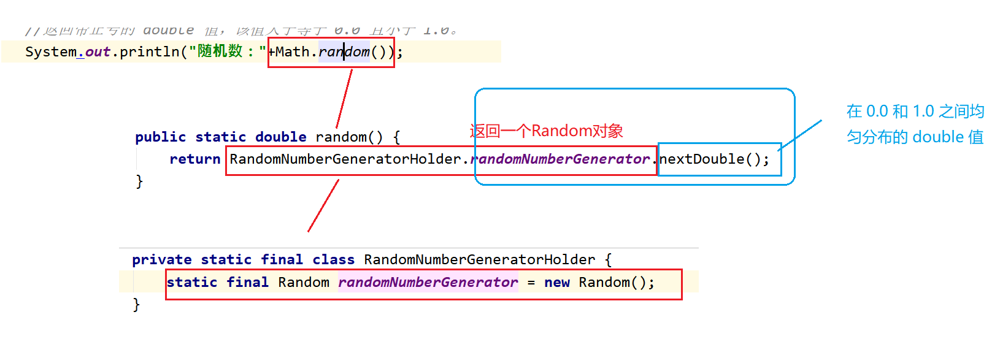
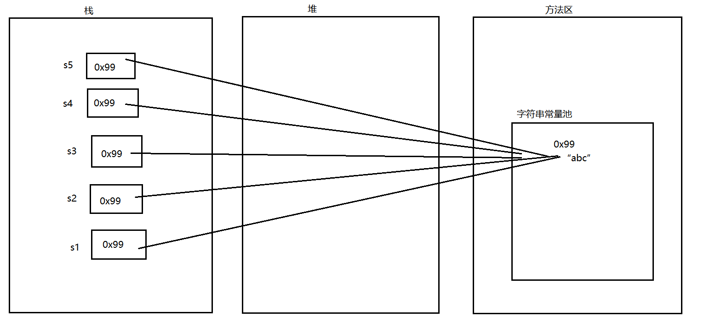
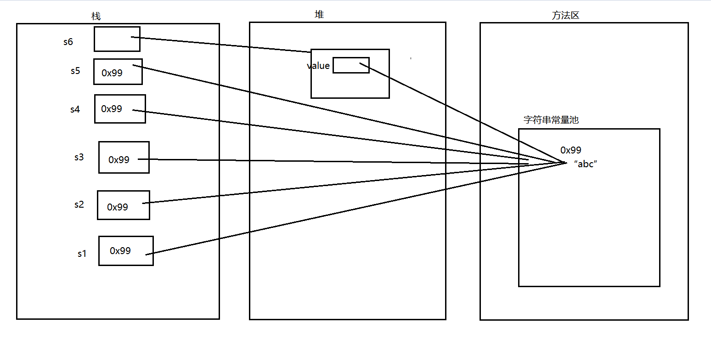
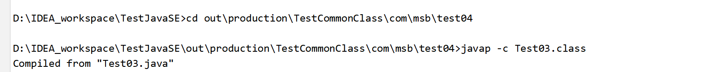
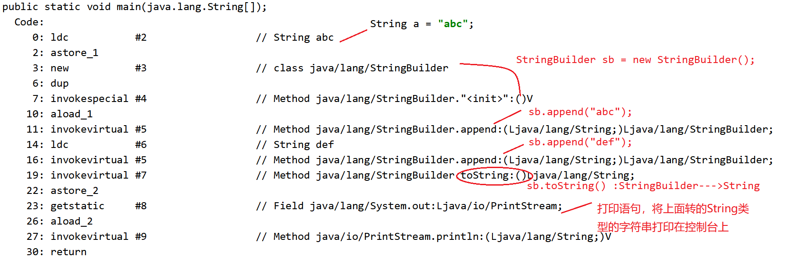
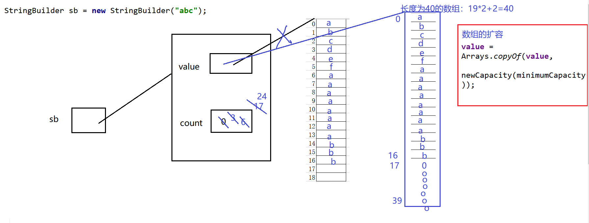
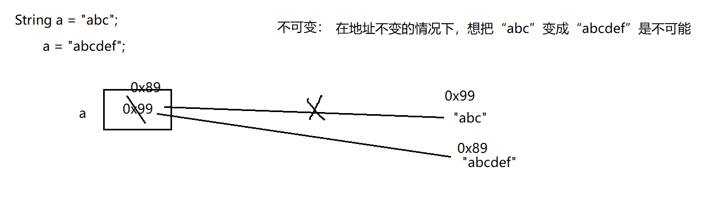

# 常用类
## 包装类
### 什么是包装类
以前定义变量，经常使用基本数据类型，
对于基本数据类型来说，它就是一个数，加点属性，加点方法，加点构造器，
将基本数据类型对应进行了一个封装，产生了一个新的类，--->包装类。
int,byte.....--->基本数据类型
包装类--->引用数据类型

### 对应关系：
| 基本数据类型 | 对应的包装类 | 继承关系             |
| ------------ | ------------ | -------------------- |
| byte         | Byte         | --->Number--->Object |
| short        | Short        | --->Number--->Object |
| int          | Integer      | --->Number--->Object |
| long         | Long         | --->Number--->Object |
| float        | Float        | --->Number--->Object |
| double       | Double       | --->Number--->Object |
| char         | Character    | Object               |
| boolean      | Boolean      | Object               |

### 已经有基本数据类型了，为什么要封装为包装类？
1. java语言 面向对象的语言，最擅长的操作各种各样的类。
2. 以前学习装数据的--->数组，`int[]`  `String[]`  `double[]`   `Student[]`
     以后学习的装数据的--->集合，有一个特点，只能装引用数据类型的数据


### 是不是有了包装类以后就不用基本数据类型了？
不是。

## Integer
### 基本常识
1. 在java.lang包下,直接使用，无需导包

2. 类的继承关系：
Integer --->Number--->Object

3. 实现接口：
Serializable,Comparable

4. 这个类被final修饰，那么这个类不能有子类，不能被继承：
5. 包装类是对基本数据类型的封装： 对int类型封装产生了Integer

### 常用属性
```java
    //属性：
    System.out.println(Integer.MAX_VALUE);
    System.out.println(Integer.MIN_VALUE);
    //“物极必反”原理：
    System.out.println(Integer.MAX_VALUE+1);
    System.out.println(Integer.MIN_VALUE-1);
```
### 构造器（发现没有空参构造器）

1. int类型作为构造器的参数：

`Integer i1 = new Integer(12);`
```java
public Integer(int value){  //传入int类型的数据
    this.value = value; //将传入的int类型的值给了底层封装的那个value
}
```

2. String类型作为构造器的参数：

`Integer i2 = new Integer("12");`
`Integer i3 = new Integer("abcdef");`
```java
public Integer(String s) throws NumberFormat Exception{//当传入的字符串没有办法转为int类型的时候会抛出异常
    this.value = parseInt(s);//将字符串转为int类型的数，然后赋值给底层value
}
```

### 自动装箱  自动拆箱
1. 自动装箱  自动拆箱 是从JDK1.5以后新出的特性
2. 自动装箱  自动拆箱 ：将基本数据类型和包装类进行快速的类型转换。
#### 代码实例
```java
    //自动装箱：int--->Integer
    Integer i = 12;
    System.out.println(i);
    //自动拆箱：Integer--->int
    Integer i2 = new Integer(12);
    int num = i2;
    System.out.println(num);
```
##### 测试
反编译工具验证：
```java
    Integer i = Integer.valueOf(12);
    System.out.println(i);

    Integer i2 = new Integer(12);
    int num = i2.intValue;
    System.out.println(num);
```
可以自定打断点测试是否走入valueOf方法中：
```java
public static Integer valueOf(int i){
    if(i >= IntegerCache.low && i<= IntegerCache.high)
        return IntegerCache.cache[i+(-IntegerCache.low)];
    return new Integer(i);
}
```

valueOf方法的底层：
```java
public static Integer valueOf(int i){
    if(i >= IntegerCache.low && i<= IntegerCache.high)//i在[-128,127]之间
        return IntegerCache.cache[i+(-IntegerCache.low)];//在cache数组中取值返回一个数
    return new Integer(i);//i不在[-128,127]则封装为Integer
}

private static class IntegerCache {//Integer内部类部分代码
        static final int low = -128;
        static final int high;
        static final Integer cache[];

        static {
            int h = 127;
            high = h;

            cache = new Integer[(high - low) + 1];//数组长度256
            int j = low;
            for(int k = 0; k < cache.length; k++)
                cache[k] = new Integer(j++);
        }
    }
```
cache数组
| 下标 | 0    | 1    | 2    | ... | 255 |
| ---- | ---- | ---- | ---- | --- | --- |
| 值   | -128 | -127 | -126 | ... | 127 |

### 常用方法：
代码实例：
```java
public class Test04 {
    public static void main(String[] args) {
        //compareTo：只返回三个值：要么是0,-1,1
        Integer i1 = new Integer(6);
        Integer i2 = new Integer(12);
        System.out.println(i1.compareTo(i2));// return (x < y) ? -1 : ((x == y) ? 0 : 1);
        //equals:Integer对Object中的equals方法进行了重写，比较的是底层封装的那个value的值。
        //Integer对象是通过new关键字创建的对象：
        Integer i3 = new Integer(12);
        Integer i4 = new Integer(12);
        System.out.println(i3 == i4);//false 因为==比较的是两个对象的地址
        boolean flag = i3.equals(i4);
        System.out.println(flag);
        //Integer对象通过自动装箱来完成：
        Integer i5 = 130;
        Integer i6 = 130;
        System.out.println(i5.equals(i6));//true
        System.out.println(i5 == i6);
        /*
        如果自动装箱值在-128~127之间，那么比较的就是具体的数值
        否则，比较的就是对象的地址
         */
        //intValue() :作用将Integer--->int
        Integer i7 = 130;
        int i = i7.intValue();
        System.out.println(i);
        //parseInt(String s) :String--->int:
        int i8 = Integer.parseInt("12");
        System.out.println(i8);
        //toString:Integer--->String
        Integer i10 = 130;
        System.out.println(i10.toString());
    }
}
```

## 日期相关的类
### java.util.Date
```java
import java.util.Date;
public class Test {
    public static void main(String[] args) {
        //java.util.Date:
        Date d = new Date();
        System.out.println(d);
        System.out.println(d.toString());
        System.out.println(d.toGMTString());//过期方法，过时方法，废弃方法。
        System.out.println(d.toLocaleString());
        System.out.println(d.getYear());//120+1900=2020
        System.out.println(d.getMonth());//5 :返回的值在 0 和 11 之间，值 0 表示 1 月。
        //返回自 1970 年 1 月 1 日 00:00:00 GMT 以来此 Date 对象表示的毫秒数。
        System.out.println(d.getTime());//1592055964263
        System.out.println(System.currentTimeMillis());
        /*
        （1）疑问：以后获取时间差用：getTime()还是currentTimeMillis()
        答案：currentTimeMillis()-->因为这个方法是静态的，可以类名.方法名直接调用
        （2）public static native long currentTimeMillis();
        本地方法 为什么没有方法体？因为这个方法的具体实现不是通过java写的。
        （3）这个方法的作用：
        一般会去衡量一些算法所用的时间
         */
        long startTime = System.currentTimeMillis();
        for (int i = 0; i < 100000; i++) {
            System.out.println(i);
        }
        long endTime = System.currentTimeMillis();
        System.out.println(endTime-startTime);
    }
}
```

### java.sql.Date
```java
import java.sql.Date;
public class Test02 {
    public static void main(String[] args) {
        //java.sql.Date:
        Date d = new Date(1592055964263L);
        System.out.println(d);
        /*
        (1)java.sql.Date和java.util.Date的区别：
        java.util.Date：年月日  时分秒
        java.sql.Date：年月日
        (2)java.sql.Date和java.util.Date的联系：
        java.sql.Date(子类) extends java.util.Date （父类）
         */
        //java.sql.Date和java.util.Date相互转换：
        //【1】util--->sql:
        java.util.Date date = new Date(1592055964263L);//创建util.Date的对象
        //方式1：向下转型
        Date date1 = (Date) date;
        /*
        父类：Animal 子类：Dog
        Animal an = new Dog();
        Dog d = (Dog)an;
         */
        //方式2：利用构造器
        Date date2 = new Date(date.getTime());
        //【2】sql-->util:
        java.util.Date date3 = d;
        //[3]String--->sql.Date:
        Date date4 =  Date.valueOf("2019-3-8");
    }
}
```
### SimpleDateFormat

#### String--->java.util.Date 类型转换
分解：
（1）String--->java.sql.Date
（2）java.sql.Date--->java.util.Date
```java
public class Test04 {
    public static void main(String[] args) {
        //（1）String--->java.sql.Date
        java.sql.Date date = java.sql.Date.valueOf("2015-9-24");
        //（2）java.sql.Date--->java.util.Date
        java.util.Date date2 = date;
        System.out.println(date2.toString());
    }
}
```
上面的代码有局限性，字符串的格式只能是年-月-日拼接的形式，换成其它类型，就会出现异常.
#### 引入新的类：SimpleDateFormat
```java
import java.text.DateFormat;
import java.text.ParseException;
import java.text.SimpleDateFormat;
import java.util.Date;
public class Test05 {

    public static void main(String[] args) {
        //日期转换：
        //SimpleDateFormat(子类) extends DateFormat（父类是一个抽象类）
        //格式化的标准已经定义好了：
        DateFormat df = new SimpleDateFormat("yyyy-MM-dd HH:mm:ss");
        //String--->Date
        try {
            Date d = df.parse("2019-4-6 12:23:54");
            System.out.println(d);
        } catch (ParseException e) {
            e.printStackTrace();
        }
        //Date--->String
        String format = df.format(new Date());
        System.out.println(format);
        Date date = new Date();
        System.out.println(date.toString());
        System.out.println(date.toGMTString());
        System.out.println(date.toLocaleString());
    }
}
```
#### 日期格式
| 字母 | 日期或时间元素           | 表示              | 示例                                  |
| ---- | ------------------------ | ----------------- | ------------------------------------- |
| G    | Era 标志符               | Text              | AD                                    |
| y    | 年                       | Year              | 1996; 96                              |
| M    | 年中的月份               | Month             | July; Jul; 07                         |
| w    | 年中的周数               | Number            | 27                                    |
| W    | 月份中的周数             | Number            | 2                                     |
| D    | 年中的天数               | Number            | 189                                   |
| d    | 月份中的天数             | Number            | 10                                    |
| F    | 月份中的星期             | Number            | 2                                     |
| E    | 星期中的天数             | Text              | Tuesday; Tue                          |
| a    | Am/pm 标记               | Text              | PM                                    |
| H    | 一天中的小时数（0-23）   | Number            | 0                                     |
| k    | 一天中的小时数（1-24）   | Number            | 24                                    |
| K    | am/pm 中的小时数（0-11） | Number            | 0                                     |
| h    | am/pm 中的小时数（1-12） | Number            | 12                                    |
| m    | 小时中的分钟数           | Number            | 30                                    |
| s    | 分钟中的秒数             | Number            | 55                                    |
| S    | 毫秒数                   | Number            | 978                                   |
| z    | 时区                     | General time zone | Pacific Standard Time; PST; GMT-08:00 |
| Z    | 时区                     | RFC 822 time zone | -0800                                 |

### Calendar
```java
import java.util.Calendar;
import java.util.GregorianCalendar;
public class Test06 {
    public static void main(String[] args) {
        //Calendar是一个抽象类，不可以直接创建对象
        //GregorianCalendar()子类 extends Calendar（父类是一个抽象类）
        Calendar cal = new GregorianCalendar();
        Calendar cal2 = Calendar.getInstance();
        System.out.println(cal);
        //常用的方法：
        // get方法，传入参数：Calendar中定义的常量
        System.out.println(cal.get(Calendar.YEAR));
        System.out.println(cal.get(Calendar.MONTH));
        System.out.println(cal.get(Calendar.DATE));
        System.out.println(cal.get(Calendar.DAY_OF_WEEK));
        System.out.println(cal.getActualMaximum(Calendar.DATE));//获取当月日期的最大天数
        System.out.println(cal.getActualMinimum(Calendar.DATE));//获取当月日期的最小天数
        // set方法：可以改变Calendar中的内容
        cal.set(Calendar.YEAR,1990);
        cal.set(Calendar.MONTH,3);
        cal.set(Calendar.DATE,16);
        System.out.println(cal);
        //String--->Calendar:
        //分解：
        //String--->java.sql.Date:
        java.sql.Date date = java.sql.Date.valueOf("2020-4-5");
        //java.sql.Date-->Calendar:
        cal.setTime(date);
        System.out.println(cal);
    }
}
```

#### 练习
```java
import java.util.Calendar;
import java.util.Scanner;
public class Test08 {
    public static void main(String[] args) {
        //录入日期的String：
        Scanner sc = new Scanner(System.in);
        System.out.print("请输入你想要查看的日期：（提示：请按照例如2012-5-6的格式书写）");
        String strDate = sc.next();
        /*System.out.println(strDate);*/
        //String--->Calendar:
        //String-->Date:
        java.sql.Date date = java.sql.Date.valueOf(strDate);
        //Date--->Calendar:
        Calendar cal = Calendar.getInstance();
        cal.setTime(date);
        //后续操作：
        //星期提示：
        System.out.println("日\t一\t二\t三\t四\t五\t六\t");
        //获取本月的最大天数：
        int maxDay = cal.getActualMaximum(Calendar.DATE);
        //获取当前日期中的日：
        int nowDay = cal.get(Calendar.DATE);
        //将日期调为本月的1号：
        cal.set(Calendar.DATE,1);
        //获取这个一号是本周的第几天：
        int num = cal.get(Calendar.DAY_OF_WEEK);
        /*System.out.println(num);*/
        //前面空出来的天数为：
        int day = num - 1;
        //引入一个计数器：
        int count = 0;//计数器最开始值为0
        //在日期前将空格打印出来：
        for (int i = 1; i <= day; i++) {
            System.out.print("\t");
        }
        //空出来的日子也要放入计数器：
        count = count + day;
        //遍历：从1号开始到maxDay号进行遍历：
        for (int i = 1; i <= maxDay ; i++) {
            if(i == nowDay){//如果遍历的i和当前日子一样的话，后面多拼一个*
                System.out.print(i+"*"+"\t");
            }else{
                System.out.print(i+"\t");
            }
            count++;//每在控制台输出一个数字，计数器做加1操作
            if(count%7 == 0){//当计数器的个数是7的倍数的时候，就换行操作
                System.out.println();
            }
        }
    }
}
```

### JDK1.8新增日期时间API
#### 引入
1. JDK1.0中使用java.util.Date类  -->第一批日期时间API
2. JDK1.1引入Calendar类   -->第二批日期时间API
   * 缺陷：
    可变性 : 像日期和时间这样的类应该是不可变的。
    偏移性 : Date中 的年份是从1900开始的，而月份都从0开始。
    格式化 : 格式化只对Date有用，Calendar则不行。

3. JDK1.8新增日期时间API -->第三批日期时间API
#### LocalDate/LocalTime/LocalDateTime
```java
import java.time.LocalDate;
import java.time.LocalDateTime;
import java.time.LocalTime;

public class Test09 {
    public static void main(String[] args) {
        //1.完成实例化：
        //方法1：now()--获取当前的日期，时间，日期+时间
        LocalDate localDate = LocalDate.now();
        System.out.println(localDate);
        LocalTime localTime = LocalTime.now();
        System.out.println(localTime);
        LocalDateTime localDateTime = LocalDateTime.now();
        System.out.println(localDateTime);
        //方法2：of()--设置指定的日期，时间，日期+时间
        LocalDate of = LocalDate.of(2010, 5, 6);
        System.out.println(of);
        LocalTime of1 = LocalTime.of(12, 35, 56);
        System.out.println(of1);
        LocalDateTime of2 = LocalDateTime.of(1890, 12, 23, 13, 24, 15);
        System.out.println(of2);
        //LocalDate,LocalTime用的不如LocalDateTime多
        //下面讲解用LocalDateTime：
        //一些列常用的get***
        System.out.println(localDateTime.getYear());//2020
        System.out.println(localDateTime.getMonth());//JUNE
        System.out.println(localDateTime.getMonthValue());//6
        System.out.println(localDateTime.getDayOfMonth());//14
        System.out.println(localDateTime.getDayOfWeek());//SUNDAY
        System.out.println(localDateTime.getHour());//22
        System.out.println(localDateTime.getMinute());//22
        System.out.println(localDateTime.getSecond());//6
        //不是set方法，叫with
        //体会：不可变性
        LocalDateTime localDateTime2 = localDateTime.withMonth(8);
        System.out.println(localDateTime);
        System.out.println(localDateTime2);
        //提供了加减的操作：
        //加：
        LocalDateTime localDateTime1 = localDateTime.plusMonths(4);
        System.out.println(localDateTime);
        System.out.println(localDateTime1);
        //减：
        LocalDateTime localDateTime3 = localDateTime.minusMonths(5);
        System.out.println(localDateTime);
        System.out.println(localDateTime3);
    }
}
```
#### DateTimeFormatter
```java
import java.time.LocalDateTime;
import java.time.format.DateTimeFormatter;
import java.time.format.FormatStyle;
import java.time.temporal.TemporalAccessor;

public class Test10 {
    public static void main(String[] args) {
        //格式化类：DateTimeFormatter
        //方式一:预定义的标准格式。如: ISO_LOCAL_DATE_TIME;ISO_LOCAL_DATE;IS0_LOCAL_TIME
        DateTimeFormatter df1 = DateTimeFormatter.ISO_LOCAL_DATE_TIME;
        //df1就可以帮我们完成LocalDateTime和String之间的相互转换：
        //LocalDateTime-->String:
        LocalDateTime now = LocalDateTime.now();
        String str = df1.format(now);
        System.out.println(str);//2020-06-15T15:02:51.29
        //String--->LocalDateTime
        TemporalAccessor parse = df1.parse("2020-06-15T15:02:51.29");
        System.out.println(parse);
        //方式二:本地化相关的格式。如: oflocalizedDateTime()
        //参数：FormatStyle.LONG / FormatStyle.MEDIUM / FormatStyle.SHORT
        //FormatStyle.LONG :2020年6月15日 下午03时17分13秒
        //FormatStyle.MEDIUM: 2020-6-15 15:17:42
        //FormatStyle.SHORT:20-6-15 下午3:18
        DateTimeFormatter df2 = DateTimeFormatter.ofLocalizedDateTime(FormatStyle.SHORT);
        //LocalDateTime-->String:
        LocalDateTime now1 = LocalDateTime.now();
        String str2 = df2.format(now1);
        System.out.println(str2);
        //String--->LocalDateTime
        TemporalAccessor parse1 = df2.parse("20-6-15 下午3:18");
        System.out.println(parse1);
        //方式三: 自定义的格式。如: ofPattern( "yyyy-MM-dd hh:mm:ss") --->重点，以后常用
        DateTimeFormatter df3 = DateTimeFormatter.ofPattern("yyyy-MM-dd hh:mm:ss");
        //LocalDateTime-->String:
        LocalDateTime now2 = LocalDateTime.now();
        String format = df3.format(now2);
        System.out.println(format);//2020-06-15 03:22:03
        //String--->LocalDateTime
        TemporalAccessor parse2 = df3.parse("2020-06-15 03:22:03");
        System.out.println(parse2);
    }
}
```

### Math类
1. 直接使用，无需导包：
2. final修饰类，这个类不能被继承：
3. 构造器私有化，不能创建Math类的对象：
4. Math内部的所有的属性，方法都被static修饰：类名.直接调用，无需创建对象：
5. 常用方法：
```java
public class Test01 {
    public static void main(String[] args) {
        //常用属性：
        System.out.println(Math.PI);
        //常用方法：
        System.out.println("随机数："+Math.random());//[0.0,1.0)
        System.out.println("绝对值："+Math.abs(-80));
        System.out.println("向上取值："+Math.ceil(9.1));
        System.out.println("向下取值："+Math.floor(9.9));
        System.out.println("四舍五入："+Math.round(3.5));
        System.out.println("取大的那个值："+Math.max(3, 6));
        System.out.println("取小的那个值："+Math.min(3, 6));
    }
}
```
6. 静态导入：
```java
//静态导入：
import static java.lang.Math.*;
public class Test01 {
    public static void main(String[] args) {
        //常用属性：
        System.out.println(PI);
        //常用方法：
        System.out.println("随机数："+random());//[0.0,1.0)
        System.out.println("绝对值："+abs(-80));
        System.out.println("向上取值："+ceil(9.1));
        System.out.println("向下取值："+floor(9.9));
        System.out.println("四舍五入："+round(3.5));
        System.out.println("取大的那个值："+max(3, 6));
        System.out.println("取小的那个值："+min(3, 6));
    }
    //如果跟Math中方法重复了，那么会优先走本类中的方法（就近原则）
    public static int random(){
        return 100;
    }
}
```

### Random类
```java
import java.util.Random;
public class Test02 {
    public static void main(String[] args) {
        //返回带正号的 double 值，该值大于等于 0.0 且小于 1.0。
        System.out.println("随机数："+Math.random());
        //学习Random类
        //（1）利用带参数的构造器创建对象：
        Random r1 = new Random(System.currentTimeMillis());
        int i = r1.nextInt();
        System.out.println(i);
        //（2）利用空参构造器创建对象：
        Random r2 = new Random();//表面是在调用无参数构造器，实际底层还是调用了带参构造器
        System.out.println(r2.nextInt(10));//在 0（包括）和指定值（不包括）之间均匀分布的 int 值。
        System.out.println(r2.nextDouble());//在 0.0 和 1.0 之间均匀分布的 double 值。
    }
}
```


### String类
1. 在java.lang包下，直接使用，无需导包。
2. `String str = “abc”;`
>"abc"就是String类下的一个具体的对象
3. 字符串是不可变的
4. 被final修饰，这个String类不可以被继承，不能有子类。
5. String底层是一个char类型的数组

#### 常用方法
1. 构造器：底层就是给对象底层的value数组进行赋值操作。
```java
    //通过构造器来创建对象：
    String s1 = new String();
    String s2 = new String("abc");
    String s3 = new String(new char[]{'a','b','c'});
```
3. 常用方法：
```java
    String s4 = "abc";
    System.out.println("字符串的长度为："+s4.length());
    String s5 = new String("abc");
    System.out.println("字符串是否为空："+s5.isEmpty());
    System.out.println("获取字符串的下标对应的字符为："+s5.charAt(1));
```

4. equals:
```java
    String s6 = new String("abc");
    String s7 = new String("abc");
    System.out.println(s6.equals(s7));
```
* 源码分析
```java
  public boolean equals(Object anObject) {
    //比较传入对象的地址是否相等，如果相等返回true
    if (this == anObject) {
        return true;
    }
    //如果地址不相等继续比较字符串的内容（instanceof是判断传入的参数是不是String的实例）
    if (anObject instanceof String) {
        String anotherString = (String)anObject;//向下转型为String
        int n = value.length;
        
        if (n == anotherString.value.length) {//判断当前字符数组长度是否等于入参的字符数组长
            char v1[] = value;
            char v2[] = anotherString.value;
            int i = 0;
            while (n-- != 0) {//对数组进行遍历，按位比较
                if (v1[i] != v2[i])
                    return false;
                i++;
            }
            return true;
        }
    }
    return false;
}
```

5. String类实现了Comparable，里面有一个抽象方法叫compareTo，所以String中一定要对这个方法进行重写：
```java
    String s8 = new String("abc");
    String s9 = new String("abc");
    System.out.println(s8.compareTo(s9));
```

```java
public int compareTo(String anotherString) {
        int len1 = value.length;
        int len2 = anotherString.value.length;
        int lim = Math.min(len1, len2);//获取2个字符串的长度, 并把最短的字符串长度作为循环的次数 (这样可以避免数组越界的异常)
        char v1[] = value;
        char v2[] = anotherString.value;

        int k = 0;// 用k记录比较的索引
        while (k < lim) {
            char c1 = v1[k];
            char c2 = v2[k];
            if (c1 != c2) {//把2个字符串从0开始遍历, 比较每一个字符, 若字符不相等时, 则返回两个字符串的差值
                return c1 - c2;
            }
            k++;//如果字符相等, 则让索引加1
        }
        return len1 - len2;//如果遍历的字符串都相等时, 则返回两个字符串的长度差
    }
```
| s8       | "abc"           | "abc"      | "abc" | "abc"    |
| -------- | --------------- | ---------- | ----- | -------- |
| s9       | "accdef"        | "abcdef"   | "abc" | "abf"    |
| 返回结果 | bc的ASCII差值-1 | 长度差值-3 | 0     | cf的差值 |

6. 常用方法：
```java
    //字符串的截取：
    String s10 = "abcdefhijk";
    System.out.println(s10.substring(3));
    System.out.println(s10.substring(3, 6));//[3,6)
    //字符串的合并/拼接操作：
    System.out.println(s10.concat("pppp"));
    //字符串中的字符的替换：
    String s11 = "abcdeahija";
    System.out.println(s11.replace('a', 'u'));
    //按照指定的字符串进行分裂为数组的形式：
    String s12 = "a-b-c-d-e-f";
    String[] strs = s12.split("-");
    System.out.println(Arrays.toString(strs));
    //转大小写的方法：
    String s13 = "abc";
    System.out.println(s13.toUpperCase());
    System.out.println(s13.toUpperCase().toLowerCase());
    //去除收尾空格：
    String s14 = "    a  b  c    ";
    System.out.println(s14.trim());
    //toString()
    String s15 = "abc";
    System.out.println(s15.toString());
    //转换为String类型：
    System.out.println(String.valueOf(false));
```
#### 内存分析
1. 字符串拼接：
```java
public class Test02 {
    
    public static void main(String[] args) {
        String s1 = "a"+"b"+"c";
        String s2 = "ab"+"c";
        String s3 = "a"+"bc";
        String s4 = "abc";
        String s5 = "abc"+"";
    }
}
```
上面的字符串，会进行编译器优化，直接合并成为完整的字符串，我们可以反编译验证：
```java
public class Test02 {
    public static void main(String[] args) {
        String s1 = "abc";
        String s2 = "abc";
        String s3 = "abc";
        String s4 = "abc";
        String s5 = "abc";
    }
}
```
然后在常量池中，常量池的特点是第一次如果没有这个字符串，就放进去，如果有这个字符串，就直接从常量池中取：

内存：


2. new关键字创建对象：
`String s6 = new String("abc");`
内存：开辟两个空间（1.字符串常量池中的字符串 2.堆中的开辟的空间）


3. 有变量参与的字符串拼接：
```java
public class Test03 {    
    public static void main(String[] args) {
        String a = "abc";
        String b = a + "def";
        System.out.println(b);
    }
}
```
a变量在编译的时候不知道a是“abc”字符串，所以不会进行编译期优化，不会直接合并为“abcdef”

反汇编过程：为了更好的帮我分析字节码文件是如何进行解析的：
利用控制台：



### StringBuilder类
1. 字符串的分类：
（1）不可变字符串：String
（2）可变字符串：StringBuilder，StringBuffer

2. StringBuilder底层：非常重要的两个属性：
`char[] value` value就是StringBuilder的底层存储
`int count`count指的是value数组中被使用的长度

3. 对应内存分析：
```java
public class Test01 {
    public static void main(String[] args) {
        //创建StringBuilder的对象：
        StringBuilder sb3 = new StringBuilder();
        //表面上调用StringBuilder的空构造器，实际底层是对value数组进行初始化，长度为16
        StringBuilder sb2 = new StringBuilder(3);
        //表面上调用StringBuilder的有参构造器，传入一个int类型的数，实际底层就是对value数组进行初始化，长度为你传入的数字
        StringBuilder sb = new StringBuilder("abc");
        System.out.println(sb.append("def").append("aaaaaaaa").append("bbb").append("ooooooo").toString());//链式调用方式：return this
    }
}
```


#### 可变与不可变
1. String--->不可变


2. StringBuilder--->可变
可变，在StringBuilder这个对象的地址不变的情况下，想把“abc”变成“abcdef”是可能的，直接追加即可
```java
public class Test02 {    
    public static void main(String[] args) {
        StringBuilder sb = new StringBuilder();
        System.out.println(sb.append("abc")==sb.append("def"));//true
    }
}
```

#### StringBuilder和StringBuffer常用方法
1. StringBuilder常用方法：
```java
public class Test03 {    
    public static void main(String[] args) {
        StringBuilder sb=new StringBuilder("nihaojavawodeshijie");
        //增
        sb.append("这是梦想");
        System.out.println(sb);//nihaojavawodeshijie这是梦想
        //删
        sb.delete(3, 6);//删除位置在[3,6)上的字符
        System.out.println(sb);//nihavawodeshijie这是梦想
        sb.deleteCharAt(16);//删除位置在16上的字符
        System.out.println(sb);//nihavawodeshijie是梦想
        //改-->插入
        StringBuilder sb1=new StringBuilder("$23445980947");
        sb1.insert(3, ",");//在下标为3的位置上插入 ,
        System.out.println(sb1);
        StringBuilder sb2=new StringBuilder("$2你好吗5980947");
        //改-->替换
        sb2.replace(3, 5, "我好累");//在下标[3,5)位置上插入字符串
        System.out.println(sb2);
        sb.setCharAt(3, '!');
        System.out.println(sb);
        //查
        StringBuilder sb3=new StringBuilder("asdfa");
        for (int i = 0; i < sb3.length(); i++) {
            System.out.print(sb3.charAt(i)+"\t");
        }
        System.out.println();
        //截取
        String str=sb3.substring(2,4);//截取[2,4)返回的是一个新的String，对StringBuilder没有影响
        System.out.println(str);
        System.out.println(sb3);
    }
}
```
2. StringBuffer常用方法：
```java
public class Test03 { 
    public static void main(String[] args) {
        StringBuffer sb=new StringBuffer("nihaojavawodeshijie");
        //增
        sb.append("这是梦想");
        System.out.println(sb);//nihaojavawodeshijie这是梦想
        //删
        sb.delete(3, 6);//删除位置在[3,6)上的字符
        System.out.println(sb);//nihavawodeshijie这是梦想
        sb.deleteCharAt(16);//删除位置在16上的字符
        System.out.println(sb);//nihavawodeshijie是梦想
        //改-->插入
        StringBuilder sb1=new StringBuilder("$23445980947");
        sb1.insert(3, ",");//在下标为3的位置上插入 ,
        System.out.println(sb1);
        StringBuilder sb2=new StringBuilder("$2你好吗5980947");
        //改-->替换
        sb2.replace(3, 5, "我好累");//在下标[3,5)位置上插入字符串
        System.out.println(sb2);
        sb.setCharAt(3, '!');
        System.out.println(sb);
        //查
        StringBuilder sb3=new StringBuilder("asdfa");
        for (int i = 0; i < sb3.length(); i++) {
            System.out.print(sb3.charAt(i)+"\t");
        }
        System.out.println();
        //截取
        String str=sb3.substring(2,4);//截取[2,4)返回的是一个新的String，对StringBuilder没有影响
        System.out.println(str);
        System.out.println(sb3);
    }
}
```

#### String、StringBuffer、StringBuilder区别与联系

1. String类是不可变类，即一旦一个String对象被创建后，包含在这个对象中的字符序列是不可改变的，直至这个对象销毁。

2. StringBuffer类则代表一个字符序列可变的字符串，可以通过append、insert、reverse、setChartAt、setLength等方法改变其内容。一旦生成了最终的字符串，调用toString方法将其转变为String

3. JDK1.5新增了一个StringBuilder类，与StringBuffer相似，构造方法和方法基本相同。不同是StringBuffer是线程安全的，而StringBuilder是线程不安全的，所以性能略高。通常情况下，创建一个内容可变的字符串，应该优先考虑使用StringBuilder
4. 总结

| 类名          | 开始时间   | 效率   | 线程安全   |
| ------------- | ---------- | ------ | ---------- |
| StringBuilder | JDK1.5开始 | 效率高 | 线程不安全 |
| StringBuffer  | JDK1.0开始 | 效率低 | 线程安全   |
