# 线程

1. 程序，进程，线程
   ➢ 程序(program)：是为完成特定任务、用某种语言编写的一组指令的集合,是一段静态的代码。 （程序是静态的）

➢ 进程(process)：是程序的一次执行过程。正在运行的一个程序，进程作为资源分配的单位，在内存中会为每个进程分配不同的内存区域。 （进程是动态的）是一个动的过程 ，进程的生命周期 : 有它自身的产生、存在和消亡的过程

➢ 线程(thread)，进程可进一步细化为线程， 是一个程序内部的一条执行路径。
若一个进程同一时间并行执行多个线程，就是支持多线程的。
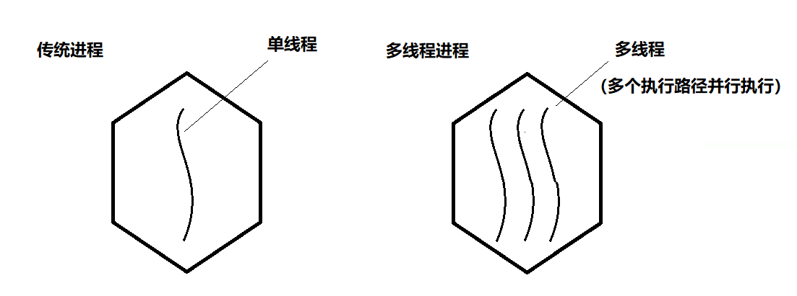

2. 单核 CPU 与多核 CPU 的任务执行：
   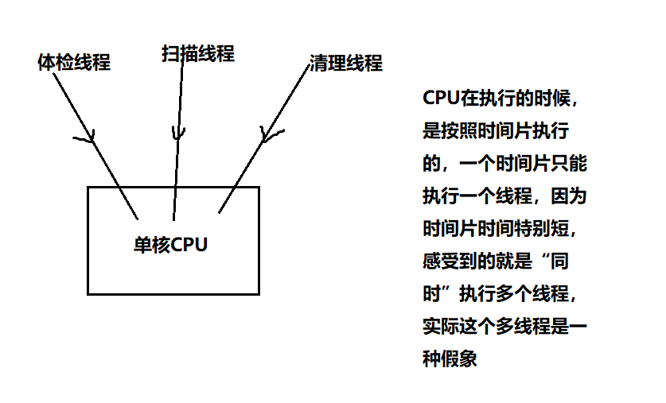
   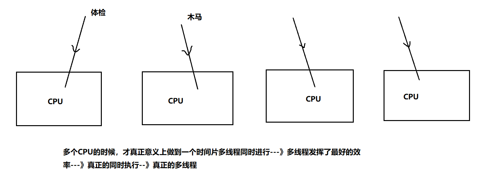

3. 并行和并发：
   并行：多个 CPU 同时执行多个任务
   并发：一个 CPU“同时”执行多个任务（采用时间片切换）

## 创建线程

1. 在学习多线程一章之前，以前的代码是单线程的吗？不是，以前也是有三个线程同时执行的。
   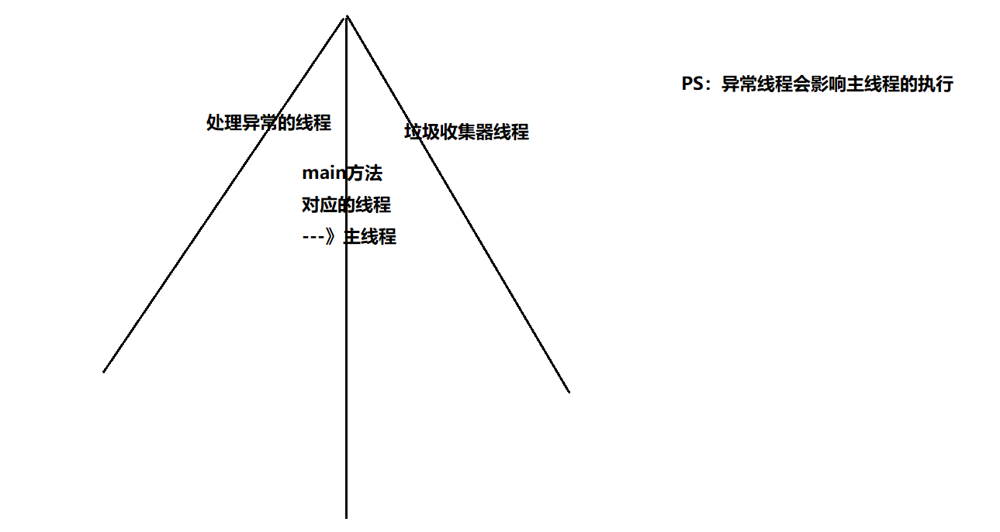
2. 现在我想自己制造多线程---》创建线程 ？？
   线程类--》线程对象
   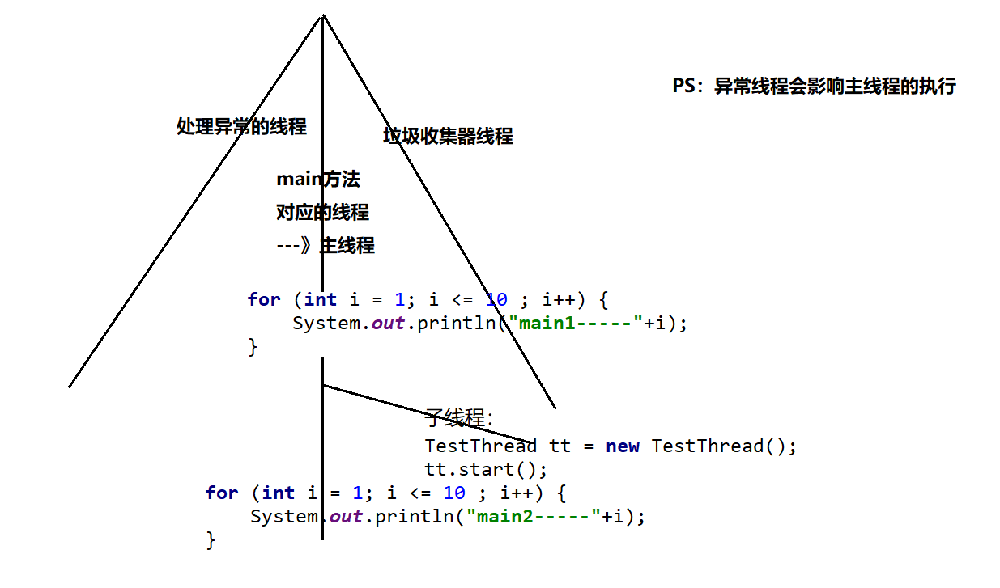

### 继承 Thread 类

```java
/**
 * 线程类叫：TestThread，不是说你名字中带线程单词你就具备多线程能力了（争抢资源能力）
 * 现在想要具备能力，继承一个类：Thread，具备了争抢资源的能力
 */
public class TestThread extends Thread{
    /*
    一会线程对象就要开始争抢资源了，这个线程要执行的任务到底是啥？这个任务你要放在方法中
    但是这个方法不能是随便写的一个方法，必须是重写Thread类中的run方法
    然后线程的任务/逻辑写在run方法中
     */
    @Override
    public void run() {
        //输出1-10
        for (int i = 1; i <= 10 ; i++) {
            System.out.println(i);
        }
    }
}
```

```java
/**
 * 测试类
 */
public class Test {
    public static void main(String[] args) {
        //主线程中也要输出十个数：
        for (int i = 1; i <= 10 ; i++) {
            System.out.println("main1-----"+i);
        }
        //制造其他线程，要跟主线程争抢资源：
        //具体的线程对象：子线程
        TestThread tt = new TestThread();
        //tt.run();//调用run方法，想要执行线程中的任务 -->这个run方法不能直接调用，直接调用就会被当做一个普通方法
        //想要tt子线程真正起作用比如要启动线程：
        tt.start();//start()是Thread类中的方法
        //主线程中也要输出十个数：
        for (int i = 1; i <= 10 ; i++) {
            System.out.println("main2-----"+i);
        }
    }
}
```

#### 设置读取线程名字

1. setName,getName 方法来进行设置读取：

```java
/**
 * 线程类叫：TestThread，不是说你名字中带线程单词你就具备多线程能力了（争抢资源能力）
 * 现在想要具备能力，继承一个类：Thread，具备了争抢资源的能力
 */
public class TestThread extends Thread{
    /*
    一会线程对象就要开始争抢资源了，这个线程要执行的任务到底是啥？这个任务你要放在方法中
    但是这个方法不能是随便写的一个方法，必须是重写Thread类中的run方法
    然后线程的任务/逻辑写在run方法中
     */
    @Override
    public void run() {
        //输出1-10
        for (int i = 1; i <= 10 ; i++) {
            System.out.println(this.getName()+i);
        }
    }
}
```

```java
/**
 * 测试类
 */
public class Test {
    public static void main(String[] args) {
        //给main方法这个主线程设置名字：
        //Thread.currentThread()作用获取当前正在执行的线程
        Thread.currentThread().setName("主线程");
        //主线程中也要输出十个数：
        for (int i = 1; i <= 10 ; i++) {
            System.out.println(Thread.currentThread().getName()+"1-------"+i);
        }
        //制造其他线程，要跟主线程争抢资源：
        //具体的线程对象：子线程
        TestThread tt = new TestThread();
        tt.setName("子线程");
        //tt.run();//调用run方法，想要执行线程中的任务 -->这个run方法不能直接调用，直接调用就会被当做一个普通方法
        //想要tt子线程真正起作用比如要启动线程：
        tt.start();//start()是Thread类中的方法
        //主线程中也要输出十个数：
        for (int i = 1; i <= 10 ; i++) {
            System.out.println(Thread.currentThread().getName()+"2-------"+i);
        }
    }
}
```

2. 通过构造器设置 名字：

```java
/**
 * 线程类叫：TestThread，不是说你名字中带线程单词你就具备多线程能力了（争抢资源能力）
 * 现在想要具备能力，继承一个类：Thread，具备了争抢资源的能力
 */
public class TestThread extends Thread{
    public TestThread(String name){
        super(name);//调用父类的有参构造器
    }
    /*
    一会线程对象就要开始争抢资源了，这个线程要执行的任务到底是啥？这个任务你要放在方法中
    但是这个方法不能是随便写的一个方法，必须是重写Thread类中的run方法
    然后线程的任务/逻辑写在run方法中
     */
    @Override
    public void run() {
        //输出1-10
        for (int i = 1; i <= 10 ; i++) {
            System.out.println(this.getName()+i);
        }
    }
}
```

#### 练习：买火车票

1. 原理：每个窗口都是一个线程对象：
   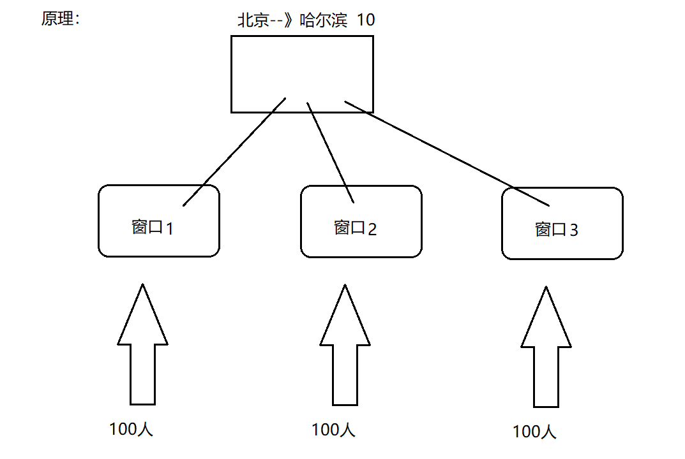

2. 代码：

```java
public class BuyTicketThread extends Thread {
    public BuyTicketThread(String name){
        super(name);
    }
    //一共10张票：
    static int ticketNum = 10;//多个对象共享10张票
    //每个窗口都是一个线程对象：每个对象执行的代码放入run方法中
    @Override
    public void run() {
        //每个窗口后面有100个人在抢票：
        for (int i = 1; i <= 100 ; i++) {
            if(ticketNum > 0){//对票数进行判断，票数大于零我们才抢票
                System.out.println("我在"+this.getName()+"买到了从北京到哈尔滨的第" + ticketNum-- + "张车票");
            }
        }
    }
}
```

```java
public class Test {
    public static void main(String[] args) {
        //多个窗口抢票：三个窗口三个线程对象：
        BuyTicketThread t1 = new BuyTicketThread("窗口1");
        t1.start();
        BuyTicketThread t2 = new BuyTicketThread("窗口2");
        t2.start();
        BuyTicketThread t3 = new BuyTicketThread("窗口3");
        t3.start();
    }
}
```

### 实现 Runable 接口

1. 代码：

```java
/**
 * TestThread实现了这个接口，才会变成一个线程类
 */
public class TestThread implements Runnable{
    @Override
    public void run() {
        //输出1-10数字：
        for (int i = 1; i <= 10 ; i++) {
            System.out.println(Thread.currentThread().getName()+"----"+i);
        }
    }
}
```

```java
public class Test {
    public static void main(String[] args) {
        //创建子线程对象：
        TestThread tt = new TestThread();
        Thread t = new Thread(tt,"子线程");
        t.start();
        //主线程里面也是打印1-10数字：
        for (int i = 1; i <= 10 ; i++) {
            System.out.println(Thread.currentThread().getName()+"---"+i);
        }
    }
}
```

#### 练习：买火车票

1. 代码：

```java
public class BuyTicketThread implements Runnable {
    int ticketNum = 10;
    @Override
    public void run() {
        for (int i = 1; i <= 100 ; i++) {
            if(ticketNum > 0){
                System.out.println("我在"+Thread.currentThread().getName()+"买到了北京到哈尔滨的第" + ticketNum-- + "张车票");
            }
        }
    }
}
```

```java
public class Test {
    public static void main(String[] args) {
        //定义一个线程对象：
        BuyTicketThread t = new BuyTicketThread();
        //窗口1买票：
        Thread t1 = new Thread(t,"窗口1");
        t1.start();
        //窗口2买票：
        Thread t2 = new Thread(t,"窗口2");
        t2.start();
        //窗口3买票：
        Thread t3 = new Thread(t,"窗口3");
        t3.start();
    }
}
```

### Thread 类 Runnable 接口

1. 实际开发中，方式 1 继承 Thread 类 还是 方式 2 实现 Runnable 接口这种方式多呢？--》方式 2

（1）方式 1 的话有 Java 单继承的局限性，因为继承了 Thread 类，就不能再继承其它的类了
（2）方式 2 的共享资源的能力也会强一些，不需要非得加个 static 来修饰

2. Thread 类 Runnable 接口 有联系吗？
   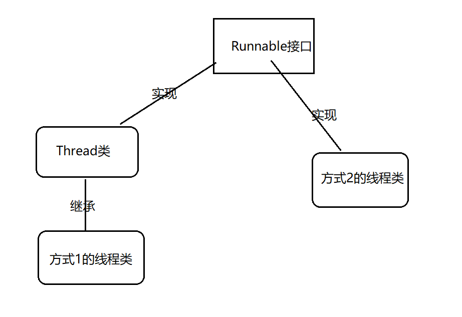

### 实现 Callable 接口

基于上面的两个不足，在 JDK1.5 以后出现了第三种创建线程的方式：实现 Callable 接口：

实现 Callable 接口好处：（1）有返回值 （2）能抛出异常
缺点：线程创建比较麻烦

```java
import java.util.Random;
import java.util.concurrent.Callable;
import java.util.concurrent.ExecutionException;
import java.util.concurrent.FutureTask;
public class TestRandomNum implements Callable<Integer> {
    /*
    1.实现Callable接口，可以不带泛型，如果不带泛型，那么call方式的返回值就是Object类型
    2.如果带泛型，那么call的返回值就是泛型对应的类型
    3.从call方法看到：方法有返回值，可以抛出异常
     */
    @Override
    public Integer call() throws Exception {
        return new Random().nextInt(10);//返回10以内的随机数
    }
}
class Test{
    public static void main(String[] args) throws ExecutionException, InterruptedException {
        //定义一个线程对象：
        TestRandomNum trn = new TestRandomNum();
        FutureTask ft = new FutureTask(trn);
        Thread t = new Thread(ft);
        t.start();
        //获取线程得到的返回值：
        Object obj = ft.get();
        System.out.println(obj);
    }
}
```

> `FutureTask`是`Runnable`接口的实现类

## 线程的生命周期

1. 线程声明周期：线程开始--》线程消亡
2. 线程经历哪些阶段：
   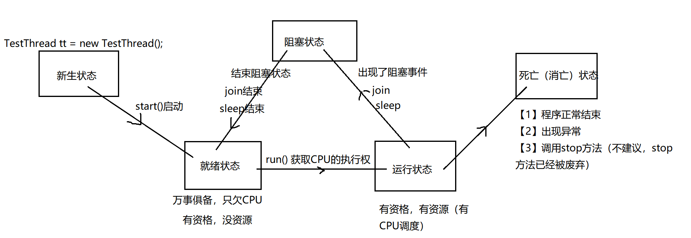

## 线程的常见方法

（1）start() : 启动当前线程，表面上调用 start 方法，实际在调用线程里面的 run 方法
（2）run() : 线程类 继承 Thread 类 或者 实现 Runnable 接口的时候，都要重新实现这个 run 方法，run 方法里面是线程要执行的内容
（3）currentThread :Thread 类中一个静态方法：获取当前正在执行的线程
（4）setName 设置线程名字
（5）getName 读取线程名字

### 设置优先级

1. 同优先级别的线程，采取的策略就是先到先服务，使用时间片策略
2. 如果优先级别高，被 CPU 调度的概率就高
3. 级别：1-10 默认的级别为 5

```java
public final static int MIN_PRIORITY = 1;
public final static int NORM_PRIORITY = 5;
public final static int MAX_PRIORITY = 10;
```

4. 代码：

```java
public class TestThread01 extends Thread {
    @Override
    public void run() {
        for (int i = 1; i <= 10; i++) {
            System.out.println(i);
        }
    }
}
class TestThread02 extends Thread{
    @Override
    public void run() {
        for (int i = 20; i <= 30 ; i++) {
            System.out.println(i);
        }
    }
}
class Test{
    public static void main(String[] args) {
        //创建两个子线程，让这两个子线程争抢资源：
        TestThread01 t1 = new TestThread01();
        t1.setPriority(10);//优先级别高
        t1.start();
        TestThread02 t2 = new TestThread02();
        t2.setPriority(1);//优先级别低
        t2.start();
    }
}
```

### join 方法

join 方法：当一个线程调用了 join 方法，这个线程就会先被执行，它执行结束以后才可以去执行其余的线程。
注意：必须先 start，再 join 才有效。

```java
public class TestThread extends Thread {
    public TestThread(String name){
        super(name);
    }
    @Override
    public void run() {
        for (int i = 1; i <= 10 ; i++) {
            System.out.println(this.getName()+"----"+i);
        }
    }
}
class Test{
    public static void main(String[] args) throws InterruptedException {
        for (int i = 1; i <= 100 ; i++) {
            System.out.println("main-----"+i);
            if(i == 6){
                //创建子线程：
                TestThread tt = new TestThread("子线程");
                tt.start();
                tt.join();//“半路杀出个程咬金”
            }
        }
    }
}
```

### sleep 方法

1. sleep : 人为的制造阻塞事件

```java
public class Test01 {
    public static void main(String[] args) {
        try {
            Thread.sleep(3000);
        } catch (InterruptedException e) {
            e.printStackTrace();
        }
        System.out.println("00000000000000");
    }
}
```

2. 案例：完成秒表功能：

```java
import javafx.scene.input.DataFormat;
import java.text.DateFormat;
import java.text.SimpleDateFormat;
import java.util.Date;
public class Test02 {
    public static void main(String[] args) {
        //2.定义一个时间格式：
        DateFormat df = new SimpleDateFormat("HH:mm:ss");
        while(true){
            //1.获取当前时间：
            Date d = new Date();
            //3.按照上面定义的格式将Date类型转为指定格式的字符串：
            System.out.println(df.format(d));
            try {
                Thread.sleep(1000);
            } catch (InterruptedException e) {
                e.printStackTrace();
            }
        }
    }
}
```

### 设置伴随线程

将子线程设置为主线程的伴随线程，主线程停止的时候，子线程也不要继续执行了
案例：皇上 --》驾崩 ---》妃子陪葬

```java
public class TestThread extends Thread {
    @Override
    public void run() {
        for (int i = 1; i <= 1000 ; i++) {
            System.out.println("子线程----"+i);
        }
    }
}
class Test{
    public static void main(String[] args) {
        //创建并启动子线程：
        TestThread tt = new TestThread();
        tt.setDaemon(true);//设置伴随线程  注意：先设置，再启动
        tt.start();
        //主线程中还要输出1-10的数字：
        for (int i = 1; i <= 10 ; i++) {
            System.out.println("main---"+i);
        }
    }
}
```

### stop 方法

```java
public class Demo {
    public static void main(String[] args) {
        for (int i = 1; i <= 100 ; i++) {
            if(i == 6){
                Thread.currentThread().stop();//过期方法，不建议使用
            }
            System.out.println(i);
        }
    }
}
```

## 线程安全问题

问题：
（1）出现了两个 10 张票或者 3 个 10 张票
原因分析：`ticketNum--`分为两个操作`ticketNum`、`--`
例如：
线程 1:我在窗口 1 买到了北京-哈尔滨火车票，最后第 10 张车票，还没等--，被线程 2 抢走了资源
线程 2:我在窗口 2 买到了北京-哈尔滨火车票，最后第 10 张车票，还没等--，被线程 3 抢走了资源
线程 3:我在窗口 3 买到了北京-哈尔滨火车票，最后第 10 张车票，执行了--，票数 9
线程 1:又抢到了资源，执行--，票数 8
线程 2:又抢到了资源，执行--，票数 7
...

（2）出现 0，-1，-2 可能
原因分析：
例如：
...
线程 1:我在窗口 1 买到了北京-哈尔滨火车票，最后第 1 张车票，还没等--，被线程 2 抢走了资源
线程 2:我在窗口 2 买到了北京-哈尔滨火车票，被线程 3 抢走了资源
线程 3:我在窗口 3 买到了北京-哈尔滨火车票，被线程 1 抢走了资源
线程 1:执行--，票数 0
线程 2:第 0 张票，执行--，票数-1
线程 3:第-1 张嫖，执行--，票数-2

- 问题：出现了 重票，错票，---》 线程安全引起的问题
- 原因：多个线程，在争抢资源的过程中，导致共享的资源出现问题。一个线程还没执行完，另一个线程就参与进来了，开始争抢。
- 解决：在我的程序中，加入“锁” --》加同步 --》同步监视器

### 解决方法：同步代码块

1. 同步代码块演示 1：

```java
public class BuyTicketThread implements Runnable {
    int ticketNum = 10;
    @Override
    public void run() {
        //此处有1000行代码
        for (int i = 1; i <= 100 ; i++) {
            synchronized (this){//把具有安全隐患的代码锁住即可，如果锁多了就会效率低 --》this就是这个锁
                if(ticketNum > 0){
                    System.out.println("我在"+Thread.currentThread().getName()+"买到了北京到哈尔滨的第" + ticketNum-- + "张车票");
                }
            }
        }
        //此处有1000行代码
    }
}
```

2. 同步代码块演示 2：

```java
public class BuyTicketThread extends Thread {
    public BuyTicketThread(String name){
        super(name);
    }
    //一共10张票：
    static int ticketNum = 10;//多个对象共享10张票
    //每个窗口都是一个线程对象：每个对象执行的代码放入run方法中
    @Override
    public void run() {
        //每个窗口后面有100个人在抢票：
        for (int i = 1; i <= 100 ; i++) {
            synchronized (BuyTicketThread.class){//锁必须多个线程用的是同一把锁！！！
                if(ticketNum > 0){//对票数进行判断，票数大于零我们才抢票
                    System.out.println("我在"+this.getName()+"买到了从北京到哈尔滨的第" + ticketNum-- + "张车票");
                }
            }
        }
    }
}
```

3. 同步监视器总结：

- 认识同步监视器（锁） ----- `synchronized(同步监视器){ }`

  - 1)必须是引用数据类型，不能是基本数据类型
  - 2)也可以创建一个专门的同步监视器，没有任何业务含义
  - 3)一般使用共享资源做同步监视器即可
  - 4)在同步代码块中不能改变同步监视器对象的引用
  - 5)尽量不要 String 和包装类 Integer 做同步监视器
  - 6)建议使用 final 修饰同步监视器

- 同步代码块的执行过程
  - 1)第一个线程来到同步代码块，发现同步监视器 open 状态，需要 close,然后执行其中的代码
  - 2)第一个线程执行过程中，发生了线程切换（阻塞 就绪），第一个线程失去了 cpu，但是没有开锁 open
  - 3)第二个线程获取了 cpu，来到了同步代码块，发现同步监视器 close 状态，无法执行其中的代码，第二个线程也进入阻塞状态
  - 4)第一个线程再次获取 CPU,接着执行后续的代码；同步代码块执行完毕，释放锁 open
  - 5)第二个线程也再次获取 cpu，来到了同步代码块，发现同步监视器 open 状态，拿到锁并且上锁，由阻塞状态进入就绪状态，再进入运行状态，重复第一个线程的处理过程（加锁）

> 强调：同步代码块中能发生 CPU 的切换,但是后续的被执行的线程也无法执行同步代码块（因为锁仍旧 close）

- 其他
  - 1)多个代码块使用了同一个同步监视器（锁），锁住一个代码块的同时，也锁住所有使用该锁的所有代码块，其他线程无法访问其中的任何一个代码块
  - 2)多个代码块使用了同一个同步监视器（锁），锁住一个代码块的同时，也锁住所有使用该锁的所有代码块， 但是没有锁住使用其他同步监视器的代码块，其他线程有机会访问其他同步监视器的代码块

### 解决方法：同步方法

1. 代码展示：

```java
public class BuyTicketThread implements Runnable {
    int ticketNum = 10;
    @Override
    public void run() {
        // 此处有 1000 行代码
        for (int i = 1; i <= 100; i++) {
            buyTicket();
        }
        // 此处有 1000 行代码
    }
    public synchronized void buyTicket() {// 锁住的是 this
        if (ticketNum > 0) {
            System.out.println("我在" + Thread.currentThread().getName() + "买到了北京到哈尔滨的第" + ticketNum-- + "张车票");
        }
    }
}
```

```java
public class BuyTicketThread extends Thread {
    public BuyTicketThread(String name) {
        super(name);
    }
    // 一共 10 张票：
    static int ticketNum = 10;// 多个对象共享 10 张票
    // 每个窗口都是一个线程对象：每个对象执行的代码放入 run 方法中
    @Override
    public void run() {
        // 每个窗口后面有 100 个人在抢票：
        for (int i = 1; i <= 100; i++) {
            buyTicket();
        }
    }
    public static synchronized void buyTicket() {// 锁住的同步监视器： BuyTicketThread.class
        if (ticketNum > 0) {// 对票数进行判断，票数大于零我们才抢票
            System.out.println("我在" + Thread.currentThread().getName() + "买到了从北京到哈尔滨的第" + ticketNum-- + "张车票");
        }
    }
}
```

2. 总结：

- 锁
  多线程在争抢资源，就要实现线程的同步（就要进行加锁，并且这个锁必须是共享的，必须是唯一的。
  咱们的锁一般都是引用数据类型的。

  > 目的：解决了线程安全问题。

- 同步方法

  1. 不要将 run()定义为同步方法
  2. 非静态同步方法的同步监视器是 this
     静态同步方法的同步监视器是 类名.class 字节码信息对象
  3. 同步代码块的效率要高于同步方法
     原因：同步方法是将线程挡在了方法的外部，而同步代码块锁将线程挡在了代码块的外部，但是却是方法的内部
  4. 同步方法的锁是 this，一旦锁住一个方法，就锁住了所有的同步方法；同步代码块只是锁住使用该同步监视器的代码块，而没有锁住使用其他监视器的代码块

### 解决方法：Lock 锁

1. Lock 锁引入：
   JDK1.5 后新增新一代的线程同步方式:Lock 锁
   与采用 synchronized 相比，lock 可提供多种锁方案，更灵活

synchronized 是 Java 中的关键字，这个关键字的识别是靠 JVM 来识别完成的呀。是虚拟机级别的。
但是 Lock 锁是 API 级别的，提供了相应的接口和对应的实现类，这个方式更灵活，表现出来的性能优于之前的方式。

2. 代码演示：

```java

import java.util.concurrent.locks.Lock;
import java.util.concurrent.locks.ReentrantLock;

public class BuyTicketThread implements Runnable {
    int ticketNum = 10;
    // 拿来一把锁：
    Lock lock = new ReentrantLock();// 多态 接口=实现类 可以使用不同的实现类

    @Override
    public void run() {
        // 此处有 1000 行代码
        for (int i = 1; i <= 100; i++) {
            // 打开锁：
            lock.lock();
            try {
                if (ticketNum > 0) {
                    System.out.println("我在" + Thread.currentThread().getName() + "买到了北京到哈尔滨的第" + ticketNum-- + "张车票");
                }
            } catch (Exception ex) {
                ex.printStackTrace();
            } finally {
                // 关闭锁：--->即使有异常，这个锁也可以得到释放
                lock.unlock();
            }
        }
        // 此处有 1000 行代码
    }
}
```

3.  Lock 和 synchronized 的区别

        1.Lock是显式锁（手动开启和关闭锁，别忘记关闭锁），synchronized是隐式锁
        2.Lock只有代码块锁，synchronized有代码块锁和方法锁
        3.使用Lock锁，JVM将花费较少的时间来调度线程，性能更好。并且具有更好的扩展性（提供更多的子类）

4.  优先使用顺序：

        Lock----同步代码块（已经进入了方法体，分配了相应资源）----同步方法（在方法体之外）

### 线程同步的优缺点

1. 对比：
   线程安全，效率低
   线程不安全，效率高

2. 可能造成死锁：
   死锁

> 不同的线程分别占用对方需要的同步资源不放弃，都在等待对方放弃自己需要的同步资源，就形成了线程的死锁
> 出现死锁后，不会出现异常，不会出现提示，只是所有的线程都处于阻塞状态，无法继续

3. 代码演示：

```java
public class TestDeadLock implements Runnable {
    public int flag = 1;
    static Object o1 = new Object(),o2 = new Object();


    public void run(){
        System.out.println("flag=" + flag);
        // 当flag==1锁住o1
        if (flag == 1) {
            synchronized (o1) {
                try {
                    Thread.sleep(500);
                } catch (Exception e) {
                    e.printStackTrace();
                }
                // 只要锁住o2就完成
                synchronized (o2) {
                    System.out.println("2");
                }
            }
        }
        // 如果flag==0锁住o2
        if (flag == 0) {
            synchronized (o2) {
                try {
                    Thread.sleep(500);
                } catch (Exception e) {
                    e.printStackTrace();
                }
                // 只要锁住o1就完成
                synchronized (o1) {
                    System.out.println("3");
                }
            }
        }
    }


    public static void main(String[] args) {
        // 实例2个线程类
        TestDeadLock td1 = new TestDeadLock();
        TestDeadLock td2 = new TestDeadLock();
        td1.flag = 1;
        td2.flag = 0;
        // 开启2个线程
        Thread t1 = new Thread(td1);
        Thread t2 = new Thread(td2);
        t1.start();
        t2.start();
    }
}
```

4. 解决方法： 减少同步资源的定义，避免嵌套同步

## 线程通信问题

应用场景：生产者和消费者问题
假设仓库中只能存放一件产品，生产者将生产出来的产品放入仓库，消费者将仓库中产品取走消费
如果仓库中没有产品，则生产者将产品放入仓库，否则停止生产并等待，直到仓库中的产品被消费者取走为止
如果仓库中放有产品，则消费者可以将产品取走消费，否则停止消费并等待，直到仓库中再次放入产品为止


代码结果展示：

```
我是生产者，生产了费列罗-----巧克力
我是消费者，我买了费列罗巧克力
我是生产者，生产了哈尔滨-----啤酒
我是消费者，我买了哈尔冰啤酒
我是生产者，生产了费列罗-----巧克力
我是消费者，我买了费列罗巧克力
我是生产者，生产了哈尔滨-----啤酒
我是消费者，我买了哈尔冰啤酒我是生产者，生产了费列罗-----巧克力
我是消费者，我买了费列罗巧克力
我是生产者，生产了哈尔滨-----啤酒
我是消费者，我买了哈尔冰啤酒
```

代码：

1. 商品：属性：品牌，名字
2. 线程 1：生产者
3. 线程 2：消费者

### 分解

#### 第一步

代码：
定义商品类

```java
public class Product {// 商品类
    // 品牌
    private String brand;
    // 名字
    private String name;

    // setter,getter 方法；
    public String getBrand() {
        return brand;
    }

    public void setBrand(String brand) {
        this.brand = brand;
    }

    public String getName() {
        return name;
    }

    public void setName(String name) {
        this.name = name;
    }
}
```

生产者线程

```java
public class ProducerThread extends Thread {// 生产者线程
    // 共享商品：
    private Product p;

    public ProducerThread(Product p) {
        this.p = p;
    }

    @Override
    public void run() {
        for (int i = 1; i <= 10; i++) {// 生产十个商品 i:生产的次数
            if (i % 2 == 0) {
                // 生产费列罗巧克力
                p.setBrand("费列罗");
                try {
                    Thread.sleep(100);
                } catch (InterruptedException e) {
                    e.printStackTrace();
                }
                p.setName("巧克力");
            } else {
                // 生产哈尔滨啤酒
                p.setBrand("哈尔滨");
                try {
                    Thread.sleep(100);
                } catch (InterruptedException e) {
                    e.printStackTrace();
                }
                p.setName("啤酒");
            }
            // 将生产信息做一个打印：
            System.out.println("生产者生产了：" + p.getBrand() + "---" + p.getName());
        }
    }
}
```

消费者线程

```java
public class CustomerThread extends Thread {// 消费者线程
    // 共享商品：
    private Product p;

    public CustomerThread(Product p) {
        this.p = p;
    }

    @Override
    public void run() {
        for (int i = 1; i <= 10; i++) {// i:消费次数
            System.out.println("消费者消费了：" + p.getBrand() + "---" + p.getName());
        }
    }
}
```

主函数

```java
public class Test {
    public static void main(String[] args) {
        // 共享的商品：
        Product p = new Product();
        // 创建生产者和消费者线程：
        ProducerThread pt = new ProducerThread(p);
        CustomerThread ct = new CustomerThread(p);
        pt.start();
        ct.start();
    }
}
```

出现问题： 1.生产者和消费者没有交替输出 2.打印数据错乱
哈尔滨 - null
费列罗啤酒
哈尔滨巧克力
----没有加同步

#### 第二步

1. 利用同步代码块解决问题：

```java

public class ProducerThread extends Thread {// 生产者线程
    // 共享商品：
    private Product p;

    public ProducerThread(Product p) {
        this.p = p;
    }

    @Override
    public void run() {
        for (int i = 1; i <= 10; i++) {// 生产十个商品 i:生产的次数
            synchronized (p) {
                if (i % 2 == 0) {
                    // 生产费列罗巧克力
                    p.setBrand("费列罗");
                    try {
                        Thread.sleep(100);
                    } catch (InterruptedException e) {
                        e.printStackTrace();
                    }
                    p.setName("巧克力");
                } else {
                    // 生产哈尔滨啤酒
                    p.setBrand("哈尔滨");
                    try {
                        Thread.sleep(100);
                    } catch (InterruptedException e) {
                        e.printStackTrace();
                    }
                    p.setName("啤酒");
                }
                // 将生产信息做一个打印：
                System.out.println("生产者生产了：" + p.getBrand() + "---" + p.getName());
            }
        }
    }
}
```

```java

public class CustomerThread extends Thread {// 消费者线程
    // 共享商品：
    private Product p;

    public CustomerThread(Product p) {
        this.p = p;
    }

    @Override
    public void run() {
        for (int i = 1; i <= 10; i++) {// i:消费次数
            synchronized (p) {
                System.out.println("消费者消费了：" + p.getBrand() + "---" + p.getName());
            }
        }
    }
}
```

2. 利用同步方法解决问题：

```java

public class Product {// 商品类
    // 品牌
    private String brand;
    // 名字
    private String name;

    // setter,getter 方法；
    public String getBrand() {
        return brand;
    }

    public void setBrand(String brand) {
        this.brand = brand;
    }

    public String getName() {
        return name;
    }

    public void setName(String name) {
        this.name = name;
    }

    // 生产商品
    public synchronized void setProduct(String brand, String name) {
        this.setBrand(brand);
        try {
            Thread.sleep(100);
        } catch (InterruptedException e) {
            e.printStackTrace();
        }
        this.setName(name);
        // 将生产信息做一个打印：
        System.out.println("生产者生产了：" + this.getBrand() + "---" + this.getName());
    }

    // 消费商品：
    public synchronized void getProduct() {
        System.out.println("消费者消费了：" + this.getBrand() + "---" + this.getName());
    }
}
```

```java

public class CustomerThread extends Thread {// 消费者线程
    // 共享商品：
    private Product p;

    public CustomerThread(Product p) {
        this.p = p;
    }

    @Override
    public void run() {
        for (int i = 1; i <= 10; i++) {// i:消费次数
            p.getProduct();
            ;
        }
    }
}

public class ProducerThread extends Thread {// 生产者线程
    // 共享商品：
    private Product p;

    public ProducerThread(Product p) {
        this.p = p;
    }

    @Override
    public void run() {
        for (int i = 1; i <= 10; i++) {// 生产十个商品 i:生产的次数
            if (i % 2 == 0) {
                p.setProduct("费列罗", "巧克力");
            } else {
                p.setProduct("哈尔滨", "啤酒");
            }
        }
    }
}
```

3. 依然存在问题：
数据没有交错

#### 第三步

1. 原理：
   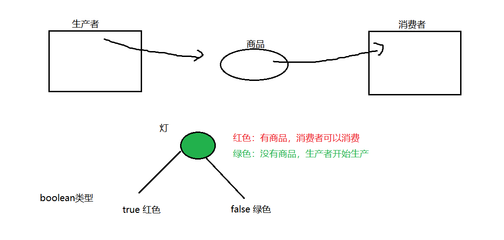

2. 代码：

```java

public class Product {// 商品类
    // 品牌
    private String brand;
    // 名字
    private String name;
    // 引入一个灯：true:红色 false 绿色
    boolean flag = false;// 默认情况下没有商品 让生产者先生产 然后消费者再消费
    // setter,getter 方法；

    public String getBrand() {
        return brand;
    }

    public void setBrand(String brand) {
        this.brand = brand;
    }

    public String getName() {
        return name;
    }

    public void setName(String name) {
        this.name = name;
    }

    // 生产商品
    public synchronized void setProduct(String brand, String name) {
        if (flag == true) {// 灯是红色，证明有商品，生产者不生产，等着消费者消费
            try {
                wait();
            } catch (InterruptedException e) {
                e.printStackTrace();
            }
        }
        // 灯是绿色的，就生产：
        this.setBrand(brand);
        try {
            Thread.sleep(100);
        } catch (InterruptedException e) {
            e.printStackTrace();
        }
        this.setName(name);
        // 将生产信息做一个打印：
        System.out.println("生产者生产了：" + this.getBrand() + "---" + this.getName());
        // 生产完以后，灯变色：变成红色：
        flag = true;
        // 告诉消费者赶紧来消费：
        notify();
    }

    // 消费商品：
    public synchronized void getProduct() {
        if (!flag) {// flag == false 没有商品，等待生产者生产：
            try {
                wait();
            } catch (InterruptedException e) {
                e.printStackTrace();
            }
        }
        // 有商品，消费：
        System.out.println("消费者消费了：" + this.getBrand() + "---" + this.getName());
        // 消费完：灯变色：
        flag = false;
        // 通知生产者生产：
        notify();
    }
}
```

3. 原理：
在Java对象中，有两种池：
锁池-----synchronized
等待吃-----wait(),notify(),notifyAll()
如果一个线程调用了某个对象的wait方法，那么该贤臣刚进入到该对象的等待池中(并且已经将锁释放),如果味来的某一时刻，另一个贤臣该调用了相同对象的notify方法或者notifyAll方法，那么该等待池中的线程就会被唤起，然后进入到对象的锁池中去获得该兑现大哥锁，如果获取锁成功后，那么该线程就会沿着wait方法之后的路径继续执行，主义是沿着wait方法之后。

注意：wait 方法和 notify 方法 是必须放在同步方法或者同步代码块中才生效的 （因为在同步的基础上进行线程的通信才是有效的）
注意：sleep 和 wait 的区别：sleep 进入阻塞状态没有释放锁，wait 进入阻塞状态但是同时释放了锁 4. 线程生命周期完整图：
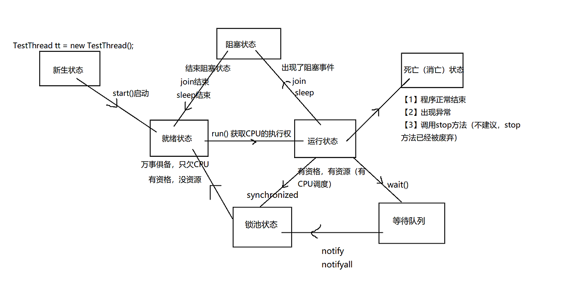

### Lock 锁下的线程通信

Condition 是在 Java 1.5 中才出现的，它用来替代传统的 Object 的 wait()、notify()实现线程间的协作，相比使用 Object 的 wait()、notify()，使用 Condition1 的 await()、signal()这种方式实现线程间协作更加安全和高效。

它的更强大的地方在于：能够更加精细的控制多线程的休眠与唤醒。对于同一个锁，我们可以创建多个 Condition，在不同的情况下使用不同的 Condition

一个 Condition 包含一个等待队列。一个 Lock 可以产生多个 Condition，所以可以有多个等待队列。

在 Object 的监视器模型上，一个对象拥有一个同步队列和等待队列，而 Lock（同步器）拥有一个同步队列和多个等待队列。

Object 中的 wait(),notify(),notifyAll()方法是和"同步锁"(synchronized 关键字)捆绑使用的；而 Condition 是需要与"互斥锁"/"共享锁"捆绑使用的。

调用 Condition 的 await()、signal()、signalAll()方法，都必须在 lock 保护之内，就是说必须在 lock.lock()和 lock.unlock 之间才可以使用

- Conditon 中的 await()对应 Object 的 wait()；
- Condition 中的 signal()对应 Object 的 notify()；
- Condition 中的 signalAll()对应 Object 的 notifyAll()。

void await() throws InterruptedException

造成当前线程在接到信号或被中断之前一直处于等待状态。

与此 Condition 相关的锁以原子方式释放，并且出于线程调度的目的，将禁用当前线程，且在发生以下四种情况之一 以前，当前线程将一直处于休眠状态：

- 其他某个线程调用此 Condition 的 signal() 方法，并且碰巧将当前线程选为被唤醒的线程；或者
- 其他某个线程调用此 Condition 的 signalAll() 方法；或者
- 其他某个线程中断当前线程，且支持中断线程的挂起；或者
- 发生“虚假唤醒”

在所有情况下，在此方法可以返回当前线程之前，都必须重新获取与此条件有关的锁。在线程返回时，可以保证它保持此锁。

void signal()

唤醒一个等待线程。

如果所有的线程都在等待此条件，则选择其中的一个唤醒。在从 await 返回之前，该线程必须重新获取锁。

void signalAll()

唤醒所有等待线程。

如果所有的线程都在等待此条件，则唤醒所有线程。在从 await 返回之前，每个线程都必须重新获取锁。

更改代码：
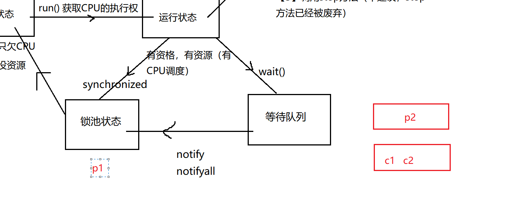

```java

import java.util.concurrent.locks.Condition;
import java.util.concurrent.locks.Lock;
import java.util.concurrent.locks.ReentrantLock;

public class Product {// 商品类
    // 品牌
    private String brand;
    // 名字
    private String name;
    // 声明一个Lock锁：
    Lock lock = new ReentrantLock();
    // 搞一个生产者的等待队列：
    Condition produceCondition = lock.newCondition();
    // 搞一个消费者的等待队列：
    Condition consumeCondition = lock.newCondition();
    // 引入一个灯：true:红色 false 绿色
    boolean flag = false;// 默认情况下没有商品 让生产者先生产 然后消费者再消费
    // setter,getter方法；

    public String getBrand() {
        return brand;
    }

    public void setBrand(String brand) {
        this.brand = brand;
    }

    public String getName() {
        return name;
    }

    public void setName(String name) {
        this.name = name;
    }

    // 生产商品
    public void setProduct(String brand, String name) {
        lock.lock();
        try {
            if (flag == true) {// 灯是红色，证明有商品，生产者不生产，等着消费者消费
                try {
                    // wait();
                    // 生产者阻塞，生产者进入等待队列中
                    produceCondition.await();
                } catch (InterruptedException e) {
                    e.printStackTrace();
                }
            }
            // 灯是绿色的，就生产：
            this.setBrand(brand);
            try {
                Thread.sleep(100);
            } catch (InterruptedException e) {
                e.printStackTrace();
            }
            this.setName(name);
            // 将生产信息做一个打印：
            System.out.println("生产者生产了：" + this.getBrand() + "---" + this.getName());
            // 生产完以后，灯变色：变成红色：
            flag = true;
            // 告诉消费者赶紧来消费：
            // notify();
            consumeCondition.signal();
        } finally {
            lock.unlock();
        }
    }

    // 消费商品：
    public void getProduct() {
        lock.lock();
        try {
            if (!flag) {// flag == false没有商品，等待生产者生产：
                try {
                    // wait();
                    // 消费者等待，消费者线程进入等待队列：
                    consumeCondition.await();
                } catch (InterruptedException e) {
                    e.printStackTrace();
                }
            }
            // 有商品，消费：
            System.out.println("消费者消费了：" + this.getBrand() + "---" + this.getName());
            // 消费完：灯变色：
            flag = false;
            // 通知生产者生产：
            // notify();
            produceCondition.signal();
        } finally {
            lock.unlock();
        }
    }
}
```
