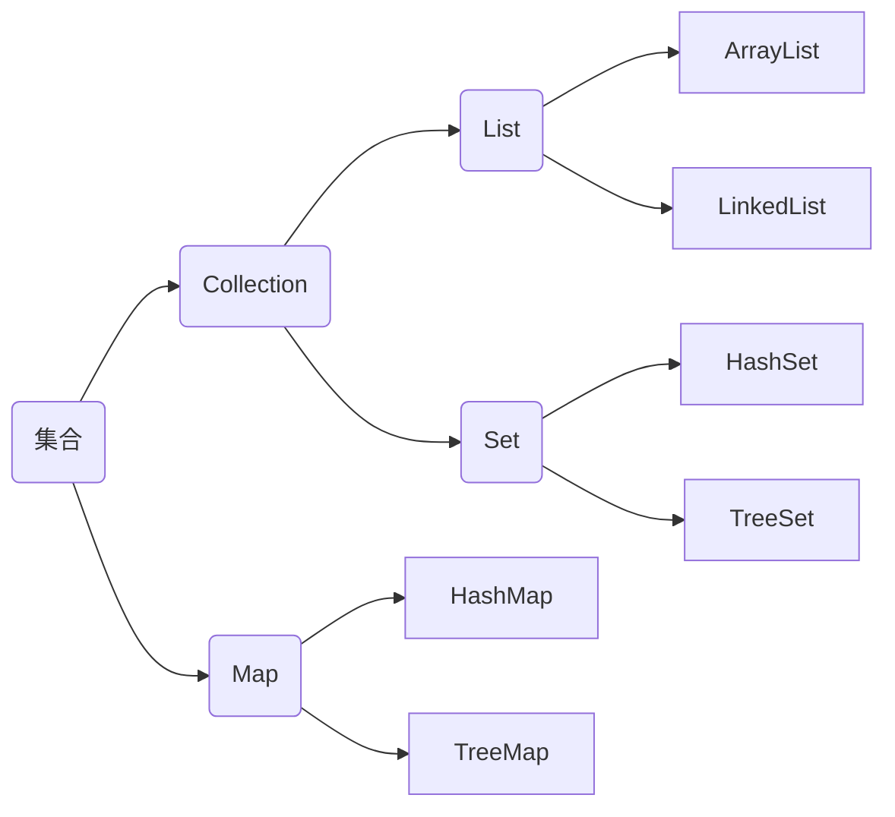
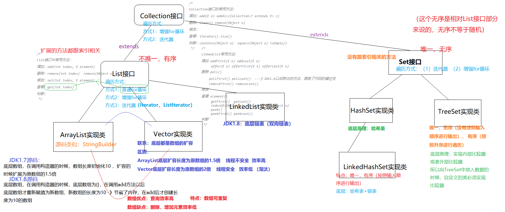
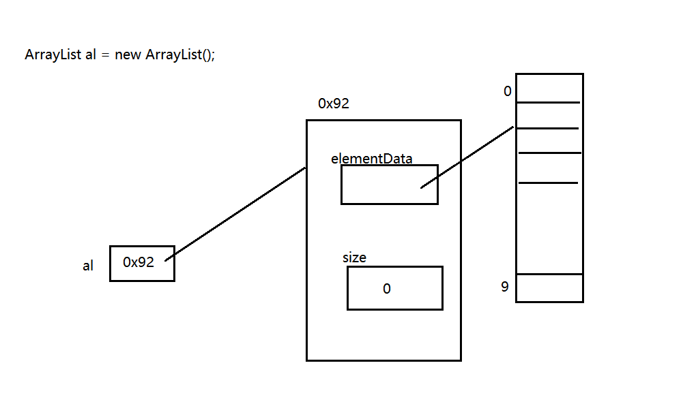
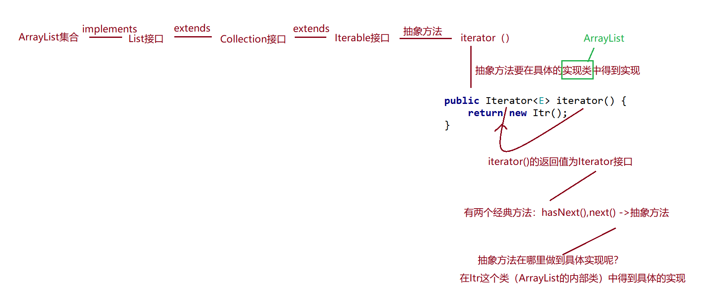
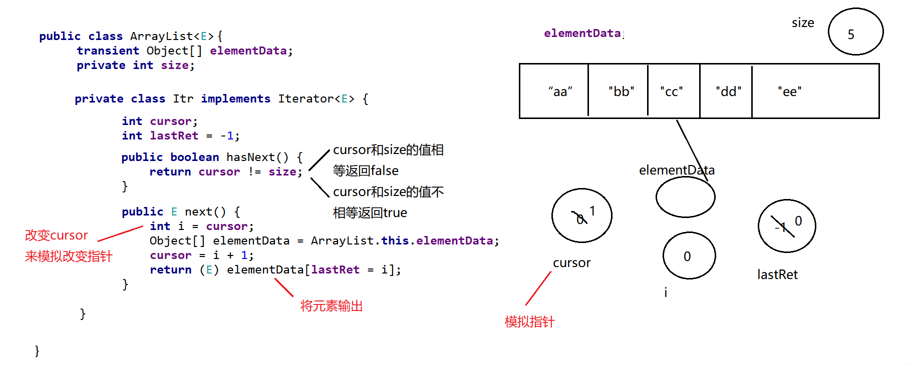
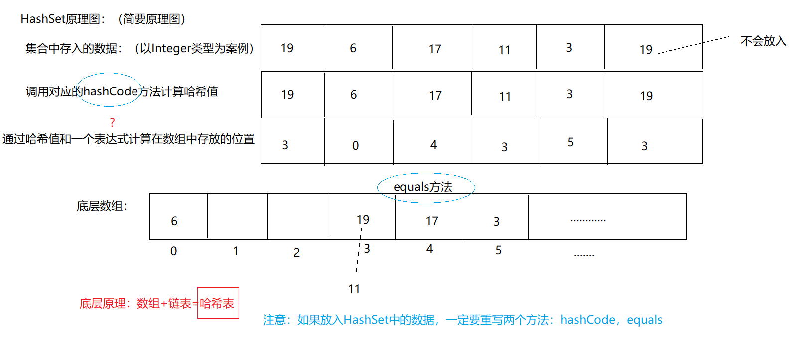
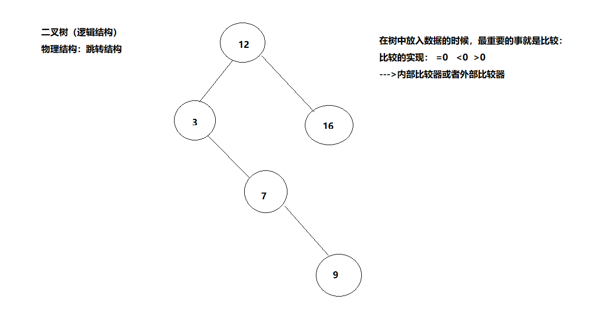
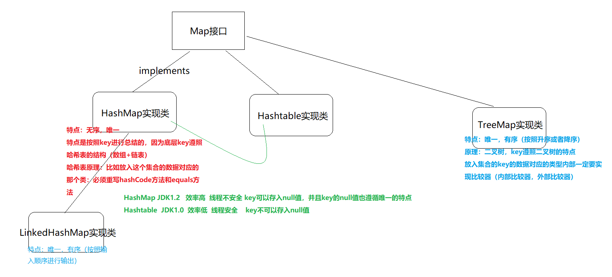
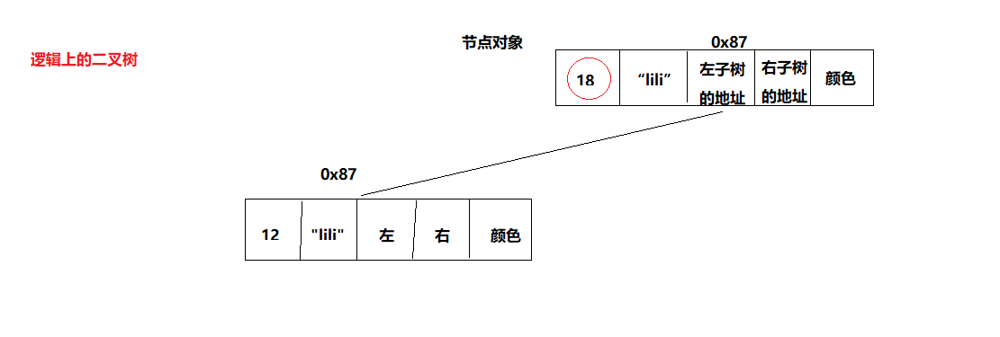
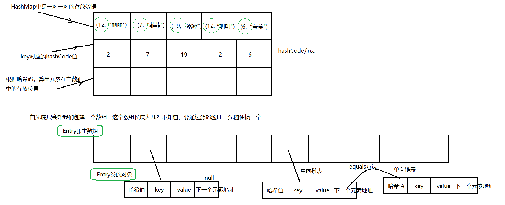

# 集合

## 数据结构简介

### 算法

(1)可以解决具体问题 :例如 1+2+3+4+。。。+99+100
解题流程=算法
(2)有设计解决的具体的流程
算法 1： 1+2=3 3+3=6 6+4=10.....加到 100 --》5050
算法 2：(1+100)*50=101*50=5050-->高斯算法
(3)有评价这个算法的具体的指标 --》时间复杂度 空间复杂度(从数学角度考虑)

### 数据结构

数据结构就是在计算机的缓存，内存，硬盘 如何组织管理数据的。重点在结构上，是按照什么结构来组织管理我们的数据。
数据结构分为：
(1)逻辑结构 ：--》思想上的结构--》卧室，厨房，卫生间 ---》线性表(数组，链表)，图，树，栈，队列
(2)物理结构 ：--》真实结构--》钢筋混凝土+牛顿力学------》紧密结构(顺序结构)，跳转结构(链式结构)

#### 紧密结构(顺序结构)，跳转结构(链式结构)

以线性表为例：
线性表的逻辑结构如图所示：

线性表特点：

线性表是 n 个类型相同数据元素的有限序列，通常记作 a0,a1,,,ai-1,ai,ai+1,,,,,an-1)。

1. 相同数据类型

在线性表的定义中,我们看到从 a0 到 an-1 的 n 个数据元素是具有相同属件的亓素。比如说可以都是数字,例如(12,23,45,56,45);也可以是宇符,例如(A,B,....Z).当然也可以是具有更复杂结构的数据元素,例如学生、商品、装备等。相同数据类型意味着在内存中存储时,每个元素会占用相同的内存空间,便于后续的查询定位。

2. 序列(顺序性)

在线性表的相邻数据元素之间存在若序偶关系，即 ai-1 是 ai 的直接前驱,则 ai 是 ai-1 的直接后续,同时 ai 又是 ai+1 的直接前驱，ai+1 是 ai 的直接后续。唯一没有直接前驱的元素 a0 一端称为表头,唯一没有后续的元素 an-1 一端称为表尾。除了表头和表尾元素外,任何一个元素都有且仅有一个直接前驱和直接后继。

3. 有限

线件表中数据元素的个数 n 定义为线性表的长度, n 是个有限值。当 n=0 时线性表为空表，在非空的线性表中每个数据元索在线性表中都有唯一确定的序号，例如 a0 的序号是 0 ,ai 的序号是 i。在一个具有 n>0 个数据元素的线性表中,数据元素序号的范围是[O, n-1]。

##### 逻辑结构和物理结构的关系：

- 线性表逻辑结构，对应的真实结构如果是紧密结构---》典型就是 数组：
  - 优点：寻址快---》查找元素快
  - 缺点：删除和增加元素效率低
- 线性表逻辑结构，对应的真实结构如果是跳转结构---》典型就是 链表：
  - 优点：删除元素，插入元素效率高
  - 缺点：查询元素效率低

## 集合引入

1. 数组，集合都是对多个数据进行存储操作的，简称为容器。

   > 这里的存储指的是内存层面的存储，而不是持久化存储(.txt,.avi,.jpg,数据库)。

2. 数组：特点：
   (1)数组一旦指定了长度，那么长度就被确定了，不可以更改。
   int[] arr = new int[6];
   (2)数组一旦声明了类型以后，数组中只能存放这个类型的数据。数组中只能存放同一种类型的数据。
   int[] arr,String[] s,double[] d.....

3. 数组：缺点：
   (1)数组一旦指定了长度，那么长度就被确定了，不可以更改。
   (2)删除，增加元素 效率低。
   (3)数组中实际元素的数量是没有办法获取的，没有提供对应的方法或者属性来获取
   (4)数组存储：有序，可重复 ，对于无序的，不可重复的数组不能满足要求。

4. 正因为上面的缺点，引入了一个新的存储数据的结构---》集合

5. 集合一章我们会学习很多集合，为什么要学习这么多集合呢？
   因为不同集合底层数据结构不一样。集合不一样，特点也不一样

6. 集合有哪些应用？
   前后端的数据交互：京东商城的商品展示，邮箱的收件箱。。。

### 简要集合结构图



- Collection：一个一个数据地存储
  > Collection 是接口，List 和 Set 是子接口，下面是实现类
- Map：一对一对数据地存储

## Collection 接口

### 结构图



### Collection 常用方法

```java
import java.util.ArrayList;
import java.util.Arrays;
import java.util.Collection;
import java.util.List;

public class Test01 {
    public static void main(String[] args) {
        /*
        Collection接口的常用方法：
        增加：add(E e) addAll(Collection<? extends E> c)
        删除：clear() remove(Object o)
        修改：
        查看：iterator() size()
        判断：contains(Object o)  equals(Object o) isEmpty()
         */
        //创建对象：接口不能创建对象，利用实现类创建对象：
        Collection col = new ArrayList();
        //调用方法：
        //集合有一个特点：只能存放引用数据类型的数据，不能是基本数据类型
        //基本数据类型自动装箱，对应包装类。int--->Integer
        col.add(18);
        col.add(12);
        col.add(11);
        col.add(17);
        System.out.println(col/*.toString()*/);
        List list = Arrays.asList(new Integer[]{11, 15, 3, 7, 1});
        col.addAll(list);//将另一个集合添加入col中
        System.out.println(col);
        //col.clear();清空集合
        System.out.println(col);
        System.out.println("集合中元素的数量为："+col.size());
        System.out.println("集合是否为空："+col.isEmpty());
        boolean isRemove = col.remove(15);
        System.out.println(col);
        System.out.println("集合中数据是否被删除："+isRemove);
        Collection col2 = new ArrayList();
        col2.add(18);
        col2.add(12);
        col2.add(11);
        col2.add(17);
        Collection col3 = new ArrayList();
        col3.add(18);
        col3.add(12);
        col3.add(11);
        col3.add(17);
        System.out.println(col2.equals(col3));
        System.out.println(col2==col3);//地址一定不相等  false
        System.out.println("是否包含元素："+col3.contains(117));
    }
}
```

### Collection 集合的遍历

```java
import java.util.ArrayList;
import java.util.Collection;
import java.util.Iterator;

public class Test02 {
    public static void main(String[] args) {
        Collection col = new ArrayList();
        col.add(18);
        col.add(12);
        col.add(11);
        col.add(17);
        col.add("abc");
        col.add(9.8);
        //对集合遍历(对集合中元素进行查看)
        //方式1：普通for循环
        /*for(int i= 0;i<col.size();i++){
            col.
        }*/
        //方式2：增强for循环
        for(Object o:col){
            System.out.println(o);
        }
        System.out.println("------------------------");
        //方式3：iterator()
        Iterator it = col.iterator();
        while(it.hasNext()){
            System.out.println(it.next());
        }
    }
}
```

### List 接口

#### List 接口常用方法和遍历方式

```java
import com.sun.org.apache.xerces.internal.dom.PSVIAttrNSImpl;
import java.util.ArrayList;
import java.util.Iterator;
import java.util.List;

public class Test03 {
    public static void main(String[] args) {
        /*
        List接口中常用方法：
        增加：add(int index, E element)
        删除：remove(int index)  remove(Object o)
        修改：set(int index, E element)
        查看：get(int index)
        判断：
         */
        List list = new ArrayList();
        list.add(13);
        list.add(17);
        list.add(6);
        list.add(-1);
        list.add(2);
        list.add("abc");
        System.out.println(list);
        list.add(3,66);
        System.out.println(list);
        list.set(3,77);
        System.out.println(list);
        list.remove(2);//在集合中存入的是Integer类型数据的时候，调用remove方法调用的是：remove(int index)
        System.out.println(list);
        list.remove("abc");
        System.out.println(list);
        Object o = list.get(0);
        System.out.println(o);
        //List集合 遍历：
        //方式1：普通for循环：
        System.out.println("---------------------");
        for(int i = 0;i<list.size();i++){
            System.out.println(list.get(i));
        }
        //方式2：增强for循环：
        System.out.println("---------------------");
        for(Object obj:list){
            System.out.println(obj);
        }
        //方式3：迭代器：
        System.out.println("---------------------");
        Iterator it = list.iterator();
        while(it.hasNext()){
            System.out.println(it.next());
        }
    }
}
```

#### ArrayList JDK1.7 源码剖析

ArrayList 是 List 类的一个典型的实现，是基于数组实现的 List 类，因此，ArrayList 封装了一个动态的、可变长度的 Object[]数组。ArrayList 是通过`initialCapacity`参数来设置数组长度的，当向 ArrayList 添加的数据超出了 ArrayList 的长度之后，`initialCapacity`会自动增加。

##### 私有属性

ArrayList 定义了两个私有属性：

```java
//elementData存储ArrayList内的元素，size表示它包含的元素的数量。
private transient Object[] elementData;
private int size;
```

其中有一个关键字：`transient`：Java 的`serialization`提供了一种持久化对象实例的机制。当持久化对象时，可能有一个特殊的对象数据成员，我们不想用`serialization`机制来保存它。为了在一个特定对象的一个域上关闭`serialization`，可以在这个域前加上关键字`transient`。

```java
public class UserInfo implements Serializable {
     private static final long serialVersionUID = 996890129747019948L;
     private String name;
     private transient String psw;

     public UserInfo(String name, String psw) {
         this.name = name;
         this.psw = psw;
    }

     public String toString() {
         return "name=" + name + ", psw=" + psw;
    }
}

 public class TestTransient {
     public static void main(String[] args) {
         UserInfo userInfo = new UserInfo("张三", "123456");
         System.out.println(userInfo);
         try {
             // 序列化，被设置为transient的属性没有被序列化
             ObjectOutputStream o = new ObjectOutputStream(new FileOutputStream(
                     "UserInfo.out"));
             o.writeObject(userInfo);
             o.close();
        } catch (Exception e) {
             // TODO: handle exception
             e.printStackTrace();
        }
         try {
             // 重新读取内容
             ObjectInputStream in = new ObjectInputStream(new FileInputStream(
                     "UserInfo.out"));
             UserInfo readUserInfo = (UserInfo) in.readObject();
             //读取后psw的内容为null
             System.out.println(readUserInfo.toString());
        } catch (Exception e) {
             // TODO: handle exception
             e.printStackTrace();
        }
    }
}
```

被标记为`transient`的属性在对象被序列化的时候不会被保存。

##### 构造方法

ArrayList 提供了三种方式的构造器。

```java
    // ArrayList无参构造函数。默认容量是10。
    public ArrayList() {
        this(10);//initialCapacity=10
    }

    // ArrayList带容量大小的构造函数。
    public ArrayList(int initialCapacity) {
        super();
        if (initialCapacity < 0)
            throw new IllegalArgumentException("Illegal Capacity: "+
                                               initialCapacity);
        this.elementData = new Object[initialCapacity];
    }

    //ArrayList无参数构造参数，默认容量10
    public ArrayList() {
        super();
        this.elementData = EMPTY_ELEMENTDATA;
    }

     // 创建一个包含collection的ArrayList
    public ArrayList(Collection<? extends E> c) {
        elementData = c.toArray(); //调用toArray()方法把collection转换成数组
        size = elementData.length; //把数组的长度赋值给ArrayList的size属性
        // c.toArray might (incorrectly) not return Object[] (see 6260652)
        if (elementData.getClass() != Object[].class)
            elementData = Arrays.copyOf(elementData, size, Object[].class);
    }
```

上边参构造器的 super()方法是 ArrayList 父类`AbstractList`的构造方法，这个构造方法如下，是一个空构造方法：

```java
protected AbstractList() {}
```

对应内存：

在实际使用中，我们尽量一次性初始化 ArrayList 的合适大小来满足要求。如果初始过大会浪费空间，初始过小又会导致中途扩容，从而性能下降。
`EMPTY_ELEMENTDATA`的定义如下：

```java
private static final Object[] EMPTY_ELEMENTDATA = {};
```

在 1.7 前，会默认在内存中直接分配 10 个空间，但是在 1.7 有了改变，会先在内存中分配一个对象的内存空间，但是这个对象是没有长度的。但是在你进行添加的时候，默认的会去拿对象的默认大小来作比较。

##### ArrayList 的动态扩容(核心)

ArrayList 的 add(E e)方法

1. 确保数组容量，其中就包括是否扩容然后将数组整个复制。同时 modCount(用来记录集合被修改的次数)值加一
2. 将元素添加到数组中
   其源码如下：

```java
    public boolean add(E e) {
        ensureCapacityInternal(size + 1);  // Increments modCount!!
        elementData[size++] = e;
        return true;
    }
```

当 ArrayList 进行`add`操作的时候，如果添加的元素超出了数组的长度，怎么办？
`add`方法会去调用下面的方法，根据传入的最小需要容量`minCapacity`来和数组的容量长度对比，若`minCapactity`大于或等于数组容量，则需要进行扩容。

```java
    private void ensureCapacityInternal(int minCapacity) {
        if (elementData == EMPTY_ELEMENTDATA) {
            minCapacity = Math.max(DEFAULT_CAPACITY, minCapacity);
        }

        ensureExplicitCapacity(minCapacity);
    }

    private void ensureExplicitCapacity(int minCapacity) {
        modCount++;

        //超出了数组可容纳的长度，需要进行动态扩展
        if (minCapacity - elementData.length > 0)
            grow(minCapacity);
    }
```

扩容的时候会去调用`grow()`方法来进行动态扩容，在`grow`中采用了位运算，我们知道位运算的速度远远快于整除运算：

```java
private static final int MAX_ARRAY_SIZE = Integer.MAX_VALUE - 8;

//这才是动态扩展的精髓，看到这个方法，ArrayList瞬间被打回原形
private void grow(int minCapacity) {
     int oldCapacity = elementData.length;
     //首先得到数组的旧容量，然后进行oldCapacity + (oldCapacity >> 1)，将oldCapacity 右移一位，其效果相当于oldCapacity /2，整句的结果就是设置新数组的容量扩展为原来数组的1.5倍
     int newCapacity = oldCapacity + (oldCapacity >> 1);
     //再判断一下新数组的容量够不够，够了就直接使用这个长度创建新数组，
     //不够就将数组长度设置为需要的长度
     if (newCapacity - minCapacity < 0)
         newCapacity = minCapacity;
     //判断有没超过最大限制，如果超出限制则调用hugeCapacity
     if (newCapacity - MAX_ARRAY_SIZE > 0)
         newCapacity = hugeCapacity(minCapacity);
     //将原来数组的值copy新数组中去， ArrayList的引用指向新数组
     //这儿会新创建数组，如果数据量很大，重复的创建的数组，那么还是会影响效率，
     //因此鼓励在合适的时候通过构造方法指定默认的capaticy大小
     elementData = Arrays.copyOf(elementData, newCapacity);
}
private static int hugeCapacity(int minCapacity) {
        if (minCapacity < 0) // overflow
            throw new OutOfMemoryError();
        return (minCapacity > MAX_ARRAY_SIZE) ?
            Integer.MAX_VALUE :
            MAX_ARRAY_SIZE;
}
```

有一点需要注意的是，容量拓展，是创建一个新的数组，然后将旧数组上的数组 copy 到新数组，这是一个很大的消耗，所以在我们使用 ArrayList 时，最好能预计数据的大小，在第一次创建时就申请够内存。

看一下 JDK1.6 的动态扩容的实现原理：

```java
public void ensureCapacity(int minCapacity) {
      modCount++;
     int oldCapacity = elementData.length;
     if (minCapacity > oldCapacity) {
         Object oldData[] = elementData;
         int newCapacity = (oldCapacity * 3)/2 + 1;
             if (newCapacity < minCapacity)
         newCapacity = minCapacity;
             // minCapacity is usually close to size, so this is a win:
             elementData = Arrays.copyOf(elementData, newCapacity);
    }
}
```

从代码上，我们可以看出区别：

1. 在容量进行扩展的时候，其实例如整除运算将容量扩展为原来的 1.5 倍加 1，而 jdk1.7 是利用位运算，从效率上，jdk1.7 就要快于 jdk1.6。
2. 在算出`newCapacity`时，其没有和 ArrayList 所定义的`MAX_ARRAY_SIZE`作比较，为什么没有进行比较呢，原因是 jdk1.6 没有定义这个`MAX_ARRAY_SIZE`最大容量，也就是说，其没有最大容量限制的，但是 jdk1.7 做了一个改进，进行了容量限制。

#### ArrayList JDK1.8 源码剖析

1. 私有属性

```java
        //集合的默认大小
        private static final int DEFAULT_CAPACITY = 10;
        //空的数组实例
        private static final Object[] EMPTY_ELEMENTDATA = {};
        //这也是一个空的数组实例，和EMPTY_ELEMENTDATA空数组相比是用于了解添加元素时数组膨胀多少
        private static final Object[] DEFAULTCAPACITY_EMPTY_ELEMENTDATA = {};
        //存储 ArrayList集合的元素，集合的长度即这个数组的长度
        //1、当 elementData == DEFAULTCAPACITY_EMPTY_ELEMENTDATA 时将会清空 ArrayList
        //2、当添加第一个元素时，elementData 长度会扩展为 DEFAULT_CAPACITY=10
        transient Object[] elementData;
        //表示集合的长度
        private int size;
```

2. 构造函数

```java
    public ArrayList() {
        this.elementData = DEFAULTCAPACITY_EMPTY_ELEMENTDATA;
    }
```

此无参构造函数将创建一个 `DEFAULTCAPACITY_EMPTY_ELEMENTDATA` 声明的数组，注意此时初始容量是 0，而不是大家以为的 10。

注意：根据默认构造函数创建的集合，`ArrayList list = new ArrayList();`此时集合长度是 0.

```java
    public ArrayList(int initialCapacity) {
        if (initialCapacity > 0) {
            this.elementData = new Object[initialCapacity];
        } else if (initialCapacity == 0) {
            this.elementData = EMPTY_ELEMENTDATA;
        } else {
            throw new IllegalArgumentException("Illegal Capacity: "+
                                               initialCapacity);
        }
}
```

初始化集合大小创建 ArrayList 集合。当大于 0 时，给定多少那就创建多大的数组；当等于 0 时，创建一个空数组；当小于 0 时，抛出异常。

```java
    public ArrayList(Collection<? extends E> c) {
        elementData = c.toArray();
        if ((size = elementData.length) != 0) {
            // c.toArray might (incorrectly) not return Object[] (see 6260652)
            if (elementData.getClass() != Object[].class)
                elementData = Arrays.copyOf(elementData, size, Object[].class);
        } else {
            // replace with empty array.
            this.elementData = EMPTY_ELEMENTDATA;
        }
    }
```

这是将已有的集合复制到 ArrayList 集合中去。

3. ArrayList 的动态扩容(核心)
   ArrayList 的 add(E e)方法具体实现：

```java
    public boolean add(E e) {
        ensureCapacityInternal(size + 1);  //添加元素之前，首先要确定集合的大小
        elementData[size++] = e;
        return true;
    }
```

如上所示，在通过调用 `add` 方法添加元素之前，我们要首先调用 `ensureCapacityInternal` 方法来确定集合的大小，如果集合满了，则要进行扩容操作。

```java
     private void ensureCapacityInternal(int minCapacity) {//这里的minCapacity 是集合当前大小+1
         //elementData 是实际用来存储元素的数组，注意数组的大小和集合的大小不是相等的，前面的size是指集合大小
         ensureExplicitCapacity(calculateCapacity(elementData, minCapacity));
     }
     private static int calculateCapacity(Object[] elementData, int minCapacity) {
         if (elementData == DEFAULTCAPACITY_EMPTY_ELEMENTDATA) {//如果数组为空，则从size+1的值和默认值10中取最大的
             return Math.max(DEFAULT_CAPACITY, minCapacity);
         }
         return minCapacity;//不为空，则返回size+1
     }
     private void ensureExplicitCapacity(int minCapacity) {
         modCount++;

         // overflow-conscious code
         if (minCapacity - elementData.length > 0)
             grow(minCapacity);
     }
```

在 `ensureExplicitCapacity` 方法中，首先对修改次数`modCount`加一，这里的`modCount`给 ArrayList 的迭代器使用的，在并发操作被修改时，提供快速失败行为（保证`modCount`在迭代期间不变，否则抛出`ConcurrentModificationException异常`，可以查看源码 865 行），接着判断`minCapacity`是否大于当前 ArrayList 内部数组长度，大于的话调用`grow`方法对内部数组`elementData`扩容，`grow`方法代码如下：

```java
     private void grow(int minCapacity) {
         int oldCapacity = elementData.length;//得到原始数组的长度
         int newCapacity = oldCapacity + (oldCapacity >> 1);//新数组的长度等于原数组长度的1.5倍
         if (newCapacity - minCapacity < 0)//当新数组长度仍然比minCapacity小，则为保证最小长度，新数组等于minCapacity
             newCapacity = minCapacity;
         //MAX_ARRAY_SIZE = Integer.MAX_VALUE - 8 = 2147483639
         if (newCapacity - MAX_ARRAY_SIZE > 0)//当得到的新数组长度比 MAX_ARRAY_SIZE 大时，调用 hugeCapacity 处理大数组
             newCapacity = hugeCapacity(minCapacity);
         //调用 Arrays.copyOf 将原数组拷贝到一个大小为newCapacity的新数组（注意是拷贝引用）
         elementData = Arrays.copyOf(elementData, newCapacity);
     }

     private static int hugeCapacity(int minCapacity) {
         if (minCapacity < 0) //
             throw new OutOfMemoryError();
         return (minCapacity > MAX_ARRAY_SIZE) ? //minCapacity > MAX_ARRAY_SIZE,则新数组大小为Integer.MAX_VALUE
             Integer.MAX_VALUE :
             MAX_ARRAY_SIZE;
     }
```

4.  ArrayList 集合添加元素总结：

①、当通过 `ArrayList()` 构造一个空集合，初始长度是为 0 的，第 1 次添加元素，会创建一个长度为 10 的数组，并将该元素赋值到数组的第一个位置。

②、第 2 次添加元素，集合不为空，而且由于集合的长度`size+1`是小于数组的长度 10，所以直接添加元素到数组的第二个位置，不用扩容。

③、第 11 次添加元素，此时 `size+1 = 11`，而数组长度是 10，这时候创建一个长度为`10+10*0.5 = 15` 的数组（扩容 1.5 倍），然后将原数组元素引用拷贝到新数组。并将第 11 次添加的元素赋值到新数组下标为 10 的位置。

④、第 `Integer.MAX_VALUE - 8 = 2147483639`，然后 `2147483639%1.5=1431655759`（这个数是要进行扩容） 次添加元素，为了防止溢出，此时会直接创建一个 `1431655759+1` 大小的数组，这样一直，每次添加一个元素，都只扩大一个范围。

⑤、第 `Integer.MAX_VALUE - 7` 次添加元素时，创建一个大小为 `Integer.MAX_VALUE` 的数组，在进行元素添加。

⑥、第 `Integer.MAX_VALUE + 1` 次添加元素时，抛出 `OutOfMemoryError 异常`。

注意：能向集合中添加 `null` 的，因为数组可以有 `null` 值存在。

```java
Object[] obj = {null,1};

ArrayList list = new ArrayList();
list.add(null);
list.add(1);
System.out.println(list.size());//2
```

#### Vector JDK1.8 源码剖析

Vector 实现了 List 的接口，底层同样是基于数组实现的，可以存储 null。功能结构与 ArrayList 的类似，不同的是线程安全的。

1. 重要属性：

```java
protected Object[] elementData;

protected int capacityIncrement;
```

2. 构造函数

```java
public Vector() {
    this(10);
}

public Vector(int initialCapacity) {
    this(initialCapacity, 0);
}

public Vector(int initialCapacity, int capacityIncrement) {
    super();
    if (initialCapacity < 0)
        throw new IllegalArgumentException("Illegal Capacity: "+ initialCapacity);
    this.elementData = new Object[initialCapacity];// 底层数组长度为10
    this.capacityIncrement = capacityIncrement;
}
```

构造函数中，初始化了存储元素的数组`elementData`和容量增量的值。

3. 添加元素 add
   Vector 使用 add 来添加元素：

```java
public synchronized boolean add(E e) {
    modCount++;
    ensureCapacityHelper(elementCount + 1);
    elementData[elementCount++] = e;
    return true;
}

private void ensureCapacityHelper(int minCapacity) {
    // overflow-conscious code
    if (minCapacity - elementData.length > 0)
        grow(minCapacity);
}

private void grow(int minCapacity) {
    // overflow-conscious code
    int oldCapacity = elementData.length;
    int newCapacity = oldCapacity + ((capacityIncrement > 0) ?
                                     capacityIncrement : oldCapacity);// 底层扩容为原来2倍
    if (newCapacity - minCapacity < 0)
        newCapacity = minCapacity;
    if (newCapacity - MAX_ARRAY_SIZE > 0)
        newCapacity = hugeCapacity(minCapacity);
    elementData = Arrays.copyOf(elementData, newCapacity);
}

private static int hugeCapacity(int minCapacity) {
    if (minCapacity < 0) // overflow
        throw new OutOfMemoryError();
    return (minCapacity > MAX_ARRAY_SIZE) ?
        Integer.MAX_VALUE :
        MAX_ARRAY_SIZE;
}
```

使用 add 直接添加元素的时候，首先通过 ensureCapacityHelper 来确认存储元素的数组的容量时候足够。如果不够，则进行 grow 扩容，增量大小为:(容量增量\*数组长度)。确认完容量之后，直接将元素添加到数组后面。

#### LinkedList 实现类的使用

```java
import java.util.Iterator;
import java.util.LinkedList;

public class Test {
    public static void main(String[] args) {
        /*
        LinkedList常用方法：
        增加 addFirst(E e) addLast(E e)
             offer(E e) offerFirst(E e) offerLast(E e)
        删除 poll()
            pollFirst() pollLast()  ---》JDK1.6以后新出的方法，提高了代码的健壮性
            removeFirst() removeLast()
        修改
        查看 element()
             getFirst()  getLast()
             indexOf(Object o)   lastIndexOf(Object o)
             peek()
             peekFirst() peekLast()
        判断
         */
        //创建一个LinkedList集合对象：
        LinkedList<String> list = new LinkedList<>();
        list.add("aaaaa");
        list.add("bbbbb");
        list.add("ccccc");
        list.add("ddddd");
        list.add("eeeee");
        list.add("bbbbb");
        list.add("fffff");
        list.addFirst("jj");
        list.addLast("hh");
        list.offer("kk");//添加元素在尾端
        list.offerFirst("pp");
        list.offerLast("rr");
        System.out.println(list);//LinkedList可以添加重复数据
        System.out.println(list.poll());//删除头上的元素并且将元素输出
        System.out.println(list.pollFirst());
        System.out.println(list.pollLast());
        System.out.println(list.removeFirst());
        System.out.println(list.removeLast());
        System.out.println(list);//LinkedList可以添加重复数据
        /*list.clear();//清空集合
        System.out.println(list);*/
        /*System.out.println(list.pollFirst());*/
        /*System.out.println(list.removeFirst());报错：Exception in thread "main" java.util.NoSuchElementException*/
        //集合的遍历：
        System.out.println("---------------------");
        //普通for循环：
        for(int i = 0;i<list.size();i++){
            System.out.println(list.get(i));
        }
        System.out.println("---------------------");
        //增强for：
        for(String s:list){
            System.out.println(s);
        }
        System.out.println("---------------------");
        //迭代器：
        /*Iterator<String> it = list.iterator();
        while(it.hasNext()){
            System.out.println(it.next());
        }*/
        //下面这种方式好，节省内存，it的生存期短
        for(Iterator<String> it = list.iterator();it.hasNext();){
            System.out.println(it.next());
        }
    }
}
```

##### LinkedList 源码自我实现

LinkedList 数据结构：
物理结构：跳转结构
逻辑结构：线性表(双向链表)

```java
public class MyLinkedList {
    //链中一定有一个首节点：
    Node first;
    //链中一定有一个尾节点：
    Node last;
    //计数器：
    int count = 0;
    //提供一个构造器：
    public MyLinkedList(){
    }
    //添加元素方法：
    public void add(Object o){
        if(first == null){//证明你添加的元素是第一个节点：
            //将添加的元素封装为一个Node对象：
            Node n = new Node();
            n.setPre(null);
            n.setObj(o);
            n.setNext(null);
            //当前链中第一个节点变为n
            first = n;
            //当前链中最后一个节点变为n
            last = n;
        }else{//证明已经不是链中第一个节点了
            //将添加的元素封装为一个Node对象：
            Node n = new Node();
            n.setPre(last);//n的上一个节点一定是当前链中的最后一个节点last
            n.setObj(o);
            n.setNext(null);
            //当前链中的最后一个节点的下一个元素 要指向n
            last.setNext(n);
            //将最后一个节点变为n
            last = n;
        }
        //链中元素数量加1
        count++;
    }
    //得到集合中元素的数量：
    public int getSize(){
        return count;
    }
    //通过下标得到元素：
    public Object get(int index){
        //获取链表的头元素：
        Node n = first;
        //一路next得到想要的元素
        for(int i=0;i<index;i++){
            n = n.getNext();
        }
        return n.getObj();
    }
}
class Test{
    public static void main(String[] args) {
        //创建一个MyLinkedList集合对象：
        MyLinkedList ml = new MyLinkedList();
        ml.add("aa");
        ml.add("bb");
        ml.add("cc");
        System.out.println(ml.getSize());
        System.out.println(ml.get(0));
    }
}
```

##### LinkedList 源码剖析(jdk1.7 1.8)

```java
public class LinkedList<E>{//E是一个泛型，具体的类型要在实例化的时候才会最终确定
        transient int size = 0;//集合中元素的数量
        //Node的内部类
        private static class Node<E> {
        E item;//当前元素
        Node<E> next;//指向下一个元素地址
        Node<E> prev;//上一个元素地址
        Node(Node<E> prev, E element, Node<E> next) {
            this.item = element;
            this.next = next;
            this.prev = prev;
        }
    }
        transient Node<E> first;//链表的首节点
        transient Node<E> last;//链表的尾节点
        //空构造器：
        public LinkedList() {
    }
        //添加元素操作：
        public boolean add(E e) {
        linkLast(e);
        return true;
    }
        void linkLast(E e) {//添加的元素e
        final Node<E> l = last;//将链表中的last节点给l 如果是第一个元素的话 l为null
                //将元素封装为一个Node具体的对象：
        final Node<E> newNode = new Node<>(l, e, null);
                //将链表的last节点指向新的创建的对象：
        last = newNode;

        if (l == null)//如果添加的是第一个节点
            first = newNode;//将链表的first节点指向为新节点
        else//如果添加的不是第一个节点
            l.next = newNode;//将l的下一个指向为新的节点
        size++;//集合中元素数量加1操作
        modCount++;
    }
        //获取集合中元素数量
        public int size() {
        return size;
    }
        //通过索引得到元素：
        public E get(int index) {
        checkElementIndex(index);//健壮性考虑
        return node(index).item;
    }

    Node<E> node(int index) {
        //如果index在链表的前半段，那么从前往后找
        if (index < (size >> 1)) {
            Node<E> x = first;
            for (int i = 0; i < index; i++)
                x = x.next;
            return x;
        } else {//如果index在链表的后半段，那么从后往前找
            Node<E> x = last;
            for (int i = size - 1; i > index; i--)
                x = x.prev;
            return x;
        }
    }
}
```

#### 迭代器

##### iterator(),Iterator,Iterable 关系



##### hasNext(),next()具体实现



> 增强 for 循环本质上也是迭代器

##### ListIterator 迭代器

```java
import java.util.ArrayList;
import java.util.Iterator;
import java.util.List;

public class Test2 {
    public static void main(String[] args) {
        ArrayList<String> list = new ArrayList<>();
        list.add("aa");
        list.add("bb");
        list.add("cc");
        list.add("dd");
        list.add("ee");
        //在"cc"之后添加一个字符串"kk"
        Iterator<String> it = list.iterator();
        while(it.hasNext()){
            if("cc".equals(it.next())){
                list.add("kk");
            }
        }
    }
}
```

运行后发现报错(并发修改异常)

> 出错原因：迭代器和 list 同时对集合进行操作
> 解决办法：事情让一个“人”做 --》引入新的迭代器：ListIterator
> 迭代和添加操作都是靠 ListIterator 来完成的：

```java
import java.util.ArrayList;
import java.util.Iterator;
import java.util.List;
import java.util.ListIterator;

public class Test2 {
    public static void main(String[] args) {
        ArrayList<String> list = new ArrayList<>();
        list.add("aa");
        list.add("bb");
        list.add("cc");
        list.add("dd");
        list.add("ee");
        //在"cc"之后添加一个字符串"kk"
        ListIterator<String> it = list.listIterator();
        while(it.hasNext()){
            if("cc".equals(it.next())){
                it.add("kk");
            }
        }
        System.out.println(it.hasNext());
        System.out.println(it.hasPrevious());
        //逆向遍历：
        while(it.hasPrevious()){
            System.out.println(it.previous());
        }
        System.out.println(it.hasNext());
        System.out.println(it.hasPrevious());
        System.out.println(list);
    }
}
```

### Set 接口

#### HashSet 实现类的使用

1. 放入 Integer 类型数据：

```java
import java.util.HashSet;

public class TestInteger {
    public static void main(String[] args) {
        //创建一个HashSet集合：
        HashSet<Integer> hs = new HashSet<>();
        System.out.println(hs.add(19));//true
        hs.add(5);
        hs.add(20);
        System.out.println(hs.add(19));//false 这个19没有放入到集合中
        hs.add(41);
        hs.add(0);
        System.out.println(hs.size());//唯一
        System.out.println(hs);//无序
    }
}
```

2. 放入 String 类型数据：

```java
import java.util.HashSet;

public class TestString {
    public static void main(String[] args) {
        //创建一个HashSet集合：
        HashSet<String> hs = new HashSet<>();
        hs.add("hello");
        hs.add("apple");
        hs.add("banana");
        hs.add("html");
        hs.add("apple");
        hs.add("css");
        System.out.println(hs.size());
        System.out.println(hs);
    }
}
```

3. 放入自定义的引用数据类型的数据：

```java
import java.util.HashSet;

public class TestStudent {
    public static void main(String[] args) {
        //创建一个HashSet集合：
        HashSet<Student> hs = new HashSet<>();
        hs.add(new Student(19,"lili"));
        hs.add(new Student(20,"lulu"));
        hs.add(new Student(18,"feifei"));
        hs.add(new Student(19,"lili"));
        hs.add(new Student(10,"nana"));
        System.out.println(hs.size());
        System.out.println(hs);
    }
}
```

上面自定义的类型不满足 唯一，无序的特点。为什么呢？

4. HashSet 原理图：（简要原理图）
   

5. 疑问：
   - 数组的长度是多少。
   - 数组的类型是什么？
   - hashCode，equals 方法真的调用了吗？验证
   - 底层表达式是什么？
   - 同一个位置的数据 向前放 还是 向后放？
   - 放入数组中的数据，是直接放的吗？是否封装为对象了？

#### LinkedHashSet 的使用

其实就是在 HashSet 的基础上，多了一个总的链表，这个总链表将放入的元素串在一起，方便有序的遍历：
（可以看到 LinkedHashMap.Entry 继承自 HashMap.Node 除了 Node 本身有的几个属性外，额外增加了 before after 用于指向前一个 Entry 后一个 Entry。也就是说，元素之间维持着一条总的链表数据结构。）

代码：

```java
import java.util.HashSet;
import java.util.LinkedHashMap;
import java.util.LinkedHashSet;

public class TestInteger {
    public static void main(String[] args) {
        //创建一个HashSet集合：
        LinkedHashSet<Integer> hs = new LinkedHashSet<>();
        System.out.println(hs.add(19));//true
        hs.add(5);
        hs.add(20);
        System.out.println(hs.add(19));//false 这个19没有放入到集合中
        hs.add(41);
        hs.add(0);
        System.out.println(hs.size());//唯一
        System.out.println(hs);//有序
    }
}
```

#### 比较器

1. 以 int 类型为案例：
   比较的思路：将比较的数据做差，然后返回一个 int 类型的数据，将这个 int 类型的数值 按照 =0 >0 <0

```java
    int a = 10;
    int b = 20;
    System.out.println(a-b); // =0  >0  <0
```

2. 比较 String 类型数据：
   String 类实现了 Comparable 接口，这个接口中有一个抽象方法 compareTo，String 类中重写这个方法即可

```java
    String a = "A";
    String b = "B";
    System.out.println(a.compareTo(b));
```

3. 比较 double 类型数据：

```java
    double a = 9.6;
    double b = 9.3;
    /* System.out.println((int)(a-b));*/
    System.out.println(((Double) a).compareTo((Double) b));
```

4. 比较自定义的数据类型：
   （1）内部比较器：

```java

public class Student implements Comparable<Student>{
    private int age;
    private double height;
    private String name;
    public int getAge() {
        return age;
    }
    public void setAge(int age) {
        this.age = age;
    }
    public double getHeight() {
        return height;
    }
    public void setHeight(double height) {
        this.height = height;
    }
    public String getName() {
        return name;
    }
    public void setName(String name) {
        this.name = name;
    }
    public Student(int age, double height, String name) {
        this.age = age;
        this.height = height;
        this.name = name;
    }
    @Override
    public String toString() {
        return "Student{" +
                "age=" + age +
                ", height=" + height +
                ", name='" + name + '\'' +
                '}';
    }
    @Override
    public int compareTo(Student o) {
        //按照年龄进行比较：
        /*return this.getAge() - o.getAge();*/
        //按照身高比较
        /*return ((Double)(this.getHeight())).compareTo((Double)(o.getHeight()));*/
        //按照名字比较：
        return this.getName().compareTo(o.getName());
    }
}
```

```java

public class Test02 {
    public static void main(String[] args) {
        //比较两个学生：
        Student s1 = new Student(14,160.5,"alili");
        Student s2 = new Student(14,170.5,"bnana");
        System.out.println(s1.compareTo(s2));
    }
}
```

（2）外部比较器：

```java
import java.util.Comparator;

public class Student{
    private int age;
    private double height;
    private String name;
    public int getAge() {
        return age;
    }
    public void setAge(int age) {
        this.age = age;
    }
    public double getHeight() {
        return height;
    }
    public void setHeight(double height) {
        this.height = height;
    }
    public String getName() {
        return name;
    }
    public void setName(String name) {
        this.name = name;
    }
    public Student(int age, double height, String name) {
        this.age = age;
        this.height = height;
        this.name = name;
    }
    @Override
    public String toString() {
        return "Student{" +
                "age=" + age +
                ", height=" + height +
                ", name='" + name + '\'' +
                '}';
    }
}
class BiJiao01 implements Comparator<Student> {
    @Override
    public int compare(Student o1, Student o2) {
        //比较年龄：
        return o1.getAge()-o2.getAge();
    }
}
class BiJiao02 implements Comparator<Student> {
    @Override
    public int compare(Student o1, Student o2) {
        //比较姓名：
        return o1.getName().compareTo(o2.getName());
    }
}

class BiJiao03 implements Comparator<Student> {
    @Override
    public int compare(Student o1, Student o2) {
        //在年龄相同的情况下 比较身高  年龄不同比较年龄
        if((o1.getAge()-o2.getAge())==0){
            return ((Double)(o1.getHeight())).compareTo((Double)(o2.getHeight()));
        }else{//年龄不一样
            return o1.getAge()-o2.getAge();
        }
    }
}
```

```java
import com.msb.test09.Student;
import java.util.Comparator;

public class Test02 {
    public static void main(String[] args) {
        //比较两个学生：
        Student s1 = new Student(9,160.5,"alili");
        Student s2 = new Student(14,170.5,"bnana");
        //获取外部比较器：
        Comparator bj1 = new BiJiao03();
        System.out.println(bj1.compare(s1, s2));
    }
}
```

5. 外部比较器和内部比较器 谁好呀？
   答案：外部比较器，多态，扩展性好

#### TreeSet 实现类的使用

1. 存入 Integer 类型数据：（底层利用的是内部比较器）

```java
import java.util.TreeSet;

public class Test01 {
    public static void main(String[] args) {
        //创建一个TreeSet:
        TreeSet<Integer> ts = new TreeSet<>();
        ts.add(12);
        ts.add(3);
        ts.add(7);
        ts.add(9);
        ts.add(3);
        ts.add(16);
        System.out.println(ts.size());
        System.out.println(ts);
    }
}
```

特点：唯一，无序（没有按照输入顺序进行输出）， 有序（按照升序进行遍历）

2. 原理：底层：二叉树（数据结构中的一个逻辑结构）
   

3. 放入 String 类型数据：（底层实现类内部比较器）

```java
import java.util.TreeSet;

public class Test02 {
    public static void main(String[] args) {
        //创建一个TreeSet:
        TreeSet<String> ts = new TreeSet<>();
        ts.add("elili");
        ts.add("blili");
        ts.add("alili");
        ts.add("elili");
        ts.add("clili");
        ts.add("flili");
        ts.add("glili");
        System.out.println(ts.size());
        System.out.println(ts);
    }
}
```

4. 想放入自定义的 Student 类型的数据：
   （1）利用内部比较器：

```java

public class Student implements Comparable<Student> {
    private int age;
    private String name;
    public int getAge() {
        return age;
    }
    public void setAge(int age) {
        this.age = age;
    }
    public String getName() {
        return name;
    }
    public void setName(String name) {
        this.name = name;
    }
    public Student(int age, String name) {
        this.age = age;
        this.name = name;
    }
    @Override
    public String toString() {
        return "Student{" +
                "age=" + age +
                ", name='" + name + '\'' +
                '}';
    }
    @Override
    public int compareTo(Student o) {
        return this.getAge()-o.getAge();
    }
}
```

```java
import java.util.TreeSet;

public class Test03 {
    public static void main(String[] args) {
        //创建一个TreeSet:
        TreeSet<Student> ts = new TreeSet<>();
        ts.add(new Student(10,"elili"));
        ts.add(new Student(8,"blili"));
        ts.add(new Student(4,"alili"));
        ts.add(new Student(9,"elili"));
        ts.add(new Student(10,"flili"));
        ts.add(new Student(1,"dlili"));
        System.out.println(ts.size());
        System.out.println(ts);
    }
}
```

（2）通过外部比较器：

```java
import java.util.Comparator;

public class Student  {
    private int age;
    private String name;
    public int getAge() {
        return age;
    }
    public void setAge(int age) {
        this.age = age;
    }
    public String getName() {
        return name;
    }
    public void setName(String name) {
        this.name = name;
    }
    public Student(int age, String name) {
        this.age = age;
        this.name = name;
    }
    @Override
    public String toString() {
        return "Student{" +
                "age=" + age +
                ", name='" + name + '\'' +
                '}';
    }
}
class BiJiao implements Comparator<Student>{
    @Override
    public int compare(Student o1, Student o2) {
        return o1.getName().compareTo(o2.getName());
    }
}
```

```java
import java.util.Comparator;
import java.util.TreeSet;

public class Test03 {
    public static void main(String[] args) {
        //创建一个TreeSet:
        //利用外部比较器，必须自己制定：
        Comparator<Student> com = new BiJiao();
        TreeSet<Student> ts = new TreeSet<>(com);//一旦指定外部比较器，那么就会按照外部比较器来比较
        ts.add(new Student(10,"elili"));
        ts.add(new Student(8,"blili"));
        ts.add(new Student(4,"alili"));
        ts.add(new Student(9,"elili"));
        ts.add(new Student(10,"flili"));
        ts.add(new Student(1,"dlili"));
        System.out.println(ts.size());
        System.out.println(ts);
    }
}
```

实际开发中利用外部比较器多，因为扩展性好（多态）

换一种写法：

```java
import java.util.Comparator;
import java.util.TreeSet;

public class Test03 {
    public static void main(String[] args) {
        //创建一个TreeSet:
        //利用外部比较器，必须自己制定：
        /*Comparator<Student> com = new Comparator<Student>() {
            @Override
            public int compare(Student o1, Student o2) {
                return o1.getName().compareTo(o2.getName());
            }
        };*/
        TreeSet<Student> ts = new TreeSet<>(new Comparator<Student>() {
            @Override
            public int compare(Student o1, Student o2) {
                return o1.getName().compareTo(o2.getName());
            }
        });//一旦指定外部比较器，那么就会按照外部比较器来比较
        ts.add(new Student(10,"elili"));
        ts.add(new Student(8,"blili"));
        ts.add(new Student(4,"alili"));
        ts.add(new Student(9,"elili"));
        ts.add(new Student(10,"flili"));
        ts.add(new Student(1,"dlili"));
        System.out.println(ts.size());
        System.out.println(ts);
    }
}
```

5. TreeSet 底层的二叉树的遍历是按照升序的结果出现的，这个升序是靠中序遍历得到的.

## Map 接口

### 结构图



### 常用方法

```java
import java.util.Collection;
import java.util.HashMap;
import java.util.Map;
import java.util.Set;

public class Test01 {
    //这是main方法，程序的入口
    public static void main(String[] args) {
        /*
        增加：put(K key, V value)
        删除：clear() remove(Object key)
        修改：
        查看：entrySet() get(Object key) keySet() size() values()
        判断：containsKey(Object key) containsValue(Object value)
            equals(Object o) isEmpty()
         */
        //创建一个Map集合：无序，唯一
        Map<String,Integer> map = new HashMap<>();
        System.out.println(map.put("lili", 10101010));
        map.put("nana",12345234);
        map.put("feifei",34563465);
        System.out.println(map.put("lili", 34565677));
        map.put("mingming",12323);
        /*map.clear();清空*/
        /*map.remove("feifei");移除*/
        System.out.println(map.size());
        System.out.println(map);
        System.out.println(map.containsKey("lili"));
        System.out.println(map.containsValue(12323));
        Map<String,Integer> map2 = new HashMap<>();
        System.out.println(map2.put("lili", 10101010));
        map2.put("nana",12345234);
        map2.put("feifei",34563465);
        System.out.println(map2.put("lili", 34565677));
        map2.put("mingming2",12323);
        System.out.println(map==map2);
        System.out.println(map.equals(map2));//equals进行了重写，比较的是集合中的值是否一致
        System.out.println("判断是否为空："+map.isEmpty());
        System.out.println(map.get("nana"));
        System.out.println("-----------------------------------");
        //keySet()对集合中的key进行遍历查看：
        Set<String> set = map.keySet();
        for(String s:set){
            System.out.println(s);
        }
        System.out.println("-----------------------------------");
        //values()对集合中的value进行遍历查看：
        Collection<Integer> values = map.values();
        for(Integer i:values){
            System.out.println(i);
        }
        System.out.println("-----------------------------------");
        //get(Object key) keySet()
        Set<String> set2 = map.keySet();
        for(String s:set2){
            System.out.println(map.get(s));
        }
        System.out.println("-----------------------------------");
        //entrySet()
        Set<Map.Entry<String, Integer>> entries = map.entrySet();
        for(Map.Entry<String, Integer> e:entries){
            System.out.println(e.getKey()+"----"+e.getValue());
        }
    }
}
```

### TreeMap

#### key 的类型为 String 类型：

```java
import java.util.Map;
import java.util.TreeMap;

public class Test02 {
    //这是main方法，程序的入口
    public static void main(String[] args) {
        Map<String,Integer> map = new TreeMap<>();
        map.put("blili",1234);
        map.put("alili",2345);
        map.put("blili",5467);
        map.put("clili",5678);
        map.put("dlili",2345);
        System.out.println(map.size());
        System.out.println(map);
    }
}
```

#### key 的类型是一个自定义的引用数据类型：

（1）内部比较器：

```java
import java.util.Map;
import java.util.TreeMap;

public class Test03 {
    //这是main方法，程序的入口
    public static void main(String[] args) {
        Map<Student,Integer> map = new TreeMap<>();
        map.put(new Student(19,"blili",170.5),1001);
        map.put(new Student(18,"blili",150.5),1003);
        map.put(new Student(19,"alili",180.5),1023);
        map.put(new Student(17,"clili",140.5),1671);
        map.put(new Student(10,"dlili",160.5),1891);
        System.out.println(map);
        System.out.println(map.size());
    }
}
```

```java

public class Student implements Comparable<Student>{
    private int age;
    private String name;
    private double height;
    public int getAge() {
        return age;
    }
    public void setAge(int age) {
        this.age = age;
    }
    public String getName() {
        return name;
    }
    public void setName(String name) {
        this.name = name;
    }
    public double getHeight() {
        return height;
    }
    public void setHeight(double height) {
        this.height = height;
    }
    public Student(int age, String name, double height) {
        this.age = age;
        this.name = name;
        this.height = height;
    }
    @Override
    public String toString() {
        return "Student{" +
                "age=" + age +
                ", name='" + name + '\'' +
                ", height=" + height +
                '}';
    }
    @Override
    public int compareTo(Student o) {
       /* return this.getAge()-o.getAge();*/
        return this.getName().compareTo(o.getName());
    }
}
```

（2）外部比较器：

```java
import java.util.Comparator;
import java.util.Map;
import java.util.TreeMap;

public class Test03 {
    //这是main方法，程序的入口
    public static void main(String[] args) {
        Map<Student,Integer> map = new TreeMap<>(new Comparator<Student>() {
            @Override
            public int compare(Student o1, Student o2) {
                return ((Double)(o1.getHeight())).compareTo((Double)(o2.getHeight()));
            }
        });
        map.put(new Student(19,"blili",170.5),1001);
        map.put(new Student(18,"blili",150.5),1003);
        map.put(new Student(19,"alili",180.5),1023);
        map.put(new Student(17,"clili",140.5),1671);
        map.put(new Student(10,"dlili",160.5),1891);
        System.out.println(map);
        System.out.println(map.size());
    }
}
```

#### 源码剖析

##### 简要原理



##### 源码

```java
    public class TreeMap<K, V> {
        // 重要属性：
        // 外部比较器：
        private final Comparator<? super K> comparator;
        // 树的根节点：
        private transient Entry<K, V> root = null;
        // 集合中元素的数量：
        private transient int size = 0;

        // 空构造器:
        public TreeMap() {
            comparator = null;// 如果使用空构造器，那么底层就不使用外部比较器
        }

        // 有参构造器：
        public TreeMap(Comparator<? super K> comparator) {
            this.comparator = comparator;// 如果使用有参构造器，那么就相当于指定了外部比较器
        }

        public V put(K key, V value) {// k,V的类型在创建对象的时候确定了
            // 如果放入的是第一对元素，那么t的值为null
            Entry<K, V> t = root;// 在放入第二个节点的时候，root已经是根节点了
            // 如果放入的是第一个元素的话，走入这个if中：
            if (t == null) {
                // 自己跟自己比
                compare(key, key); // type (and possibly null) check
                // 根节点确定为root
                root = new Entry<>(key, value, null);
                // size值变为1
                size = 1;
                modCount++;
                return null;
            }

            int cmp;
            Entry<K, V> parent;
            // split comparator and comparable paths
            // 将外部比较器赋给cpr:
            Comparator<? super K> cpr = comparator;
            // cpr不等于null，意味着你刚才创建对象的时候调用了有参构造器，指定了外部比较器
            if (cpr != null) {
                do {
                    parent = t;
                    cmp = cpr.compare(key, t.key);// 将元素的key值做比较
                    // cmp返回的值就是int类型的数据：
                    // 要是这个值《0 =0 》0
                    if (cmp < 0)
                        t = t.left;
                    else if (cmp > 0)
                        t = t.right;
                    else// cpm==0
                        // 如果key的值一样，那么新的value替换老的value 但是key不变 因为key是唯一的
                        return t.setValue(value);
                } while (t != null);
            }
            // cpr等于null，意味着你刚才创建对象的时候调用了空构造器，没有指定外部比较器，使用内部比较器
            else {
                if (key == null)
                    throw new NullPointerException();
                Comparable<? super K> k = (Comparable<? super K>) key;
                do {
                    parent = t;
                    cmp = k.compareTo(t.key);// 将元素的key值做比较
                    if (cmp < 0)
                        t = t.left;
                    else if (cmp > 0)
                        t = t.right;
                    else
                        return t.setValue(value);
                } while (t != null);
            }
            Entry<K, V> e = new Entry<>(key, value, parent);
            if (cmp < 0)
                parent.left = e;
            else
                parent.right = e;
            fixAfterInsertion(e);
            size++;// size加1 操作
            modCount++;
            return null;
        }
    }

    static final class Entry<K, V> implements Map.Entry<K, V> {
        K key;
        V value;
        Entry<K, V> left = null;
        Entry<K, V> right = null;
        Entry<K, V> parent;
        boolean color = BLACK;
    }
```

##### TreeSet 源码

```java
public class TreeSet<E> extends AbstractSet<E>
            implements NavigableSet<E>, Cloneable, java.io.Serializable {
        // 重要属性：
        private transient NavigableMap<E, Object> m;
        private static final Object PRESENT = new Object();

        // 在调用空构造器的时候，底层创建了一个TreeMap
        public TreeSet() {
            this(new TreeMap<E, Object>());
        }

        TreeSet(NavigableMap<E, Object> m) {
            this.m = m;
        }

        public boolean add(E e) {
            return m.put(e, PRESENT) == null;
        }
    }
```

### HashMap
#### 代码展示特性
```java
import java.util.HashMap;
/**
 * @author : msb-zhaoss
 */
public class Test {
    //这是main方法，程序的入口
    public static void main(String[] args) {
        //JDK1.7以后支持后面的<>中内容可以不写
        HashMap<Integer,String> hm = new HashMap<>();
        System.out.println(hm.put(12,"丽丽"));
        System.out.println(hm.put(7,"菲菲"));
        System.out.println(hm.put(19,"露露"));
        System.out.println(hm.put(12,"明明"));
        System.out.println(hm.put(6,"莹莹"));
        System.out.println("集合的长度："+hm.size());
        System.out.println("集合中内容查看："+hm);
    }
}
```
输出：
```
null
null
null
丽丽
null
集合的长度：4
集合中内容查看：{19=露露,6=莹莹,7=菲菲,12=明明}
```
##### 两点疑问
1. 返回的丽丽是什么？
2. 12是谁的12？
#### 简要原理(jdk1.7)

#### 源码(jdk1.7)
```java
    public class HashMap<K, V>
            extends AbstractMap<K, V> // 【1】继承的AbstractMap中，已经实现了Map接口
            // 【2】又实现了这个接口，多余，但是设计者觉得没有必要删除，就这么地了
            implements Map<K, V>, Cloneable, Serializable {

        // 【3】后续会用到的重要属性：先粘贴过来：
        static final int DEFAULT_INITIAL_CAPACITY = 16;// 哈希表主数组的默认长度
        // 定义了一个float类型的变量，以后作为：默认的装填因子，加载因子是表示Hsah表中元素的填满的程度
        // 太大容易引起哈西冲突，太小容易浪费 0.75是经过大量运算后得到的最好值
        // 这个值其实可以自己改，但是不建议改，因为这个0.75是大量运算得到的
        static final float DEFAULT_LOAD_FACTOR = 0.75f;
        transient Entry<K, V>[] table;// 主数组,每个元素为Entry类型
        transient int size;
        int threshold;// 数组扩容的界限值,门槛值 16*0.75=12
        final float loadFactor;// 用来接收装填因子的变量

        // 【4】查看构造器：内部相当于：this(16,0.75f);调用了当前类中的带参构造器
        public HashMap() {
            this(DEFAULT_INITIAL_CAPACITY, DEFAULT_LOAD_FACTOR);
        }

        // 【5】本类中带参数构造器：--》作用给一些数值进行初始化的！
        public HashMap(int initialCapacity, float loadFactor) {
            // 【6】给capacity赋值，capacity的值一定是 大于你传进来的initialCapacity 的 最小的 2的倍数
            int capacity = 1;
            while (capacity < initialCapacity)
                capacity <<= 1;
            // 【7】给loadFactor赋值，将装填因子0.75赋值给loadFactor
            this.loadFactor = loadFactor;
            // 【8】数组扩容的界限值,门槛值
            threshold = (int) Math.min(capacity * loadFactor, MAXIMUM_CAPACITY + 1);

            // 【9】给table数组赋值，初始化数组长度为16
            table = new Entry[capacity];

        }

        // 【10】调用put方法：
        public V put(K key, V value) {
            // 【11】对空值的判断
            if (key == null)
                return putForNullKey(value);
            // 【12】调用hash方法，获取哈希码
            int hash = hash(key);
            // 【14】得到key对应在数组中的位置
            int i = indexFor(hash, table.length);
            // 【16】如果你放入的元素，在主数组那个位置上没有值，e==null 那么下面这个循环不走
            // 当在同一个位置上放入元素的时候
            for (Entry<K, V> e = table[i]; e != null; e = e.next) {
                Object k;
                // 哈希值一样 并且 equals相比一样
                // (k = e.key) == key 如果是一个对象就不用比较equals了
                if (e.hash == hash && ((k = e.key) == key || key.equals(k))) {
                    V oldValue = e.value;
                    e.value = value;
                    e.recordAccess(this);
                    return oldValue;
                }
            }
            modCount++;
            // 【17】走addEntry添加这个节点的方法：
            addEntry(hash, key, value, i);
            return null;
        }

        // 【13】hash方法返回这个key对应的哈希值，内部进行二次散列，为了尽量保证不同的key得到不同的哈希码！
        final int hash(Object k) {
            int h = 0;
            if (useAltHashing) {
                if (k instanceof String) {
                    return sun.misc.Hashing.stringHash32((String) k);
                }
                h = hashSeed;
            }
            // k.hashCode()函数调用的是key键值类型自带的哈希函数，
            // 由于不同的对象其hashCode()有可能相同，所以需对hashCode()再次哈希，以降低相同率。
            h ^= k.hashCode();
            // This function ensures that hashCodes that differ only by
            // constant multiples at each bit position have a bounded
            // number of collisions (approximately 8 at default load factor).
            /*
             * 接下来的一串与运算和异或运算，称之为“扰动函数”，
             * 扰动的核心思想在于使计算出来的值在保留原有相关特性的基础上，
             * 增加其值的不确定性，从而降低冲突的概率。
             * 不同的版本实现的方式不一样，但其根本思想是一致的。
             * 往右移动的目的，就是为了将h的高位利用起来，减少哈西冲突
             */
            h ^= (h >>> 20) ^ (h >>> 12);
            return h ^ (h >>> 7) ^ (h >>> 4);
        }

        // 【15】返回int类型数组的坐标
        static int indexFor(int h, int length) {
            // 其实这个算法就是取模运算：h%length，取模效率不如位运算
            return h & (length - 1);
        }

        // 【18】调用addEntry
        void addEntry(int hash, K key, V value, int bucketIndex) {
            // 【25】size的大小 大于 16*0.75=12的时候，比如你放入的是第13个，这第13个你打算放在没有元素的位置上的时候
            if ((size >= threshold) && (null != table[bucketIndex])) {
                // 【26】主数组扩容为2倍
                resize(2 * table.length);
                // 【30】重新调整当前元素的hash码
                hash = (null != key) ? hash(key) : 0;
                // 【31】重新计算元素位置
                bucketIndex = indexFor(hash, table.length);
            }
            // 【19】将hash,key,value,bucketIndex位置 封装为一个Entry对象：
            createEntry(hash, key, value, bucketIndex);
        }

        // 【20】
        void createEntry(int hash, K key, V value, int bucketIndex) {
            // 【21】获取bucketIndex位置上的元素给e
            Entry<K, V> e = table[bucketIndex];
            // 【22】然后将hash, key, value封装为一个对象，然后将下一个元素的指向为e （链表的头插法）
            // 【23】将新的Entry放在table[bucketIndex]的位置上
            table[bucketIndex] = new Entry<>(hash, key, value, e);
            // 【24】集合中加入一个元素 size+1
            size++;
        }

        // 【27】
        void resize(int newCapacity) {
            Entry[] oldTable = table;
            int oldCapacity = oldTable.length;
            if (oldCapacity == MAXIMUM_CAPACITY) {
                threshold = Integer.MAX_VALUE;
                return;
            }
            // 【28】创建长度为newCapacity的数组
            Entry[] newTable = new Entry[newCapacity];
            boolean oldAltHashing = useAltHashing;
            useAltHashing |= sun.misc.VM.isBooted() &&
                    (newCapacity >= Holder.ALTERNATIVE_HASHING_THRESHOLD);
            boolean rehash = oldAltHashing ^ useAltHashing;
            // 【28.5】转让方法：将老数组中的东西都重新放入新数组中
            transfer(newTable, rehash);
            // 【29】老数组替换为新数组
            table = newTable;
            // 【29.5】重新计算
            threshold = (int) Math.min(newCapacity * loadFactor, MAXIMUM_CAPACITY + 1);
        }

        // 【28.6】
        void transfer(Entry[] newTable, boolean rehash) {
            int newCapacity = newTable.length;
            for (Entry<K, V> e : table) {
                while (null != e) {
                    Entry<K, V> next = e.next;
                    if (rehash) {
                        e.hash = null == e.key ? 0 : hash(e.key);
                    }
                    // 【28.7】将哈希值，和新的数组容量传进去，重新计算key在新数组中的位置
                    int i = indexFor(e.hash, newCapacity);
                    // 【28.8】头插法
                    e.next = newTable[i];// 获取链表上元素给e.next
                    newTable[i] = e;// 然后将e放在i位置
                    e = next;// e再指向下一个节点继续遍历
                }
            }
        }
    }
```
#### 细节
##### 主数组长度为2的幂
原因1：
`h%length`和`h&(length-1)`等效的前提就是:length必须是2的整数倍

原因2：如果不是2的整数倍，那么哈西碰撞、哈西冲突的概率就高了很多.

位运算就涉及到length是不是2的整数倍：
比如是2的整数倍：
`h&(length-1)`:
```
hash值      3   00000011
length-1    7   00000111
---------------------------
                00000011 索引为3

hash值      2   00000010
length-1    7   00000111
---------------------------
                00000010 索引为2
```
并且这个得到的索引值，一定在 0-15之间（数组是16的时候）：
```
16-1=15
hashcode 1101 0010 1010 1010
length 0000 0000 0000 1111 = 0-15
```
当然如果你扩容后数组长度为 32，那么这个索引就在0-31之间

比如不是2的整数倍：
`h%length`
```
hash值      3   00000011
length-1    8   00001000
---------------------------
                00000011 索引为0

hash值      2   00000010
length-1    8   00001000
---------------------------
                00000010 索引为0
```
发现：如果不是2的整数倍，那么 哈西碰撞 哈西冲突的概率就高了很多

##### 装填因子是0.75
如果装填因子是1， 那么数组满了再扩容，可以做到  最大的空间利用率 
但是这是一个理想状态，元素不可能完全的均匀分布，很可能就哈西碰撞产生链表了。产生链表的话 查询时间就长了。 
---》空间好，时间不好

如果装填因子是0.5，就浪费空间，但是可以做到到0.5就扩容，然后哈西碰撞就少，不产生链表的话，那么查询效率很高   
---》时间好，空间不好
所以在空间和时间中，取中间值，平衡这个两个因素 就取值为 0.75

#### HashSet底层原理
```java
public class HashSet<E>{
    //重要属性：
    private transient HashMap<E,Object> map;
    private static final Object PRESENT = new Object();
    //构造器：
    public HashSet() {
        map = new HashMap<>();//HashSet底层就是利用HashMap来完成的
    }
        
    public boolean add(E e) {
        return map.put(e, PRESENT)==null;
    }      
}
```